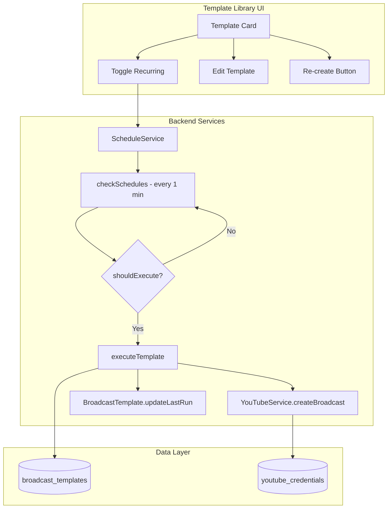

# Design Document: Auto Daily Broadcast

## Overview

Fitur ini memperbaiki dan menyempurnakan logika auto-create broadcast harian yang sudah ada di ScheduleService. Fokus utama adalah memastikan broadcast benar-benar dibuat secara otomatis setiap hari pada waktu yang ditentukan, dengan handling yang robust untuk missed schedules, server restart, dan error recovery.

## Architecture



## Components and Interfaces

### 1. ScheduleService (Enhanced)

Service yang menjalankan pengecekan jadwal setiap menit dan membuat broadcast otomatis.

```javascript
class ScheduleService {
  // Initialize service and load recurring templates
  async init(): Promise<void>
  
  // Check all templates and execute if time matches
  async checkSchedules(): Promise<void>
  
  // Determine if template should execute now
  shouldExecute(template: Template, now: Date): boolean
  
  // Check if template already ran today
  hasRunToday(template: Template, now: Date): boolean
  
  // Execute template - create broadcast with retry
  async executeTemplate(template: Template, retryCount?: number): Promise<BroadcastResult>
  
  // Handle missed schedules (next_run_at in past)
  async handleMissedSchedule(template: Template): Promise<void>
}
```

### 2. BroadcastTemplate Model (Existing)

Model untuk menyimpan template dengan konfigurasi recurring.

```javascript
// Key fields for recurring
{
  recurring_enabled: boolean,
  recurring_pattern: 'daily' | 'weekly',
  recurring_time: string, // HH:mm format
  recurring_days: string[], // for weekly pattern
  next_run_at: string, // ISO timestamp
  last_run_at: string, // ISO timestamp
  stream_id: string // optional - existing stream to bind
}
```

### 3. RecurringUtils (Enhanced)

Utility functions untuk kalkulasi jadwal.

```javascript
// Calculate next run time based on pattern and current time
calculateNextRun(config: RecurringConfig): Date

// Format next run timestamp for storage
formatNextRunAt(date: Date): string

// Replace placeholders in title/description
replaceTitlePlaceholders(text: string, date: Date): string

// Check if schedule was missed
isScheduleMissed(nextRunAt: string, now: Date): boolean
```

## Data Models

### broadcast_templates Table (Existing)

```sql
CREATE TABLE broadcast_templates (
  id TEXT PRIMARY KEY,
  user_id TEXT NOT NULL,
  account_id TEXT NOT NULL,
  name TEXT NOT NULL,
  title TEXT NOT NULL,
  description TEXT,
  privacy_status TEXT DEFAULT 'unlisted',
  tags TEXT, -- JSON array
  category_id TEXT DEFAULT '20',
  thumbnail_path TEXT,
  stream_id TEXT, -- existing stream to bind
  recurring_enabled INTEGER DEFAULT 0,
  recurring_pattern TEXT, -- 'daily' or 'weekly'
  recurring_time TEXT, -- HH:mm format
  recurring_days TEXT, -- JSON array for weekly
  next_run_at TEXT, -- ISO timestamp
  last_run_at TEXT, -- ISO timestamp
  created_at DATETIME DEFAULT CURRENT_TIMESTAMP,
  updated_at DATETIME DEFAULT CURRENT_TIMESTAMP
);
```

## Correctness Properties

*A property is a characteristic or behavior that should hold true across all valid executions of a system-essentially, a formal statement about what the system should do. Properties serve as the bridge between human-readable specifications and machine-verifiable correctness guarantees.*

### Property 1: Next run calculation correctness
*For any* current time and recurring_time configuration, when recurring is enabled with daily pattern, the calculated next_run_at SHALL be:
- Today at recurring_time if current time is before recurring_time
- Tomorrow at recurring_time if current time is at or after recurring_time

**Validates: Requirements 1.1, 3.2, 5.3**

### Property 2: Schedule execution timing
*For any* template with recurring enabled, shouldExecute SHALL return true only when:
- Current hour and minute match recurring_time
- Template has not already run today (hasRunToday returns false)
- For weekly pattern: current day is in recurring_days

**Validates: Requirements 1.2, 2.3**

### Property 3: Duplicate prevention
*For any* template with last_run_at set to today, hasRunToday SHALL return true, preventing duplicate broadcast creation on the same day.

**Validates: Requirements 2.3**

### Property 4: Placeholder replacement correctness
*For any* title string containing {date} and/or {time} placeholders, replaceTitlePlaceholders SHALL:
- Replace {date} with date in DD/MM/YYYY format
- Replace {time} with time in HH:mm format
- Preserve all other text unchanged

**Validates: Requirements 4.1, 4.2**

### Property 5: Template settings preservation
*For any* template, when executeTemplate creates a broadcast, the broadcast data SHALL include:
- Title with placeholders replaced
- Template's privacy_status, description, tags, category_id
- Template's stream_id if configured
- Scheduled start time 10 minutes from creation

**Validates: Requirements 1.4, 4.3, 4.4**

### Property 6: Toggle preserves configuration
*For any* template with recurring configuration, when recurring_enabled is toggled off, the recurring_pattern, recurring_time, and recurring_days SHALL remain unchanged in the database.

**Validates: Requirements 5.2**

### Property 7: Last run update correctness
*For any* successful broadcast creation, updateLastRun SHALL:
- Set last_run_at to current timestamp
- Set next_run_at to tomorrow at recurring_time (for daily pattern)

**Validates: Requirements 1.3**

## Error Handling

### Broadcast Creation Failure
- Retry up to 3 times with 30-second intervals
- Log error with template ID and error message
- After all retries fail, log final error and continue to next template

### Missing YouTube Credentials
- Log error and skip template
- Do not retry (credentials issue requires user action)

### Invalid Template Configuration
- Log warning with template ID
- Skip template without retry

### Server Restart Recovery
- On init, load all templates with recurring_enabled
- Check for missed schedules (next_run_at in past)
- Execute missed schedules immediately if within same day

## Testing Strategy

### Property-Based Testing Library
- **fast-check** untuk JavaScript property-based testing
- Minimum 100 iterations per property test

### Unit Tests
- Test calculateNextRun with various time scenarios
- Test shouldExecute with different template states
- Test hasRunToday with various last_run_at values
- Test replaceTitlePlaceholders with various inputs

### Property-Based Tests
- Property 1: Generate random current times and recurring_times, verify next_run_at calculation
- Property 2: Generate random templates and times, verify shouldExecute logic
- Property 3: Generate templates with various last_run_at, verify hasRunToday
- Property 4: Generate random titles with placeholders, verify replacement
- Property 5: Generate random templates, verify broadcast data includes all settings
- Property 6: Generate templates, toggle off, verify config preserved
- Property 7: Generate successful executions, verify last_run_at and next_run_at updates

### Integration Tests
- Test full flow: enable recurring → wait for schedule → verify broadcast created
- Test server restart recovery with missed schedules
- Test retry logic with simulated failures

