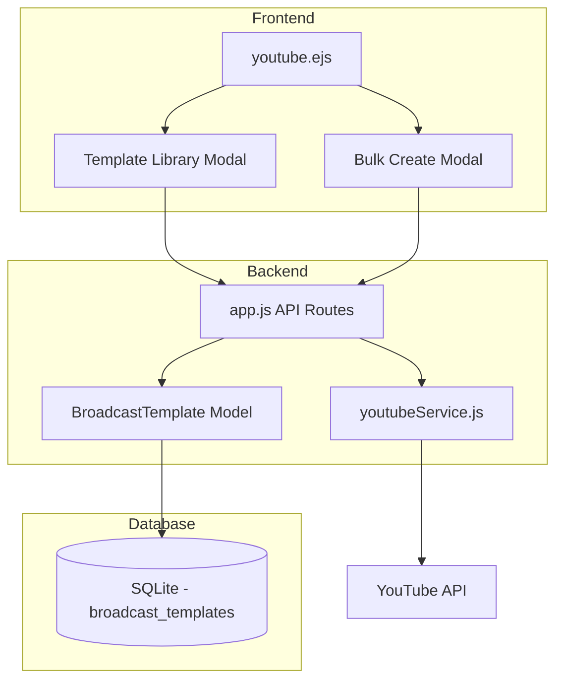

# Design Document: Broadcast Template

## Overview

Fitur Broadcast Template memungkinkan user menyimpan konfigurasi YouTube broadcast sebagai template yang dapat digunakan berulang kali. Fitur ini mencakup:
- Save as Template dari broadcast yang sudah ada
- Template Library untuk mengelola template
- Create from Template untuk membuat broadcast baru
- Bulk Create untuk membuat banyak broadcast sekaligus

## Architecture



## Components and Interfaces

### 1. Database Schema - broadcast_templates table

```sql
CREATE TABLE IF NOT EXISTS broadcast_templates (
    id TEXT PRIMARY KEY,
    user_id TEXT NOT NULL,
    account_id INTEGER NOT NULL,
    name TEXT NOT NULL,
    title TEXT NOT NULL,
    description TEXT,
    privacy_status TEXT DEFAULT 'unlisted',
    tags TEXT,
    category_id TEXT DEFAULT '20',
    thumbnail_path TEXT,
    stream_id TEXT,
    created_at TIMESTAMP DEFAULT CURRENT_TIMESTAMP,
    updated_at TIMESTAMP DEFAULT CURRENT_TIMESTAMP,
    FOREIGN KEY (user_id) REFERENCES users(id) ON DELETE CASCADE,
    FOREIGN KEY (account_id) REFERENCES youtube_credentials(id) ON DELETE CASCADE,
    UNIQUE(user_id, name)
);
```

### 2. BroadcastTemplate Model (models/BroadcastTemplate.js)

```javascript
class BroadcastTemplate {
    static create(templateData)      // Create new template
    static findById(id)              // Find template by ID
    static findByUserId(userId)      // Get all templates for user
    static findByName(userId, name)  // Find template by name
    static update(id, templateData)  // Update template
    static delete(id, userId)        // Delete template
    static nameExists(userId, name)  // Check if name exists
}
```

### 3. API Endpoints

| Method | Endpoint | Description |
|--------|----------|-------------|
| POST | /api/youtube/templates | Create new template |
| GET | /api/youtube/templates | Get all templates for user |
| GET | /api/youtube/templates/:id | Get template by ID |
| PUT | /api/youtube/templates/:id | Update template |
| DELETE | /api/youtube/templates/:id | Delete template |
| POST | /api/youtube/templates/:id/create-broadcast | Create broadcast from template |
| POST | /api/youtube/templates/:id/bulk-create | Bulk create broadcasts from template |

### 4. Frontend Components

#### Template Library Modal
- List semua template dengan nama, YouTube account, dan tanggal dibuat
- Tombol Edit, Delete, Create Broadcast, Bulk Create untuk setiap template
- Tombol Create New Template

#### Save as Template Modal
- Input nama template
- Preview settings yang akan disimpan
- Tombol Save

#### Bulk Create Modal
- Pilih template
- Input multiple schedule times (date/time picker)
- Tombol Add Schedule, Remove Schedule
- Preview list of broadcasts to create
- Tombol Create All

## Data Models

### BroadcastTemplate

| Field | Type | Description |
|-------|------|-------------|
| id | TEXT | UUID primary key |
| user_id | TEXT | Foreign key to users |
| account_id | INTEGER | Foreign key to youtube_credentials |
| name | TEXT | Template name (unique per user) |
| title | TEXT | Broadcast title |
| description | TEXT | Broadcast description |
| privacy_status | TEXT | public/unlisted/private |
| tags | TEXT | JSON array of tags |
| category_id | TEXT | YouTube category ID |
| thumbnail_path | TEXT | Path to thumbnail image |
| stream_id | TEXT | YouTube stream ID for reuse |
| created_at | TIMESTAMP | Creation timestamp |
| updated_at | TIMESTAMP | Last update timestamp |

## Correctness Properties

*A property is a characteristic or behavior that should hold true across all valid executions of a system-essentially, a formal statement about what the system should do. Properties serve as the bridge between human-readable specifications and machine-verifiable correctness guarantees.*

### Property 1: Template name uniqueness per user
*For any* user and template name, there can only be one template with that name for that user. Attempting to create a duplicate should fail with validation error.
**Validates: Requirements 1.4**

### Property 2: Template data integrity on save
*For any* broadcast configuration, saving it as a template should preserve all fields (title, description, privacy_status, tags, category_id, thumbnail_path, account_id).
**Validates: Requirements 1.1, 1.3**

### Property 3: Empty name validation
*For any* template creation attempt with empty or whitespace-only name, the system should reject the operation with a validation error.
**Validates: Requirements 1.4, 5.2**

### Property 4: User template isolation
*For any* user, querying templates should return only templates belonging to that user, not templates from other users.
**Validates: Requirements 2.1**

### Property 5: Template deletion completeness
*For any* template deletion, the template should no longer exist in the database, and other templates should remain unchanged.
**Validates: Requirements 2.4**

### Property 6: Bulk create attempt count
*For any* bulk create operation with N schedule times, the system should attempt exactly N broadcast creations and return a summary with total, success, and failure counts that sum correctly.
**Validates: Requirements 4.3, 4.4**

### Property 7: Bulk create partial failure resilience
*For any* bulk create operation where some broadcasts fail, the system should continue creating remaining broadcasts and include all failures in the summary.
**Validates: Requirements 4.5**

### Property 8: Required fields validation
*For any* template creation, the system should require name, title, and account_id fields to be present and non-empty.
**Validates: Requirements 5.2**

## Error Handling

| Error Case | Response |
|------------|----------|
| Template name already exists | 400 - "Template name already exists" |
| Template not found | 404 - "Template not found" |
| Invalid template data | 400 - Validation error details |
| YouTube API error during broadcast creation | 500 - YouTube error message |
| Partial failure in bulk create | 207 - Multi-status with success/failure details |

## Testing Strategy

### Unit Tests
- BroadcastTemplate model CRUD operations
- Validation logic for template data
- Name uniqueness checking

### Property-Based Tests
- Use fast-check library for property-based testing
- Test template name uniqueness across random inputs
- Test bulk create with varying numbers of schedules
- Test template data integrity through save/load cycles

### Integration Tests
- API endpoint responses
- Database operations
- YouTube API integration (mocked)
