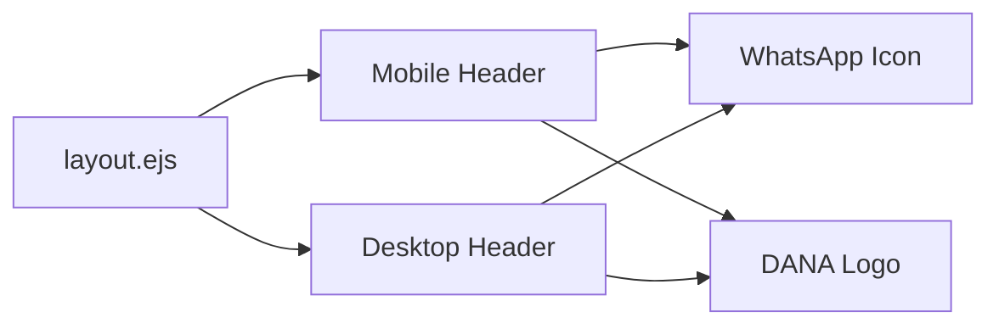

# Design Document: Dana Icon Update

## Overview

Perubahan ini memperbarui tampilan icon donasi di header aplikasi StreamFlow dengan mengganti icon kopi dan tulisan "Traktir Kopi" dengan logo aplikasi DANA. Jarak antara icon WhatsApp dan DANA juga diatur agar lebih dekat dengan menghapus divider yang ada.

## Architecture

Perubahan ini bersifat frontend-only dan hanya melibatkan modifikasi pada file template `views/layout.ejs`. Tidak ada perubahan pada backend atau logika aplikasi.

## Components and Interfaces

### File yang Dimodifikasi

1. **views/layout.ejs**
   - Mobile Header section (line ~26-33)
   - Desktop Header section (line ~95-102)

### Elemen yang Diubah

| Elemen Lama | Elemen Baru |
|-------------|-------------|
| `<i class="ti ti-coffee">` + `Traktir Kopi` | `` |
| Divider `
` | Dihapus |
| Gap `gap-0.5` / margin `mr-1.5`, `ml-1.5` | Gap `gap-2` |

### Asset Baru

- **public/images/dana-logo.svg** - Logo DANA dalam format SVG

## Data Models

Tidak ada perubahan data model. Fitur ini murni perubahan tampilan UI.

## Correctness Properties

*A property is a characteristic or behavior that should hold true across all valid executions of a system-essentially, a formal statement about what the system should do. Properties serve as the bridge between human-readable specifications and machine-verifiable correctness guarantees.*

Berdasarkan analisis prework, sebagian besar acceptance criteria adalah perubahan UI visual yang lebih cocok divalidasi dengan example-based testing daripada property-based testing. Berikut adalah property yang dapat diuji:

### Property 1: Link DANA memiliki atribut yang benar
*For any* render dari layout.ejs, elemen link DANA harus memiliki atribut `href` yang mengarah ke link donasi DANA, atribut `target="_blank"`, dan atribut `title="Donate via Dana"`.
**Validates: Requirements 3.1, 3.3**

### Property 2: Tidak ada elemen "Traktir Kopi" setelah update
*For any* render dari layout.ejs, tidak boleh ada elemen dengan teks "Traktir Kopi" di dalam header.
**Validates: Requirements 1.2**

## Error Handling

Tidak ada error handling khusus yang diperlukan karena ini adalah perubahan UI statis. Jika logo DANA gagal dimuat, browser akan menampilkan alt text atau placeholder default.

Pertimbangan:
- Gunakan atribut `alt` pada tag `` untuk aksesibilitas
- Pastikan file SVG tersedia di path yang benar

## Testing Strategy

### Unit Testing
Karena perubahan ini bersifat UI/template, unit testing tradisional tidak applicable. Validasi dilakukan melalui:
- Visual inspection pada browser
- Pengecekan DOM structure

### Example-Based Testing
Testing manual untuk memverifikasi:
1. Logo DANA muncul di mobile dan desktop header
2. Tulisan "Traktir Kopi" tidak ada
3. Jarak antara WhatsApp dan DANA dekat
4. Link donasi berfungsi dengan benar
5. Hover effect bekerja di desktop

### Property-Based Testing
Tidak diperlukan property-based testing untuk fitur ini karena:
- Perubahan bersifat UI statis tanpa logika kompleks
- Tidak ada input yang bervariasi yang perlu diuji
- Validasi cukup dengan example-based testing
