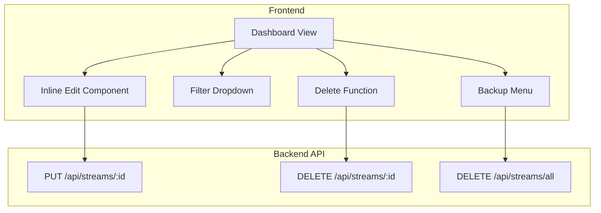

# Design Document

## Overview

Dokumen ini menjelaskan desain teknis untuk perbaikan UX dashboard streaming. Implementasi mencakup inline editing untuk kolom Schedule dan Duration, penghapusan konfirmasi delete, filter dropdown untuk nama stream, dan fitur hapus semua di menu Backup.

## Architecture

Perubahan dilakukan pada layer frontend (views/dashboard.ejs) dengan penambahan komponen inline edit dan modifikasi fungsi JavaScript existing. Backend API sudah tersedia untuk update stream (`PUT /api/streams/:id`) dan delete (`DELETE /api/streams/:id`).



## Components and Interfaces

### 1. Inline Edit Component

Komponen untuk mengedit Schedule dan Duration langsung di tabel.

```javascript
// Inline Edit Interface
interface InlineEditConfig {
  streamId: string;
  field: 'schedule' | 'duration';
  currentValue: any;
  onSave: (newValue: any) => Promise<void>;
  onCancel: () => void;
}

// Schedule Edit Interface
interface ScheduleEditData {
  schedule_type: 'once' | 'daily' | 'weekly';
  recurring_time?: string;
  schedule_days?: number[];
  schedule_time?: string;
}

// Duration Edit Interface  
interface DurationEditData {
  stream_duration_hours: number;
}
```

### 2. Filter Dropdown Component

Komponen dropdown untuk filter stream berdasarkan nama.

```javascript
// Filter Interface
interface StreamFilter {
  options: FilterOption[];
  selectedValue: string;
  onChange: (value: string) => void;
}

interface FilterOption {
  value: string;
  label: string;
  count: number;
}
```

### 3. Delete All API Endpoint

Endpoint baru untuk menghapus semua stream.

```javascript
// DELETE /api/streams/all
// Response: { success: boolean, deleted: number, error?: string }
```

## Data Models

### Stream Model (Existing)

```javascript
{
  id: string,
  title: string,
  video_id: string,
  audio_id: string,
  stream_key: string,
  schedule_type: 'once' | 'daily' | 'weekly',
  schedule_time: string,
  recurring_time: string,
  schedule_days: number[],
  stream_duration_hours: number,
  status: 'offline' | 'live' | 'scheduled',
  // ... other fields
}
```

### Filter State

```javascript
{
  allStreams: Stream[],
  filteredStreams: Stream[],
  filterOptions: FilterOption[],
  selectedFilter: string
}
```


## Correctness Properties

*A property is a characteristic or behavior that should hold true across all valid executions of a system-essentially, a formal statement about what the system should do. Properties serve as the bridge between human-readable specifications and machine-verifiable correctness guarantees.*

### Property Reflection

After analyzing the acceptance criteria, the following redundancies were identified:
- Properties 1.3 and 1.4 can be combined into a single "inline save triggers API" property
- Properties 2.2 and 2.3 can be combined into a single "delete result handling" property
- Properties 4.2 and 4.3 can be combined into a single "delete all result handling" property

### Properties

**Property 1: Inline edit save triggers API call with correct data**
*For any* inline edit modification (schedule or duration), when the user confirms the edit (blur or Enter), the system should call the API with the modified field value matching the user input.
**Validates: Requirements 1.3, 1.4**

**Property 2: Failed inline edit reverts to original value**
*For any* inline edit that fails to save, the displayed value should revert to the original value before the edit was initiated.
**Validates: Requirements 1.5**

**Property 3: Escape key cancels inline edit**
*For any* active inline edit state, pressing Escape should restore the original value and close the edit interface.
**Validates: Requirements 1.6**

**Property 4: Delete operation result handling**
*For any* stream delete operation, if successful the stream list should refresh and show success notification; if failed the error notification should display the failure reason.
**Validates: Requirements 2.2, 2.3**

**Property 5: Filter displays only matching streams**
*For any* filter selection and any stream list, the displayed streams should only include those whose names match the selected filter criteria.
**Validates: Requirements 3.2**

**Property 6: Filter options reflect current streams**
*For any* change to the stream list (add/remove), the filter dropdown options should update to contain only prefixes from the current stream names.
**Validates: Requirements 3.4**

**Property 7: Delete all removes all streams**
*For any* stream list, after a successful delete all operation, the stream list should be empty and success notification should be displayed.
**Validates: Requirements 4.2**

## Error Handling

### Inline Edit Errors
- API failure: Revert to original value, show error toast
- Network timeout: Revert to original value, show "Connection error" toast
- Invalid input: Show validation error, keep edit mode active

### Delete Errors
- API failure: Show error toast with reason
- Network timeout: Show "Connection error" toast
- Stream not found: Show "Stream not found" toast, refresh list

### Delete All Errors
- API failure: Show error toast with reason
- Partial failure: Show warning with count of deleted/failed

## Testing Strategy

### Unit Testing
Unit tests akan memverifikasi:
- Fungsi `createInlineEdit()` menghasilkan DOM element yang benar
- Fungsi `saveInlineEdit()` memanggil API dengan data yang benar
- Fungsi `filterStreams()` memfilter array dengan benar
- Fungsi `generateFilterOptions()` menghasilkan opsi unik dari nama stream

### Property-Based Testing
Property-based testing akan menggunakan **fast-check** library untuk JavaScript.

Setiap property test harus:
- Dikonfigurasi untuk minimal 100 iterasi
- Di-tag dengan format: `**Feature: dashboard-ux-improvement, Property {number}: {property_text}**`
- Menggunakan generator yang sesuai untuk input data

Test properties:
1. **Inline Save API Call**: Generate random schedule/duration values, verify API called with matching data
2. **Failed Edit Revert**: Generate random original values, simulate failure, verify revert
3. **Escape Cancel**: Generate random edit states, simulate Escape, verify original restored
4. **Delete Result**: Generate random stream lists, simulate delete, verify correct handling
5. **Filter Matching**: Generate random stream lists and filter values, verify only matching displayed
6. **Filter Options Update**: Generate random stream add/remove operations, verify options updated
7. **Delete All Empty**: Generate random stream lists, simulate delete all, verify empty result
