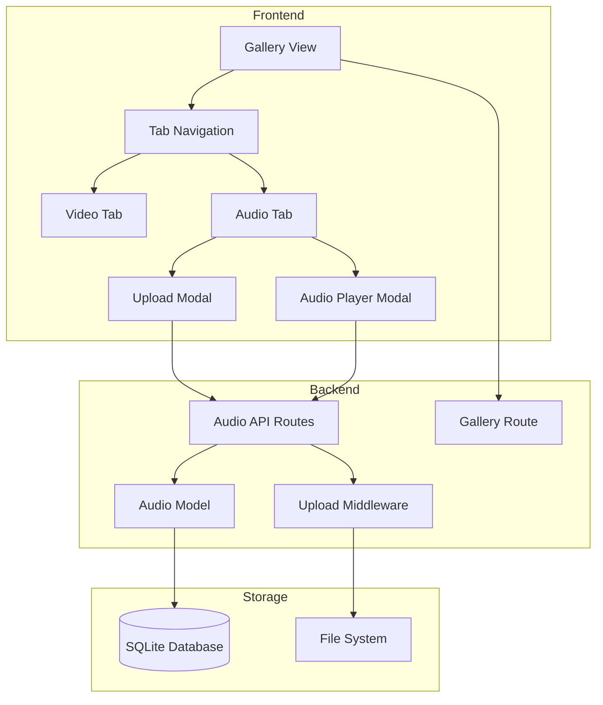

# Design Document: Gallery Audio Tabs

## Overview

Fitur ini memperluas panel Gallery yang ada dengan menambahkan kemampuan upload dan manajemen file audio. Gallery akan memiliki sistem tab untuk memisahkan konten video dan audio, memungkinkan pengguna mengelola kedua jenis media secara terorganisir dalam satu halaman.

## Architecture



## Components and Interfaces

### 1. Audio Model (`models/Audio.js`)

```javascript
class Audio {
  // Create new audio record
  static async create(data: {
    title: string,
    filepath: string,
    file_size: number,
    duration: number,
    format: string,
    user_id: string
  }): Promise<AudioRecord>
  
  // Find audio by ID
  static async findById(id: string): Promise<AudioRecord | null>
  
  // Find all audio for user
  static async findAll(userId: string): Promise<AudioRecord[]>
  
  // Update audio record
  static async update(id: string, data: Partial<AudioRecord>): Promise<AudioRecord>
  
  // Delete audio record and file
  static async delete(id: string): Promise<{ success: boolean }>
}
```

### 2. Upload Middleware Extension

```javascript
// Add audio storage configuration
const audioStorage = multer.diskStorage({
  destination: paths.audios,
  filename: getUniqueFilename
})

// Audio file filter
const audioFilter = (req, file, cb) => {
  const allowedFormats = ['audio/mpeg', 'audio/wav', 'audio/aac', 'audio/x-m4a']
  const allowedExts = ['.mp3', '.wav', '.aac', '.m4a']
  // Validate and callback
}

const uploadAudio = multer({
  storage: audioStorage,
  fileFilter: audioFilter
})
```

### 3. API Routes

| Method | Endpoint | Description |
|--------|----------|-------------|
| GET | `/gallery?tab=audio` | Get gallery with audio tab active |
| POST | `/api/audios/upload` | Upload audio file(s) |
| GET | `/api/audios/:id` | Get audio details |
| POST | `/api/audios/:id/rename` | Rename audio file |
| DELETE | `/api/audios/:id` | Delete audio file |
| GET | `/stream/audio/:id` | Stream audio file |

### 4. Frontend Components

#### Tab Navigation Component
- Video tab (default)
- Audio tab
- URL query parameter sync (`?tab=video` or `?tab=audio`)

#### Audio Card Component
- Default audio icon/waveform thumbnail
- Title, duration, file size, upload date
- Play button overlay on hover
- Rename and delete action buttons

#### Audio Upload Modal
- Drag and drop zone
- File input accepting MP3, WAV, AAC
- Progress indicator
- Success/error notifications

#### Audio Player Modal
- Audio element with native controls
- Title display
- Close button

## Data Models

### Audio Table Schema

```sql
CREATE TABLE IF NOT EXISTS audios (
  id TEXT PRIMARY KEY,
  title TEXT NOT NULL,
  filepath TEXT NOT NULL,
  file_size INTEGER,
  duration REAL,
  format TEXT,
  user_id TEXT,
  upload_date TIMESTAMP DEFAULT CURRENT_TIMESTAMP,
  created_at TIMESTAMP DEFAULT CURRENT_TIMESTAMP,
  updated_at TIMESTAMP DEFAULT CURRENT_TIMESTAMP,
  FOREIGN KEY (user_id) REFERENCES users(id)
);
```

### AudioRecord Interface

```typescript
interface AudioRecord {
  id: string
  title: string
  filepath: string
  file_size: number
  duration: number
  format: string
  user_id: string
  upload_date: string
  created_at: string
  updated_at: string
}
```

## Correctness Properties

*A property is a characteristic or behavior that should hold true across all valid executions of a system-essentially, a formal statement about what the system should do. Properties serve as the bridge between human-readable specifications and machine-verifiable correctness guarantees.*

Based on the prework analysis, the following properties were identified. After reflection to eliminate redundancy:

- Properties 2.2 and 2.3 (tab filtering) can be combined into one property about tab-based filtering
- Properties 5.2 and 5.4 (rename/delete) are distinct operations and should remain separate
- Properties 6.1 and 6.2 (search/sort) are distinct operations and should remain separate

### Property 1: Audio metadata storage completeness
*For any* valid audio file uploaded to the system, the stored record SHALL contain non-null values for title, filepath, file_size, duration, and format fields.
**Validates: Requirements 1.2**

### Property 2: Invalid audio format rejection
*For any* file with a MIME type or extension not in the allowed list (MP3, WAV, AAC), the upload SHALL be rejected with an error response.
**Validates: Requirements 1.3**

### Property 3: Tab-based media filtering
*For any* gallery state containing both video and audio files, selecting a tab SHALL display only media of the corresponding type (videos for Video tab, audios for Audio tab).
**Validates: Requirements 2.2, 2.3**

### Property 4: URL tab parameter activation
*For any* valid tab query parameter value ("video" or "audio"), loading the gallery page SHALL activate the corresponding tab.
**Validates: Requirements 2.5**

### Property 5: Audio card information display
*For any* audio record in the database, the rendered audio card SHALL contain the title, duration, file size, and upload date.
**Validates: Requirements 3.1**

### Property 6: Audio rename persistence
*For any* audio file and valid new title, after rename operation the audio record SHALL have the updated title.
**Validates: Requirements 5.2**

### Property 7: Audio deletion completeness
*For any* audio file, after confirmed deletion, the audio record SHALL not exist in the database AND the file SHALL not exist in the filesystem.
**Validates: Requirements 5.4**

### Property 8: Audio search filtering
*For any* search query on the Audio tab, all displayed audio files SHALL have titles containing the search query (case-insensitive).
**Validates: Requirements 6.1**

### Property 9: Audio sort ordering
*For any* sort option selected (newest/oldest), the displayed audio files SHALL be ordered by upload_date in the corresponding direction.
**Validates: Requirements 6.2**

## Error Handling

| Error Scenario | Response | User Feedback |
|----------------|----------|---------------|
| Invalid file format | 400 Bad Request | "Only MP3, WAV, and AAC formats are allowed" |
| File too large | 413 Payload Too Large | "File size exceeds maximum limit" |
| Upload failure | 500 Internal Server Error | "Failed to upload audio. Please try again." |
| Audio not found | 404 Not Found | "Audio file not found" |
| Rename failure | 500 Internal Server Error | "Failed to rename audio. Please try again." |
| Delete failure | 500 Internal Server Error | "Failed to delete audio. Please try again." |
| Unauthorized access | 401 Unauthorized | Redirect to login |

## Testing Strategy

### Unit Testing
- Audio model CRUD operations
- File filter validation logic
- Metadata extraction functions

### Property-Based Testing

Library: **fast-check** (JavaScript property-based testing library)

Configuration: Minimum 100 iterations per property test.

Each property test must be annotated with:
```javascript
// **Feature: gallery-audio-tabs, Property {number}: {property_text}**
// **Validates: Requirements X.Y**
```

Property tests to implement:
1. Audio metadata completeness (Property 1)
2. Invalid format rejection (Property 2)
3. Tab filtering correctness (Property 3)
4. URL parameter tab activation (Property 4)
5. Audio card information display (Property 5)
6. Rename persistence (Property 6)
7. Deletion completeness (Property 7)
8. Search filtering (Property 8)
9. Sort ordering (Property 9)

### Integration Testing
- Full upload flow with metadata extraction
- Tab switching with database queries
- Search and sort with various data sets
