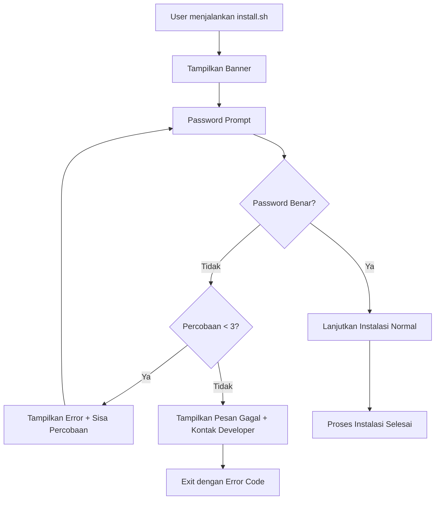

# Design Document

## Overview

Fitur Installation Password Lock menambahkan lapisan keamanan pada script instalasi `install.sh` dengan memvalidasi password sebelum proses instalasi dimulai. Implementasi menggunakan bash scripting dengan validasi password sederhana yang membandingkan input pengguna dengan password yang sudah ditetapkan (`1988`). Jika validasi gagal setelah 3 percobaan, instalasi dibatalkan dan pengguna diarahkan untuk menghubungi developer.

## Architecture



## Components and Interfaces

### 1. Password Validation Function

```bash
validate_password() {
    local input_password="$1"
    local correct_password="1988"
    
    if [ "$input_password" = "$correct_password" ]; then
        return 0  # Success
    else
        return 1  # Failure
    fi
}
```

### 2. Password Prompt Function

```bash
prompt_password() {
    local max_attempts=3
    local attempt=1
    
    while [ $attempt -le $max_attempts ]; do
        echo -n "🔐 Masukkan password instalasi: "
        read -s password
        echo
        
        if validate_password "$password"; then
            echo "✅ Password benar! Melanjutkan instalasi..."
            return 0
        else
            remaining=$((max_attempts - attempt))
            if [ $remaining -gt 0 ]; then
                echo "❌ Password salah! Sisa percobaan: $remaining"
            fi
            attempt=$((attempt + 1))
        fi
    done
    
    # Gagal setelah 3 percobaan
    show_failure_message
    return 1
}
```

### 3. Failure Message Function

```bash
show_failure_message() {
    echo
    echo "================================"
    echo "❌ INSTALASI DIBATALKAN"
    echo "================================"
    echo
    echo "Password salah 3 kali berturut-turut."
    echo "Untuk mendapatkan password instalasi,"
    echo "silakan hubungi developer:"
    echo
    echo "📱 WhatsApp: 089621453431"
    echo
    echo "================================"
}
```

## Data Models

Tidak ada data model yang diperlukan karena fitur ini hanya menggunakan validasi sederhana di bash script tanpa penyimpanan data persisten.

| Item | Nilai |
|------|-------|
| Password | 1988 |
| Max Attempts | 3 |
| Developer Contact | WhatsApp 089621453431 |

## Correctness Properties

*A property is a characteristic or behavior that should hold true across all valid executions of a system-essentially, a formal statement about what the system should do. Properties serve as the bridge between human-readable specifications and machine-verifiable correctness guarantees.*

### Property 1: Password validation correctness
*For any* input string, the validation function should return success (exit code 0) if and only if the input equals "1988", and return failure (exit code 1) for all other inputs
**Validates: Requirements 1.2, 1.3, 4.3**

### Property 2: Retry limit and failure handling
*For any* sequence of 3 consecutive wrong password attempts, the system should terminate with error code and display developer contact (WhatsApp 089621453431)
**Validates: Requirements 1.4, 4.2**

### Property 3: Remaining attempts display
*For any* failed password attempt (before reaching limit), the system should display the correct number of remaining attempts (3 - current_attempt)
**Validates: Requirements 3.3**

## Error Handling

| Scenario | Handling |
|----------|----------|
| Password salah (percobaan 1-2) | Tampilkan error, sisa percobaan, minta input ulang |
| Password salah (percobaan 3) | Tampilkan pesan gagal + kontak developer, exit 1 |
| User menekan Ctrl+C | Script berhenti, tidak ada cleanup diperlukan |
| Input kosong | Dianggap password salah |

## Testing Strategy

### Unit Testing
- Test fungsi `validate_password` dengan berbagai input
- Test counter percobaan berjalan dengan benar

### Property-Based Testing
Menggunakan bash testing dengan berbagai kombinasi input:
- Password benar di percobaan ke-1, ke-2, ke-3
- Password salah semua 3 percobaan
- Input kosong
- Input dengan spasi
- Input dengan karakter khusus

### Integration Testing
- Test full flow instalasi dengan password benar
- Test full flow instalasi dengan password salah 3x
