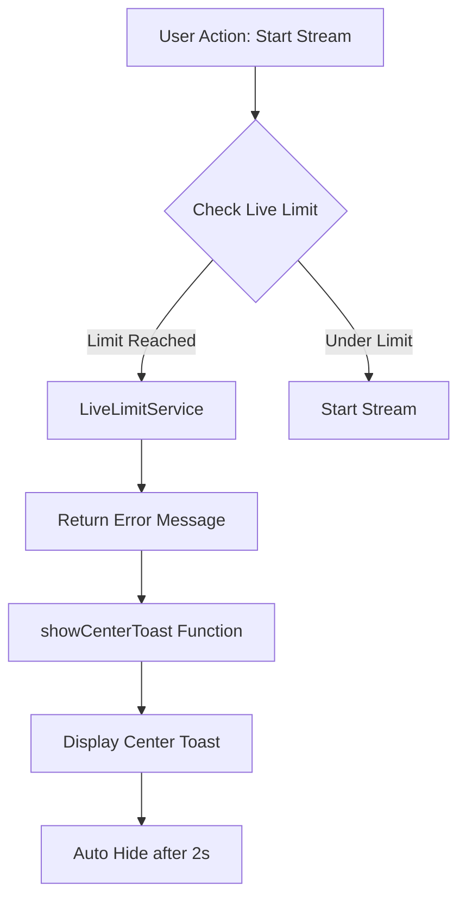

# Design Document: Limit Message Update

## Overview

Fitur ini memperbarui sistem notifikasi untuk pesan limit live streaming. Perubahan utama meliputi:
1. Update teks pesan menjadi "Hubungi Admin Untuk Menambah Limit"
2. Membuat komponen center toast baru yang muncul di tengah layar
3. Mengatur durasi tampil menjadi 2 detik dengan animasi fade

## Architecture



## Components and Interfaces

### 1. Center Toast Component (Frontend)

Komponen toast baru yang ditampilkan di tengah layar.

```javascript
/**
 * Menampilkan toast notification di tengah layar
 * @param {string} type - Tipe toast: 'success', 'error', 'warning'
 * @param {string} message - Pesan yang ditampilkan
 * @param {number} duration - Durasi tampil dalam ms (default: 2000)
 */
function showCenterToast(type, message, duration = 2000)
```

### 2. LiveLimitService Update (Backend)

Update pesan error di service.

```javascript
// services/liveLimitService.js
message: canStart ? null : 'Hubungi Admin Untuk Menambah Limit'
```

### 3. Dashboard Integration

Update fungsi yang menangani error limit di dashboard untuk menggunakan center toast.

## Data Models

Tidak ada perubahan data model. Fitur ini hanya mengubah presentasi pesan.

## Correctness Properties

*A property is a characteristic or behavior that should hold true across all valid executions of a system-essentially, a formal statement about what the system should do. Properties serve as the bridge between human-readable specifications and machine-verifiable correctness guarantees.*

### Property 1: Limit message consistency
*For any* user yang mencapai limit, pesan yang dikembalikan oleh LiveLimitService harus selalu "Hubungi Admin Untuk Menambah Limit"
**Validates: Requirements 1.1, 2.2**

### Property 2: Toast duration consistency
*For any* center toast yang ditampilkan, durasi default harus 2000ms (2 detik)
**Validates: Requirements 1.3**

## Error Handling

| Scenario | Handling |
|----------|----------|
| Toast element tidak ditemukan | Fallback ke console.log |
| Multiple toast bersamaan | Toast baru menggantikan yang lama |

## Testing Strategy

### Unit Tests
- Verifikasi pesan yang dikembalikan LiveLimitService
- Verifikasi fungsi showCenterToast dipanggil dengan parameter yang benar

### Property-Based Tests
Menggunakan Jest untuk property-based testing:

1. **Property 1 Test**: Untuk semua user dengan limit tercapai, pesan harus konsisten
   - Tag: **Feature: limit-message-update, Property 1: Limit message consistency**

2. **Property 2 Test**: Untuk semua panggilan showCenterToast tanpa duration, default harus 2000ms
   - Tag: **Feature: limit-message-update, Property 2: Toast duration consistency**

### Manual Testing
- Verifikasi posisi toast di tengah layar
- Verifikasi animasi fade-in dan fade-out
- Verifikasi toast hilang setelah 2 detik
