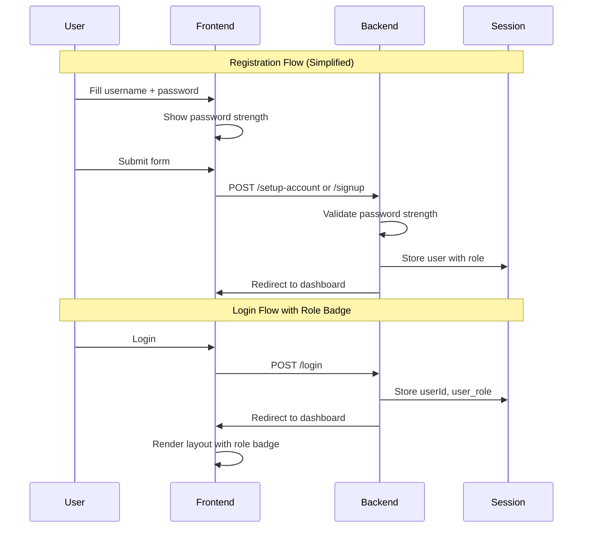

# Design Document: Login UX Improvement

## Overview

Fitur ini meningkatkan pengalaman pengguna pada sistem autentikasi StreamFlow dengan dua perubahan utama:
1. Menghilangkan field konfirmasi password untuk mempercepat proses registrasi
2. Menambahkan indikator visual (badge) yang membedakan peran admin dan member

## Architecture

### Komponen yang Terpengaruh

```
┌─────────────────────────────────────────────────────────────┐
│                      Frontend (Views)                        │
├─────────────────────────────────────────────────────────────┤
│  setup-account.ejs  │  signup.ejs  │  layout.ejs            │
│  - Remove confirm   │  - Remove    │  - Add role badge      │
│    password field   │    confirm   │    component           │
│  - Keep strength    │    password  │  - Style admin/member  │
│    indicator        │    field     │    differently         │
└─────────────────────────────────────────────────────────────┘
                              │
                              ▼
┌─────────────────────────────────────────────────────────────┐
│                      Backend (app.js)                        │
├─────────────────────────────────────────────────────────────┤
│  - Remove confirmPassword validation                         │
│  - Keep password strength validation                         │
│  - Ensure user_role is passed to session                     │
└─────────────────────────────────────────────────────────────┘
```

### Flow Diagram



## Components and Interfaces

### 1. Form Components (setup-account.ejs, signup.ejs)

**Perubahan:**
- Hapus field `confirm-password`
- Hapus validasi client-side untuk password match
- Pertahankan password strength indicator

### 2. Role Badge Component (layout.ejs)

**Lokasi:** Di dalam profile dropdown dan mobile profile popup

**Props:**
- `role`: string ('admin' | 'member')

**Styling:**
- Admin: Background biru/gold, icon `ti-shield-check`
- Member: Background gray/green, icon `ti-user`

### 3. Backend Validation (app.js)

**Perubahan:**
- Hapus validasi `confirmPassword` di route `/setup-account` dan `/signup`
- Pertahankan validasi password strength (min 8 chars, uppercase, lowercase, number)

## Data Models

Tidak ada perubahan pada data model. Menggunakan field `user_role` yang sudah ada di tabel `users`.

```sql
-- Existing schema (no changes)
users (
  id TEXT PRIMARY KEY,
  username TEXT,
  password TEXT,
  avatar_path TEXT,
  user_role TEXT DEFAULT 'member',  -- 'admin' or 'member'
  status TEXT DEFAULT 'active',
  created_at DATETIME,
  updated_at DATETIME
)
```

## Correctness Properties

*A property is a characteristic or behavior that should hold true across all valid executions of a system-essentially, a formal statement about what the system should do. Properties serve as the bridge between human-readable specifications and machine-verifiable correctness guarantees.*

### Property 1: Role Badge Consistency
*For any* authenticated user with a valid role (admin or member), the rendered page SHALL display the corresponding role badge with correct styling.
**Validates: Requirements 2.1, 2.2, 2.3**

### Property 2: Form Submission Without Confirmation
*For any* valid password (meeting strength requirements), the registration form SHALL accept submission without a confirmPassword field.
**Validates: Requirements 1.1, 1.2, 1.3**

### Property 3: Role Badge Location Consistency
*For any* authenticated page view, the role badge SHALL appear in the same DOM location (profile dropdown area).
**Validates: Requirements 2.4, 3.1**

## Error Handling

### Registration Errors
- Password terlalu lemah: Tampilkan pesan error dengan kriteria yang tidak terpenuhi
- Username sudah ada: Tampilkan pesan "Username already exists"

### Role Badge Errors
- Role tidak valid: Default ke 'member' badge
- Session tidak ada role: Tidak tampilkan badge (graceful degradation)

## Testing Strategy

### Unit Tests
- Test password validation function accepts valid passwords
- Test password validation rejects weak passwords
- Test role badge helper function returns correct HTML for each role

### Property-Based Tests
Library: fast-check (JavaScript property-based testing)

**Property Test 1: Role Badge Rendering**
- Generate random users with valid roles
- Verify badge HTML contains correct class and icon for each role
- **Feature: login-ux-improvement, Property 1: Role Badge Consistency**

**Property Test 2: Password Validation**
- Generate random strings meeting password criteria
- Verify validation passes without confirmation field
- **Feature: login-ux-improvement, Property 2: Form Submission Without Confirmation**

### Integration Tests
- Test full registration flow without confirm password
- Test login flow displays correct role badge
- Test role badge appears on multiple pages
