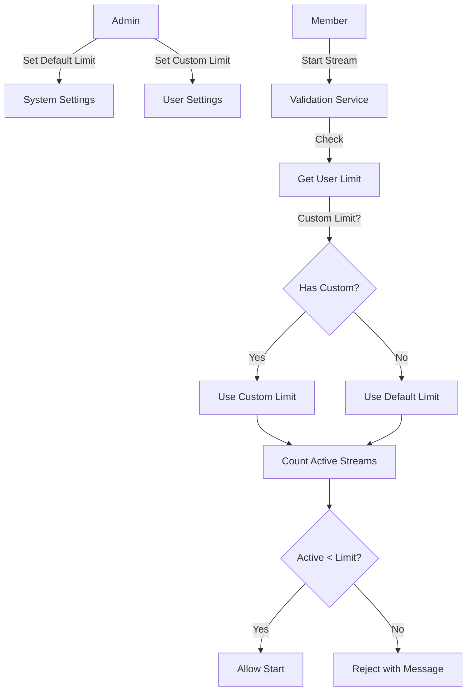

# Design Document: Member Live Limit

## Overview

Fitur ini memungkinkan admin untuk mengontrol dan membatasi jumlah maksimal live streaming yang dapat dijalankan secara bersamaan oleh setiap member. Sistem akan menyimpan konfigurasi default di system settings dan memungkinkan override per-user. Validasi dilakukan sebelum member dapat memulai streaming baru.

## Architecture



## Components and Interfaces

### 1. Database Schema Changes

#### System Settings Table (New)
```sql
CREATE TABLE IF NOT EXISTS system_settings (
    key TEXT PRIMARY KEY,
    value TEXT NOT NULL,
    updated_at TIMESTAMP DEFAULT CURRENT_TIMESTAMP
);
```

#### Users Table (Add Column)
```sql
ALTER TABLE users ADD COLUMN live_limit INTEGER DEFAULT NULL;
```

### 2. SystemSettings Model (New)

```javascript
// models/SystemSettings.js
class SystemSettings {
    static get(key)           // Get setting value by key
    static set(key, value)    // Set setting value
    static getDefaultLiveLimit()  // Get default live limit (returns 1 if not set)
}
```

### 3. User Model (Update)

```javascript
// models/User.js - Add methods
class User {
    static updateLiveLimit(userId, limit)  // Update user's custom live limit
    static getLiveLimit(userId)            // Get effective live limit for user
}
```

### 4. LiveLimitService (New)

```javascript
// services/liveLimitService.js
class LiveLimitService {
    static async getEffectiveLimit(userId)     // Get effective limit (custom or default)
    static async countActiveStreams(userId)    // Count streams with status 'live'
    static async canStartStream(userId)        // Check if user can start new stream
    static async validateAndGetInfo(userId)    // Get validation result with details
}
```

### 5. API Endpoints

| Method | Endpoint | Description | Access |
|--------|----------|-------------|--------|
| GET | /api/settings/live-limit | Get default live limit | Admin |
| POST | /api/settings/live-limit | Set default live limit | Admin |
| POST | /api/users/update | Update user (includes live_limit) | Admin |
| GET | /api/streams/limit-info | Get current user's limit info | Auth |

## Data Models

### SystemSettings
```javascript
{
    key: "default_live_limit",
    value: "1",  // Stored as string, parsed as integer
    updated_at: "2025-12-06T10:00:00Z"
}
```

### User (Extended)
```javascript
{
    id: "uuid",
    username: "string",
    // ... existing fields
    live_limit: null | number  // null = use default, number = custom limit
}
```

### LiveLimitInfo (Response)
```javascript
{
    userId: "uuid",
    effectiveLimit: 3,
    activeStreams: 2,
    canStart: true,
    isCustomLimit: false,
    message: null | "Batas live streaming tercapai. Hubungi Admin untuk menambah limit."
}
```

## Correctness Properties

*A property is a characteristic or behavior that should hold true across all valid executions of a system-essentially, a formal statement about what the system should do. Properties serve as the bridge between human-readable specifications and machine-verifiable correctness guarantees.*

### Property 1: Settings Round Trip
*For any* valid live limit value (integer >= 1), saving it to system settings and then retrieving it should return the same value.
**Validates: Requirements 1.2**

### Property 2: Custom Limit Priority
*For any* user with a custom live limit set (value > 0), the effective limit returned by the system should equal the custom limit, not the default limit.
**Validates: Requirements 2.2, 3.4**

### Property 3: Live Limit Validation
*For any* user attempting to start a stream, if their active stream count is greater than or equal to their effective limit, the system should reject the request; otherwise, the system should allow it.
**Validates: Requirements 3.1, 3.2, 3.3**

### Property 4: Active Stream Count Accuracy
*For any* user, the count of active streams returned by the system should equal the number of streams in the database with status 'live' belonging to that user.
**Validates: Requirements 3.1**

## Error Handling

| Scenario | Error Message | HTTP Status |
|----------|---------------|-------------|
| Invalid limit value (< 1) | "Live limit must be at least 1" | 400 |
| Limit reached | "Batas live streaming tercapai. Hubungi Admin untuk menambah limit." | 403 |
| User not found | "User not found" | 404 |
| Database error | "Failed to update settings" | 500 |

## Testing Strategy

### Unit Tests
- Test SystemSettings model CRUD operations
- Test User.getLiveLimit with various scenarios
- Test LiveLimitService.canStartStream logic

### Property-Based Tests
Using fast-check library for JavaScript:

1. **Property 1 Test**: Generate random valid limit values, save and retrieve, verify equality
2. **Property 2 Test**: Generate users with/without custom limits, verify effective limit calculation
3. **Property 3 Test**: Generate users with various active stream counts and limits, verify validation logic
4. **Property 4 Test**: Generate streams with various statuses, verify count accuracy

Each property-based test should run minimum 100 iterations and be tagged with the format:
`**Feature: member-live-limit, Property {number}: {property_text}**`
