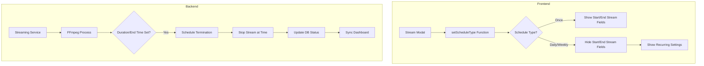

# Design Document: Mobile Schedule UI Fix & Stream Sync

## Overview

Fitur ini memperbaiki dua masalah utama:
1. **UI Mobile Fix**: Menyembunyikan field "Start Stream" dan "End Stream" pada tampilan mobile saat schedule type Daily atau Weekly dipilih, konsisten dengan perilaku desktop
2. **Stream Sync**: Memastikan stream berhenti secara otomatis sesuai durasi/end time yang dijadwalkan dan status di aplikasi tetap sinkron dengan platform streaming

## Architecture



## Components and Interfaces

### 1. Frontend Components

#### setScheduleType Function (stream-modal.js)
Fungsi yang sudah ada untuk mengatur schedule type. Perlu diperbaiki untuk:
- Menyembunyikan `onceScheduleSettings` saat Daily/Weekly dipilih (sudah ada, perlu verifikasi di mobile)
- Menampilkan `recurringScheduleSettings` saat Daily/Weekly dipilih
- Menghilangkan duplikasi label/teks

```javascript
function setScheduleType(type) {
  // Update button styles
  // Show/hide appropriate settings based on type
  // Ensure no duplicate elements are shown
}
```

#### CSS/HTML Changes (dashboard.ejs)
- Memastikan `onceScheduleSettings` tersembunyi dengan benar di mobile
- Menghapus elemen UI yang terduplikasi

### 2. Backend Components

#### Streaming Service (streamingService.js)
Sudah ada implementasi untuk:
- Duration-based termination via FFmpeg `-t` flag
- Status update saat stream berhenti

Perlu diperbaiki:
- Memastikan end time scheduling bekerja dengan benar
- Sinkronisasi status yang lebih reliable

#### Scheduler Service (schedulerService.js)
Sudah ada implementasi untuk:
- `scheduleStreamTermination()` - menjadwalkan penghentian stream
- `checkStreamDurations()` - memeriksa durasi stream yang berjalan

Perlu diperbaiki:
- Handling end time dari `schedule_end_time` field
- Memastikan termination terjadi tepat waktu

## Data Models

### Stream Model (existing)
```javascript
{
  id: string,
  schedule_type: 'once' | 'daily' | 'weekly',
  schedule_start_time: datetime,  // Untuk schedule type 'once'
  schedule_end_time: datetime,    // Untuk schedule type 'once'
  recurring_time: string,         // Format HH:MM untuk daily/weekly
  schedule_days: string,          // JSON array untuk weekly [0-6]
  recurring_enabled: boolean,
  stream_duration_hours: number,  // Durasi dalam jam
  status: 'offline' | 'live' | 'scheduled'
}
```

## Correctness Properties

*A property is a characteristic or behavior that should hold true across all valid executions of a system-essentially, a formal statement about what the system should do. Properties serve as the bridge between human-readable specifications and machine-verifiable correctness guarantees.*

### Property 1: Schedule Type Visibility Consistency
*For any* schedule type selection (once, daily, weekly), the visibility of Start/End Stream fields SHALL be consistent:
- Once: Start/End Stream fields visible, Recurring Settings hidden
- Daily/Weekly: Start/End Stream fields hidden, Recurring Settings visible

This property holds for both mobile and desktop views.

**Validates: Requirements 1.1, 1.2, 1.3, 1.4**

### Property 2: Recurring Schedule Fields Visibility
*For any* recurring schedule type (daily or weekly):
- Daily: Stream Time and Enable Recurring toggle SHALL be visible
- Weekly: Stream Time, Day Selector, and Enable Recurring toggle SHALL be visible

**Validates: Requirements 2.1, 2.2**

### Property 3: No Duplicate UI Elements
*For any* schedule type selection, each label/text element SHALL appear exactly once in the form. No duplicate labels or redundant UI elements SHALL be present.

**Validates: Requirements 2.4, 2.5**

### Property 4: Stream Auto-Termination
*For any* stream with duration or end time set:
- If `stream_duration_hours` is set, stream SHALL stop after exactly that duration
- If `schedule_end_time` is set, stream SHALL stop at that exact time
- The earlier of the two conditions SHALL trigger the stop

**Validates: Requirements 3.1, 3.2**

### Property 5: Status Update on Stream Stop
*For any* stream that stops (manually, by duration, by end time, or by error):
- Database status SHALL be updated to 'offline'
- Dashboard SHALL reflect the updated status
- No stream SHALL remain in 'live' status when FFmpeg process is not running

**Validates: Requirements 3.3, 3.4, 3.5**

## Error Handling

### Frontend
- Jika JavaScript gagal load, form tetap fungsional dengan default behavior
- Validasi input sebelum submit form

### Backend
- FFmpeg process crash: Retry hingga 3 kali, kemudian update status ke offline
- Database error: Log error dan retry
- Scheduler error: Log error dan continue checking

## Testing Strategy

### Property-Based Testing Library
Menggunakan **fast-check** untuk JavaScript property-based testing.

### Unit Tests
- Test `setScheduleType()` function dengan berbagai input
- Test visibility toggle untuk mobile dan desktop
- Test scheduler termination logic

### Property-Based Tests
Setiap property-based test HARUS:
1. Di-tag dengan format: `**Feature: mobile-schedule-ui-fix, Property {number}: {property_text}**`
2. Menjalankan minimal 100 iterasi
3. Reference ke correctness property di design document

### Integration Tests
- Test end-to-end flow dari schedule creation hingga auto-termination
- Test sinkronisasi status antara frontend dan backend
