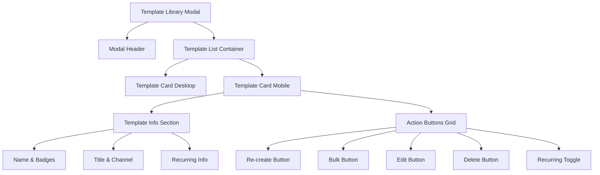

# Design Document: Mobile Template Library Fix

## Overview

Perbaikan tampilan Template Library modal pada perangkat mobile untuk memberikan pengalaman pengguna yang lebih baik. Fokus utama adalah menyederhanakan layout template cards, mengorganisir action buttons dalam grid yang rapi, dan memastikan semua informasi dapat dibaca dengan jelas tanpa terpotong.

## Architecture

Perubahan akan dilakukan pada dua komponen utama:
1. **Template Library Modal HTML** (`views/youtube.ejs`) - Struktur modal yang responsif
2. **Template Rendering JavaScript** (`public/js/youtube.js`) - Fungsi `renderTemplateList()` untuk render template cards dengan layout mobile-friendly
3. **CSS Styles** (`public/css/styles.css`) - Mobile-specific styles untuk template cards



## Components and Interfaces

### 1. Template Card Mobile Layout

```html
<!-- Mobile Template Card Structure -->
<div class="template-card bg-dark-700 rounded-lg p-4">
  <!-- Desktop Layout (hidden on mobile) -->
  <div class="hidden md:flex items-start justify-between gap-4">
    <!-- Existing desktop layout -->
  </div>
  
  <!-- Mobile Layout (hidden on desktop) -->
  <div class="md:hidden">
    <!-- Template Info -->
    <div class="mb-3">
      <div class="flex items-center gap-2 flex-wrap mb-1">
        <h4 class="font-medium text-white">{name}</h4>
        <span class="badge">{broadcast count}</span>
        <span class="badge">{auto}</span>
      </div>
      <p class="text-sm text-gray-400 mb-1">{title}</p>
      <p class="text-xs text-red-400">{channel}</p>
      <!-- Recurring Info (if enabled) -->
      <div class="recurring-info mt-2">{pattern} - Next: {time}</div>
    </div>
    
    <!-- Action Buttons Grid -->
    <div class="grid grid-cols-3 gap-2">
      <button>Re-create</button>
      <button>Bulk</button>
      <button>Edit</button>
      <button>Delete</button>
      <button>Recurring Toggle</button>
    </div>
  </div>
</div>
```

### 2. Action Button Component (Mobile)

```html
<button class="flex items-center justify-center gap-1 px-3 py-2 rounded-lg text-sm">
  <i class="ti ti-{icon}"></i>
  <span class="text-xs">{label}</span>
</button>
```

### 3. CSS Classes

```css
/* Mobile Template Card Styles */
@media (max-width: 767px) {
  .template-card-mobile .action-grid {
    display: grid;
    grid-template-columns: repeat(3, 1fr);
    gap: 0.5rem;
  }
  
  .template-card-mobile .action-btn {
    min-height: 44px;
    display: flex;
    align-items: center;
    justify-content: center;
  }
}
```

## Data Models

Tidak ada perubahan pada data model. Template data structure tetap sama:

```typescript
interface Template {
  id: string;
  name: string;
  title: string;
  channel_name: string;
  isMultiBroadcast: boolean;
  broadcasts: Broadcast[];
  recurring_enabled: boolean;
  recurring_pattern: string;
  recurring_days: string;
  recurring_time: string;
  next_run_at: string;
  created_at: string;
}
```

## Correctness Properties

*A property is a characteristic or behavior that should hold true across all valid executions of a system-essentially, a formal statement about what the system should do. Properties serve as the bridge between human-readable specifications and machine-verifiable correctness guarantees.*

### Property 1: Recurring toggle state consistency
*For any* template with `recurring_enabled` set to true or false, the rendered toggle button SHALL display the correct state ("On" with green styling when enabled, "Off" with gray styling when disabled).
**Validates: Requirements 2.2**

### Property 2: Recurring badge visibility
*For any* template with `recurring_enabled` set to true, the rendered template card SHALL contain a visible recurring pattern badge with the correct pattern text.
**Validates: Requirements 4.1**

## Error Handling

1. **Missing Template Data**: Jika template data tidak lengkap (missing name, title, atau channel), tampilkan placeholder text
2. **Invalid Recurring Pattern**: Jika recurring pattern tidak valid, tampilkan "Invalid schedule" sebagai fallback
3. **Empty Template List**: Tampilkan empty state dengan pesan yang jelas

## Testing Strategy

### Unit Tests
- Test `renderTemplateList()` function dengan berbagai template data
- Test `formatRecurringPattern()` function dengan berbagai pattern types
- Test `formatNextRun()` function dengan berbagai date formats

### Property-Based Tests
Menggunakan Jest dengan fast-check library untuk property-based testing:

1. **Property 1 Test**: Generate random templates dengan recurring_enabled true/false, verify button state matches
2. **Property 2 Test**: Generate random templates dengan recurring_enabled true, verify badge is present

### Integration Tests
- Test modal open/close behavior
- Test template CRUD operations
- Test responsive layout switching

### Manual Testing Checklist
- [ ] Verify template cards display correctly on mobile (< 768px)
- [ ] Verify action buttons are tappable (44px minimum touch target)
- [ ] Verify recurring info is readable
- [ ] Verify no horizontal scrolling on mobile
- [ ] Verify modal scrolls properly with many templates
