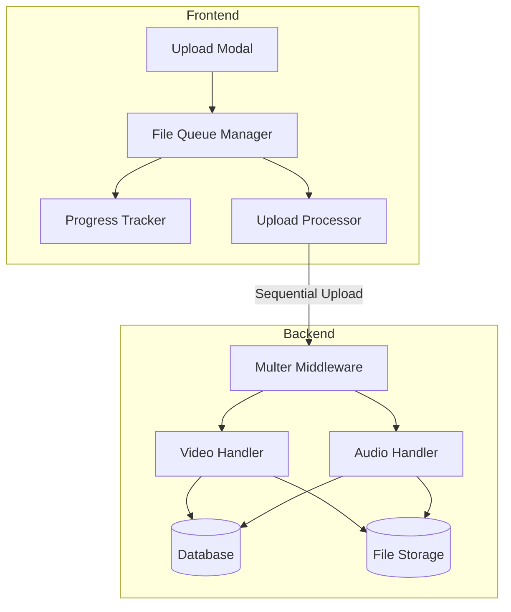

# Design Document: Multiple File Upload

## Overview

Fitur ini menambahkan kemampuan untuk mengupload beberapa file video dan audio sekaligus dalam satu operasi. Implementasi akan menggunakan pendekatan sequential upload di frontend untuk menghindari overload server, dengan progress tracking individual untuk setiap file dan kemampuan untuk cancel/retry.

## Architecture



## Components and Interfaces

### 1. Frontend Components

#### FileQueueManager (JavaScript Class)
Mengelola antrian file yang akan diupload.

```javascript
class FileQueueManager {
  constructor(options) {
    this.files = [];           // Array of FileQueueItem
    this.currentIndex = 0;
    this.isUploading = false;
    this.onProgress = options.onProgress;
    this.onFileComplete = options.onFileComplete;
    this.onAllComplete = options.onAllComplete;
  }
  
  addFiles(fileList) {}        // Add files to queue
  removeFile(index) {}         // Remove file from queue
  startUpload() {}             // Start sequential upload
  cancelCurrent() {}           // Cancel current upload
  cancelAll() {}               // Cancel all and clear queue
  retryFailed() {}             // Retry only failed files
}
```

#### FileQueueItem (Data Structure)
```javascript
{
  id: string,                  // Unique identifier
  file: File,                  // Original File object
  name: string,                // File name
  size: number,                // File size in bytes
  status: 'pending' | 'uploading' | 'success' | 'error',
  progress: number,            // 0-100
  error: string | null,        // Error message if failed
  xhr: XMLHttpRequest | null   // For abort capability
}
```

#### Upload Modal UI Updates
- File input dengan attribute `multiple`
- Dropzone yang menerima multiple files
- File list dengan progress bar per file
- Cancel button per file
- Cancel All button
- Retry Failed button
- Overall progress indicator

### 2. Backend Components

Backend tetap menggunakan endpoint yang sama (`/api/videos/upload` dan `/api/audios/upload`) karena file diupload secara sequential satu per satu dari frontend.

### 3. File Validation

#### Video Formats
- Allowed: `.mp4`, `.avi`, `.mov`
- MIME types: `video/mp4`, `video/avi`, `video/quicktime`

#### Audio Formats
- Allowed: `.mp3`, `.wav`, `.aac`, `.m4a`
- MIME types: `audio/mpeg`, `audio/wav`, `audio/aac`, `audio/x-m4a`

## Data Models

Tidak ada perubahan pada data model. Video dan Audio model tetap sama karena setiap file tetap disimpan sebagai record individual.

## Correctness Properties

*A property is a characteristic or behavior that should hold true across all valid executions of a system-essentially, a formal statement about what the system should do. Properties serve as the bridge between human-readable specifications and machine-verifiable correctness guarantees.*

### Property 1: File Filter Correctness
*For any* list of files containing both valid and invalid formats, the filter function SHALL return only files with valid formats, and the count of returned files SHALL be less than or equal to the input count.
**Validates: Requirements 1.4, 2.4**

### Property 2: File List Display Completeness
*For any* list of selected files, the rendered file list SHALL contain an entry for each file showing its name and formatted size.
**Validates: Requirements 1.3, 2.3**

### Property 3: Queue Removal Isolation
*For any* file queue with multiple files, removing a file at index N SHALL not modify files at other indices, and the queue length SHALL decrease by exactly 1.
**Validates: Requirements 4.2**

### Property 4: Upload State Transitions
*For any* file in the queue, the status SHALL transition from 'pending' to 'uploading' to either 'success' or 'error', and once in 'success' or 'error' state, the status SHALL not change unless explicitly retried.
**Validates: Requirements 3.2, 3.3**

### Property 5: Overall Progress Calculation
*For any* upload queue, the overall progress percentage SHALL equal the sum of (completed files * 100 + current file progress) divided by (total files * 100), expressed as a percentage.
**Validates: Requirements 3.5**

### Property 6: Summary Accuracy
*For any* completed upload batch, the summary SHALL show success count + failure count equal to total files, and each file SHALL be categorized correctly based on its final status.
**Validates: Requirements 3.4, 5.2**

### Property 7: Sequential Processing
*For any* upload queue, at most one file SHALL have status 'uploading' at any given time.
**Validates: Requirements 6.1**

### Property 8: Error Resilience
*For any* upload queue where file at index N fails, files at indices greater than N SHALL still be processed.
**Validates: Requirements 5.1**

### Property 9: Database Record Integrity
*For any* successfully uploaded file, querying the database SHALL return a record with matching title (derived from filename), filepath, file_size, and non-null duration.
**Validates: Requirements 6.3**

## Error Handling

### Frontend Errors
| Error Type | Handling |
|------------|----------|
| Invalid file format | Show warning, exclude from queue |
| Network error | Mark file as error, continue with next |
| Server error (5xx) | Mark file as error, allow retry |
| Upload timeout | Mark file as error, allow retry |
| User cancel | Remove from queue or abort XHR |

### Backend Errors
| Error Type | Response |
|------------|----------|
| No file provided | 400 Bad Request |
| Invalid format | 400 Bad Request |
| File too large | 413 Payload Too Large |
| Processing error | 500 Internal Server Error |

## Testing Strategy

### Unit Testing Framework
- Jest untuk backend testing
- Jest dengan jsdom untuk frontend testing

### Property-Based Testing Framework
- fast-check untuk JavaScript property-based testing

### Test Categories

1. **Unit Tests**
   - FileQueueManager methods
   - File validation functions
   - Progress calculation
   - State transitions

2. **Property-Based Tests**
   - File filter correctness (Property 1)
   - Queue operations (Property 3)
   - Progress calculation (Property 5)
   - Summary accuracy (Property 6)
   - Sequential processing (Property 7)
   - Error resilience (Property 8)

3. **Integration Tests**
   - End-to-end upload flow
   - Cancel and retry scenarios
