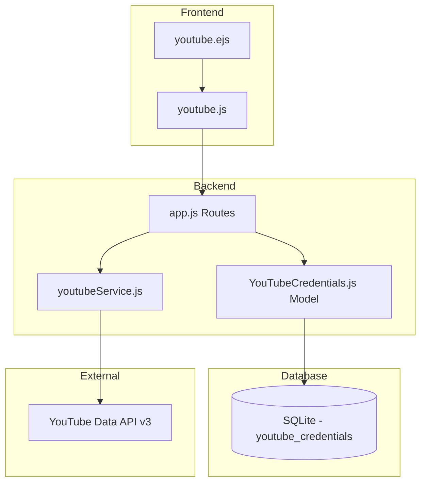

# Design Document: Multiple YouTube Accounts

## Overview

Fitur ini memperluas kemampuan YouTube Sync di StreamFlow Lite untuk mendukung multiple akun YouTube per user. Perubahan utama meliputi modifikasi database schema untuk menghapus constraint UNIQUE pada user_id, update UI untuk menampilkan dan mengelola multiple accounts, serta penambahan fitur edit dan reuse broadcast.

## Architecture

### Current State
```
User (1) -----> (1) YouTubeCredentials
```

### Target State
```
User (1) -----> (N) YouTubeCredentials
```

### Component Diagram



## Components and Interfaces

### 1. Database Schema Changes

**Modified Table: youtube_credentials**

```sql
-- Remove UNIQUE constraint on user_id
-- Add unique constraint on user_id + channel_id combination
CREATE TABLE youtube_credentials (
    id INTEGER PRIMARY KEY AUTOINCREMENT,
    user_id TEXT NOT NULL,
    client_id TEXT NOT NULL,
    client_secret TEXT NOT NULL,
    refresh_token TEXT NOT NULL,
    channel_name TEXT,
    channel_id TEXT,
    is_primary INTEGER DEFAULT 0,
    created_at TIMESTAMP DEFAULT CURRENT_TIMESTAMP,
    FOREIGN KEY (user_id) REFERENCES users(id) ON DELETE CASCADE,
    UNIQUE(user_id, channel_id)
);
```

### 2. YouTubeCredentials Model Updates

**New/Modified Methods:**

```javascript
// Find all credentials for a user
static async findAllByUserId(userId) -> Promise<Array<Credentials>>

// Find specific credential by ID
static async findById(credentialId) -> Promise<Credentials|null>

// Save new credentials (no longer updates existing)
static async create(userId, data) -> Promise<Credentials>

// Update existing credentials
static async update(credentialId, data) -> Promise<Credentials>

// Delete specific credential
static async deleteById(credentialId) -> Promise<boolean>

// Set primary account
static async setPrimary(userId, credentialId) -> Promise<boolean>

// Get primary account for user
static async getPrimary(userId) -> Promise<Credentials|null>

// Check if channel already connected
static async existsByChannel(userId, channelId) -> Promise<boolean>
```

### 3. YouTube Service Updates

**New Methods:**

```javascript
// Update existing broadcast
async updateBroadcast(accessToken, broadcastId, data) -> Promise<BroadcastInfo>

// Get broadcast details for editing
async getBroadcast(accessToken, broadcastId) -> Promise<BroadcastInfo>
```

### 4. API Routes

**New/Modified Endpoints:**

| Method | Endpoint | Description |
|--------|----------|-------------|
| GET | /youtube | Get page with all connected accounts |
| POST | /api/youtube/credentials | Add new YouTube account |
| DELETE | /api/youtube/credentials/:id | Remove specific account |
| PUT | /api/youtube/credentials/:id/primary | Set as primary account |
| GET | /api/youtube/accounts | List all connected accounts |
| GET | /api/youtube/broadcasts/:accountId | List broadcasts for specific account |
| POST | /api/youtube/broadcasts | Create broadcast (with accountId) |
| PUT | /api/youtube/broadcasts/:id | Update existing broadcast |
| GET | /api/youtube/broadcasts/:id/details | Get broadcast details for edit |
| POST | /api/youtube/broadcasts/:id/reuse | Create new broadcast from existing |

### 5. Frontend Components

**UI Changes:**

1. **Connected Accounts Section**
   - List all connected YouTube accounts as cards
   - Each card shows: channel name, channel thumbnail, disconnect button
   - "Add Account" button to connect new account
   - Primary account indicator

2. **Account Selector in Create Broadcast Modal**
   - Dropdown to select YouTube account
   - Auto-select if only one account
   - Load stream keys based on selected account

3. **Broadcast List**
   - Show channel name badge on each broadcast
   - Add "Edit" button
   - Add "Reuse" button

4. **Edit Broadcast Modal**
   - Pre-filled form with current broadcast data
   - Same fields as create modal
   - Update button instead of Create

## Data Models

### YouTubeCredential

```typescript
interface YouTubeCredential {
  id: number;
  userId: string;
  clientId: string;
  clientSecret: string;
  refreshToken: string;
  channelName: string | null;
  channelId: string | null;
  isPrimary: boolean;
  createdAt: string;
}
```

### Broadcast (Extended)

```typescript
interface Broadcast {
  id: string;
  title: string;
  description: string;
  scheduledStartTime: string;
  privacyStatus: 'public' | 'unlisted' | 'private';
  lifeCycleStatus: string;
  thumbnailUrl: string;
  streamKey: string;
  rtmpUrl: string;
  // New fields
  accountId: number;        // YouTube credential ID
  channelName: string;      // For display
}
```


## Correctness Properties

*A property is a characteristic or behavior that should hold true across all valid executions of a system-essentially, a formal statement about what the system should do. Properties serve as the bridge between human-readable specifications and machine-verifiable correctness guarantees.*

Based on the prework analysis, the following properties can be tested:

### Property 1: Adding account preserves existing accounts
*For any* user with N connected YouTube accounts, adding a new valid account should result in exactly N+1 accounts, with all original accounts preserved.
**Validates: Requirements 1.2**

### Property 2: Disconnect removes only target account
*For any* user with N connected YouTube accounts (N > 1), disconnecting a specific account should result in exactly N-1 accounts, with all other accounts unchanged.
**Validates: Requirements 3.1, 3.4**

### Property 3: All connected accounts are displayed
*For any* user with connected YouTube accounts, the YouTube page should display all accounts with their channel names visible.
**Validates: Requirements 1.4**

### Property 4: Broadcast uses selected account credentials
*For any* broadcast creation with a selected YouTube account, the system should use that account's credentials for the YouTube API call.
**Validates: Requirements 2.4**

### Property 5: Broadcast stores account identifier
*For any* created broadcast, the associated YouTube account identifier should be stored and retrievable.
**Validates: Requirements 4.3**

### Property 6: Edit form pre-fills all broadcast fields
*For any* existing broadcast, opening the edit form should pre-fill all editable fields (title, description, scheduled time, privacy status) with current values.
**Validates: Requirements 5.1**

### Property 7: Reuse copies specified fields only
*For any* broadcast being reused, the create form should be pre-filled with title, description, privacy status, tags, and category from the original broadcast, but NOT the scheduled time.
**Validates: Requirements 6.1, 6.2, 6.3**

### Property 8: Reuse creates new broadcast
*For any* reused broadcast submission, a new broadcast should be created with a different ID than the original.
**Validates: Requirements 6.5**

## Error Handling

### Credential Validation Errors
| Error | Message | Action |
|-------|---------|--------|
| Invalid Client ID | "Invalid Client ID format" | Show error, keep form open |
| Invalid Client Secret | "Invalid Client Secret" | Show error, keep form open |
| Invalid Refresh Token | "Invalid or expired Refresh Token" | Show error, keep form open |
| API Connection Failed | "Failed to connect to YouTube API" | Show error with retry option |
| Channel Already Connected | "This YouTube channel is already connected" | Show error, prevent duplicate |

### Broadcast Operation Errors
| Error | Message | Action |
|-------|---------|--------|
| Broadcast Not Found | "Broadcast not found or has been deleted" | Refresh list, show notification |
| Update Failed | "Failed to update broadcast: [reason]" | Show error, preserve form data |
| Create Failed | "Failed to create broadcast: [reason]" | Show error, preserve form data |
| Account Not Found | "Selected YouTube account not found" | Refresh accounts, show error |

## Testing Strategy

### Unit Tests
- YouTubeCredentials model methods (CRUD operations)
- Account selection logic
- Form pre-fill logic for edit/reuse
- Error message generation

### Property-Based Tests
Using **fast-check** library for JavaScript property-based testing.

Each property test should:
- Run minimum 100 iterations
- Tag with format: `**Feature: multiple-youtube-accounts, Property {number}: {property_text}**`

**Test Structure:**
```javascript
// Example property test structure
describe('Multiple YouTube Accounts Properties', () => {
  it('Property 1: Adding account preserves existing accounts', () => {
    // **Feature: multiple-youtube-accounts, Property 1: Adding account preserves existing accounts**
    fc.assert(
      fc.property(
        fc.array(credentialArbitrary, { minLength: 0, maxLength: 10 }),
        fc.record({ clientId: fc.string(), ... }),
        (existingAccounts, newAccount) => {
          // Setup: Create user with existingAccounts
          // Action: Add newAccount
          // Assert: Count is existingAccounts.length + 1
          // Assert: All original accounts still exist
        }
      ),
      { numRuns: 100 }
    );
  });
});
```

### Integration Tests
- Full flow: Connect account → Create broadcast → Edit → Reuse
- Multi-account scenarios
- Error recovery scenarios

## Migration Plan

### Database Migration
1. Create backup of youtube_credentials table
2. Remove UNIQUE constraint on user_id
3. Add is_primary column with default 0
4. Add UNIQUE constraint on (user_id, channel_id)
5. Set existing records as primary (is_primary = 1)

```sql
-- Migration script
BEGIN TRANSACTION;

-- Create new table with updated schema
CREATE TABLE youtube_credentials_new (
    id INTEGER PRIMARY KEY AUTOINCREMENT,
    user_id TEXT NOT NULL,
    client_id TEXT NOT NULL,
    client_secret TEXT NOT NULL,
    refresh_token TEXT NOT NULL,
    channel_name TEXT,
    channel_id TEXT,
    is_primary INTEGER DEFAULT 0,
    created_at TIMESTAMP DEFAULT CURRENT_TIMESTAMP,
    FOREIGN KEY (user_id) REFERENCES users(id) ON DELETE CASCADE,
    UNIQUE(user_id, channel_id)
);

-- Copy existing data and set as primary
INSERT INTO youtube_credentials_new 
    (id, user_id, client_id, client_secret, refresh_token, channel_name, channel_id, is_primary, created_at)
SELECT id, user_id, client_id, client_secret, refresh_token, channel_name, channel_id, 1, created_at
FROM youtube_credentials;

-- Drop old table and rename new
DROP TABLE youtube_credentials;
ALTER TABLE youtube_credentials_new RENAME TO youtube_credentials;

COMMIT;
```

### Backward Compatibility
- Existing single-account users will have their account marked as primary
- All existing functionality continues to work
- New multi-account features are additive
