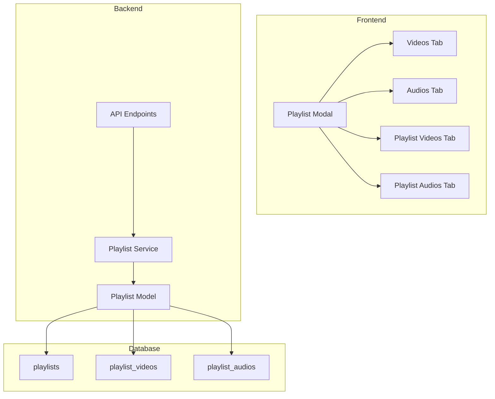

# Design Document: Playlist Audio Selection

## Overview

Fitur ini menambahkan kemampuan untuk memilih audio dalam playlist menggunakan sistem tab. UI akan memiliki dua kolom dengan tab masing-masing:
- Kolom kiri: Tab "Videos" | "Audios" untuk available media
- Kolom kanan: Tab "Playlist Videos" | "Playlist Audios" untuk selected media

Implementasi memerlukan:
1. Tabel database baru `playlist_audios` untuk menyimpan relasi playlist-audio
2. Update model Playlist untuk mendukung audio
3. Update UI playlist modal dengan sistem tab
4. Update API endpoints untuk handle audio

## Architecture



## Components and Interfaces

### 1. Database Schema

Tabel baru `playlist_audios`:
```sql
CREATE TABLE IF NOT EXISTS playlist_audios (
    id TEXT PRIMARY KEY,
    playlist_id TEXT NOT NULL,
    audio_id TEXT NOT NULL,
    position INTEGER NOT NULL,
    created_at TIMESTAMP DEFAULT CURRENT_TIMESTAMP,
    FOREIGN KEY (playlist_id) REFERENCES playlists(id) ON DELETE CASCADE,
    FOREIGN KEY (audio_id) REFERENCES audios(id) ON DELETE CASCADE
)
```

### 2. Playlist Model Updates

```javascript
// New methods in Playlist model
static findByIdWithMedia(id) // Returns playlist with both videos and audios
static addAudio(playlistId, audioId, position)
static removeAudio(playlistId, audioId)
static updateAudioPositions(playlistId, audioPositions)
static getAudioNextPosition(playlistId)
```

### 3. API Endpoints

Existing endpoints yang perlu diupdate:
- `POST /api/playlists` - Accept audios array
- `PUT /api/playlists/:id` - Accept audios array
- `GET /api/playlists/:id` - Return audios in response

### 4. Frontend Components

Tab structure di playlist modal:
```html
<!-- Left Column: Available Media -->
<div class="tabs">
    <button data-tab="available-videos">Videos</button>
    <button data-tab="available-audios">Audios</button>
</div>
<div id="available-videos">...</div>
<div id="available-audios">...</div>

<!-- Right Column: Selected Media -->
<div class="tabs">
    <button data-tab="selected-videos">Playlist Videos</button>
    <button data-tab="selected-audios">Playlist Audios</button>
</div>
<div id="selected-videos">...</div>
<div id="selected-audios">...</div>
```

## Data Models

### Playlist with Media
```javascript
{
    id: string,
    name: string,
    description: string,
    is_shuffle: boolean,
    user_id: string,
    videos: [
        { id, title, thumbnail_path, duration, position }
    ],
    audios: [
        { id, title, filepath, duration, position }
    ],
    video_count: number,
    audio_count: number
}
```

### API Request Body
```javascript
// POST/PUT /api/playlists
{
    name: string,
    description: string,
    shuffle: boolean,
    videos: string[],  // array of video IDs
    audios: string[]   // array of audio IDs
}
```

## Correctness Properties

*A property is a characteristic or behavior that should hold true across all valid executions of a system-essentially, a formal statement about what the system should do. Properties serve as the bridge between human-readable specifications and machine-verifiable correctness guarantees.*

### Property 1: Audio Selection Moves Audio Between Lists
*For any* audio in the available list, when it is added to the selected list, it should no longer appear in the available list and should appear in the selected list.
**Validates: Requirements 3.1, 3.3**

### Property 2: Audio Removal Returns Audio to Available List
*For any* audio in the selected list, when it is removed, it should no longer appear in the selected list and should appear in the available list.
**Validates: Requirements 3.2, 3.4**

### Property 3: Audio Reorder Preserves All Audios
*For any* reorder operation on selected audios, the set of audios before and after reordering should be identical (only positions change).
**Validates: Requirements 3.5**

### Property 4: Audio Persistence Round Trip
*For any* playlist with selected audios, saving the playlist and then loading it should return the same set of audios in the same order.
**Validates: Requirements 4.1, 4.2**

## Error Handling

| Error Case | Handling |
|------------|----------|
| Audio not found | Return 404 with message "Audio not found" |
| Invalid audio ID | Validate UUID format, return 400 if invalid |
| Database error | Log error, return 500 with generic message |
| Duplicate audio in playlist | Silently ignore, don't add duplicate |

## Testing Strategy

### Unit Tests
- Test Playlist model methods for audio operations
- Test API endpoint validation
- Test tab switching logic

### Property-Based Tests
Library: **fast-check** (JavaScript property-based testing library)

Each property test should run minimum 100 iterations.

- **Property 1**: Generate random available audios, add random subset, verify mutual exclusion
- **Property 2**: Generate random selected audios, remove random subset, verify return to available
- **Property 3**: Generate random audio list, apply random permutation, verify set equality
- **Property 4**: Generate random playlist with audios, save and load, verify equality

Test annotations format: `**Feature: playlist-audio-selection, Property {number}: {property_text}**`
