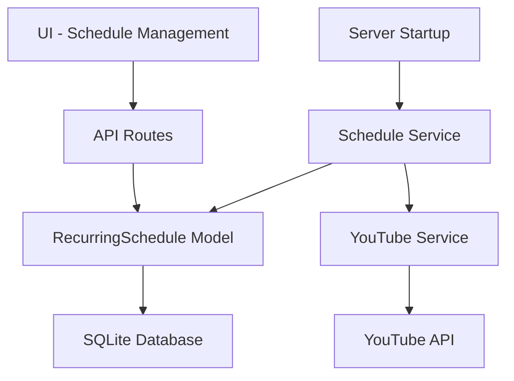

# Design Document: Recurring Broadcast Schedule

## Overview

Fitur Recurring Broadcast Schedule memungkinkan pengguna membuat jadwal broadcast berulang secara otomatis. Sistem akan membuat broadcast baru di YouTube sesuai jadwal yang ditentukan (daily atau weekly) menggunakan template settings yang dikonfigurasi.

Komponen utama:
- Model RecurringSchedule untuk menyimpan konfigurasi jadwal
- Schedule Service untuk menjalankan pembuatan broadcast otomatis
- UI untuk membuat dan mengelola jadwal

## Architecture



## Components and Interfaces

### 1. Database Schema

```sql
CREATE TABLE recurring_schedules (
  id TEXT PRIMARY KEY,
  user_id TEXT NOT NULL,
  account_id INTEGER NOT NULL,
  name TEXT NOT NULL,
  pattern TEXT NOT NULL CHECK(pattern IN ('daily', 'weekly')),
  schedule_time TEXT NOT NULL,
  days_of_week TEXT,
  title_template TEXT NOT NULL,
  description TEXT,
  privacy_status TEXT DEFAULT 'unlisted',
  tags TEXT,
  category_id TEXT DEFAULT '20',
  is_active INTEGER DEFAULT 1,
  last_run_at TEXT,
  next_run_at TEXT,
  created_at TEXT DEFAULT CURRENT_TIMESTAMP,
  updated_at TEXT DEFAULT CURRENT_TIMESTAMP,
  FOREIGN KEY (user_id) REFERENCES users(id),
  FOREIGN KEY (account_id) REFERENCES youtube_credentials(id)
);
```

### 2. RecurringSchedule Model

```javascript
class RecurringSchedule {
  static create(scheduleData)
  static findById(id)
  static findByUserId(userId)
  static findActiveSchedules()
  static update(id, scheduleData)
  static delete(id, userId)
  static updateLastRun(id, lastRunAt, nextRunAt)
}
```

### 3. Schedule Service

```javascript
class ScheduleService {
  constructor()
  init()                          // Load and start all active schedules
  scheduleJob(schedule)           // Schedule a cron job for a schedule
  cancelJob(scheduleId)           // Cancel a scheduled job
  executeSchedule(schedule)       // Create broadcast from schedule
  calculateNextRun(schedule)      // Calculate next execution time
  replacePlaceholders(template, date)  // Replace {date}, {time}, {day} placeholders
}
```

### 4. API Endpoints

| Method | Endpoint | Description |
|--------|----------|-------------|
| GET | /api/schedules | Get all schedules for user |
| POST | /api/schedules | Create new schedule |
| GET | /api/schedules/:id | Get schedule by ID |
| PUT | /api/schedules/:id | Update schedule |
| DELETE | /api/schedules/:id | Delete schedule |
| POST | /api/schedules/:id/toggle | Toggle schedule active status |

### 5. UI Components

Schedule List dalam halaman YouTube:
```
┌─────────────────────────────────────────────────────────────┐
│ Recurring Schedules                          [+ New Schedule]│
├─────────────────────────────────────────────────────────────┤
│ ☑ Daily Stream    │ Daily 19:00    │ Active   │ [Edit][Del] │
│ ☑ Weekend Show    │ Sat,Sun 20:00  │ Active   │ [Edit][Del] │
│ ☐ Weekday News    │ Mon-Fri 08:00  │ Paused   │ [Edit][Del] │
└─────────────────────────────────────────────────────────────┘
```

Create/Edit Schedule Modal:
```
┌─────────────────────────────────────────────────────────────┐
│ Create Recurring Schedule                              [X]  │
├─────────────────────────────────────────────────────────────┤
│ Schedule Name: [________________________]                   │
│                                                             │
│ Pattern: (●) Daily  ( ) Weekly                              │
│                                                             │
│ Time: [19:00]                                               │
│                                                             │
│ Days (Weekly only):                                         │
│ [ ] Mon [✓] Tue [ ] Wed [ ] Thu [✓] Fri [ ] Sat [ ] Sun    │
│                                                             │
│ ─── Broadcast Settings ───                                  │
│ Title: [Live Stream {day} {date}___________]                │
│ Description: [_____________________________]                │
│ Privacy: [Unlisted ▼]                                       │
│ Account: [Channel Name ▼]                                   │
│                                                             │
│              [Cancel]  [Save Schedule]                      │
└─────────────────────────────────────────────────────────────┘
```

## Data Models

### RecurringSchedule Object

```javascript
{
  id: string,
  user_id: string,
  account_id: number,
  name: string,
  pattern: 'daily' | 'weekly',
  schedule_time: string,        // Format: "HH:mm"
  days_of_week: string | null,  // JSON array: ["mon","tue","wed","thu","fri","sat","sun"]
  title_template: string,       // Supports {date}, {time}, {day} placeholders
  description: string | null,
  privacy_status: 'public' | 'unlisted' | 'private',
  tags: string | null,          // JSON array
  category_id: string,
  is_active: boolean,
  last_run_at: string | null,
  next_run_at: string | null,
  created_at: string,
  updated_at: string
}
```

### Title Placeholders

| Placeholder | Description | Example |
|-------------|-------------|---------|
| {date} | Current date | "24 Dec 2025" |
| {time} | Scheduled time | "19:00" |
| {day} | Day of week | "Wednesday" |
| {day_short} | Short day | "Wed" |
| {month} | Month name | "December" |
| {year} | Year | "2025" |


## Correctness Properties

*A property is a characteristic or behavior that should hold true across all valid executions of a system-essentially, a formal statement about what the system should do. Properties serve as the bridge between human-readable specifications and machine-verifiable correctness guarantees.*

### Property 1: Daily Schedule Execution
*For any* active daily schedule, when the scheduled time arrives, the system SHALL create a broadcast with settings matching the schedule template (title with placeholders replaced, description, privacy, tags).
**Validates: Requirements 1.2, 1.3, 1.4**

### Property 2: Weekly Schedule Validation
*For any* weekly schedule being saved, if no days of the week are selected, the system SHALL reject the save operation and return an error.
**Validates: Requirements 2.4**

### Property 3: Placeholder Replacement
*For any* title template containing placeholders ({date}, {time}, {day}, etc.), the replacePlaceholders function SHALL return a string with all placeholders replaced by actual date/time values.
**Validates: Requirements 4.4**

### Property 4: Schedule Toggle Effect
*For any* schedule that is toggled to inactive, the system SHALL NOT create broadcasts for that schedule until it is toggled back to active.
**Validates: Requirements 3.2**

### Property 5: Next Run Calculation
*For any* schedule (daily or weekly), the calculateNextRun function SHALL return a timestamp that is in the future and matches the schedule pattern.
**Validates: Requirements 1.4, 2.3**

## Error Handling

| Scenario | Handling |
|----------|----------|
| YouTube API error | Log error, retry up to 3 times, mark schedule as failed if all retries fail |
| Invalid schedule time | Reject with validation error |
| No days selected (weekly) | Reject with validation error |
| Account not found | Log error, skip schedule execution |
| Database error | Log error, continue with other schedules |

## Testing Strategy

### Unit Testing

Unit tests akan memverifikasi:
- RecurringSchedule model CRUD operations
- Placeholder replacement function
- Next run calculation for daily and weekly patterns
- Schedule validation (required fields, weekly days)

### Property-Based Testing

Menggunakan **fast-check** library untuk JavaScript property-based testing.

Property tests akan memverifikasi:
1. **Property 1**: Untuk setiap daily schedule aktif, broadcast yang dibuat memiliki settings yang sesuai
2. **Property 2**: Untuk setiap weekly schedule tanpa hari yang dipilih, save operation ditolak
3. **Property 3**: Untuk setiap title template dengan placeholder, output tidak mengandung placeholder
4. **Property 4**: Untuk setiap schedule yang di-toggle inactive, tidak ada broadcast yang dibuat
5. **Property 5**: Untuk setiap schedule, next run time selalu di masa depan dan sesuai pattern

Setiap property test akan:
- Menjalankan minimal 100 iterasi
- Menggunakan generator untuk membuat data schedule random
- Di-tag dengan format: `**Feature: recurring-broadcast-schedule, Property {number}: {property_text}**`
