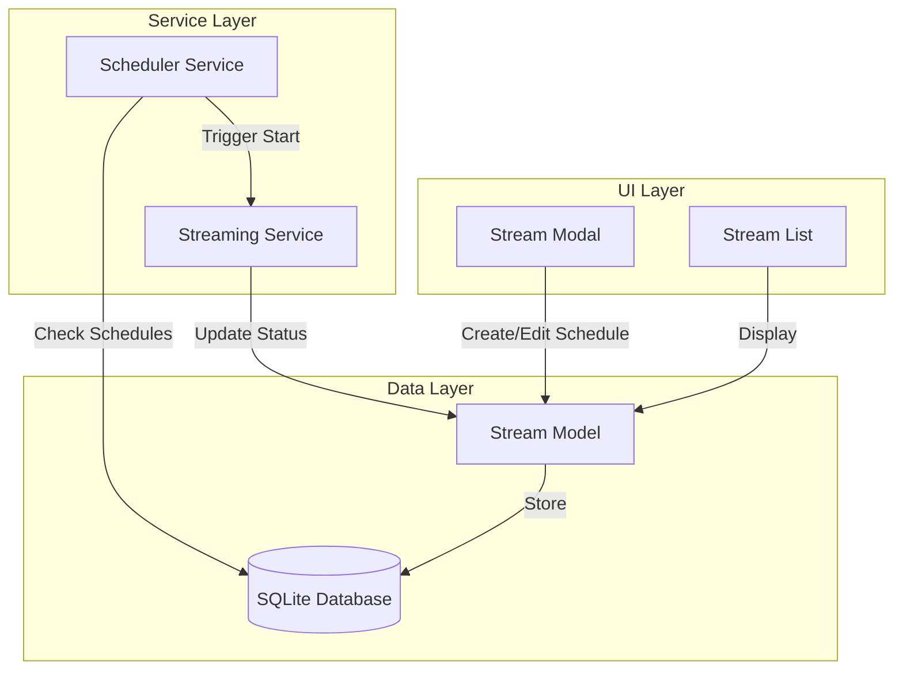

# Design Document: Recurring Schedule

## Overview

Fitur Recurring Schedule memungkinkan pengguna menjadwalkan live streaming secara otomatis dengan pola berulang harian (daily) atau mingguan (weekly). Sistem akan menggunakan scheduler service yang sudah ada dan memperluas fungsionalitasnya untuk mendukung jadwal berulang.

## Architecture



## Components and Interfaces

### 1. Database Schema Extension

Extend the `streams` table with recurring schedule fields:

```sql
ALTER TABLE streams ADD COLUMN schedule_type TEXT DEFAULT 'once';
-- 'once' = one-time schedule (existing behavior)
-- 'daily' = repeat every day
-- 'weekly' = repeat on specific days

ALTER TABLE streams ADD COLUMN schedule_days TEXT DEFAULT NULL;
-- JSON array of day numbers [0-6] where 0=Sunday
-- Example: "[1,3,5]" for Monday, Wednesday, Friday

ALTER TABLE streams ADD COLUMN recurring_time TEXT DEFAULT NULL;
-- Time in HH:MM format for recurring schedules

ALTER TABLE streams ADD COLUMN recurring_enabled INTEGER DEFAULT 1;
-- 1 = enabled, 0 = disabled
```

### 2. Stream Model Interface

```javascript
// Extended Stream model methods
class Stream {
  // Existing methods...
  
  static async findRecurringSchedules(scheduleType, currentDay, currentTime);
  static async updateRecurringEnabled(id, enabled, userId);
  static async getNextScheduledTime(stream);
}
```

### 3. Scheduler Service Interface

```javascript
// Extended scheduler service
const schedulerService = {
  // Existing methods...
  
  checkRecurringSchedules(),      // Check and trigger recurring schedules
  shouldTriggerDaily(stream),     // Check if daily schedule should trigger
  shouldTriggerWeekly(stream),    // Check if weekly schedule should trigger
  calculateNextRun(stream),       // Calculate next scheduled run time
};
```

### 4. Schedule Configuration Interface

```typescript
interface ScheduleConfig {
  schedule_type: 'once' | 'daily' | 'weekly';
  schedule_time?: string;        // For one-time: ISO datetime, For recurring: HH:MM
  schedule_days?: number[];      // For weekly: array of day numbers [0-6]
  recurring_time?: string;       // HH:MM format for daily/weekly
  recurring_enabled: boolean;
}
```

## Data Models

### Schedule Configuration Object

```javascript
{
  schedule_type: 'weekly',
  schedule_days: [1, 3, 5],      // Monday, Wednesday, Friday
  recurring_time: '20:00',       // 8 PM
  recurring_enabled: true,
  duration: 120                  // 2 hours in minutes
}
```

### Stream with Recurring Schedule

```javascript
{
  id: 'uuid',
  title: 'Daily Music Stream',
  video_id: 'video-uuid',
  stream_key: 'xxxx-xxxx-xxxx',
  schedule_type: 'daily',
  recurring_time: '19:00',
  recurring_enabled: true,
  duration: 180,
  status: 'scheduled'
}
```

## Correctness Properties

*A property is a characteristic or behavior that should hold true across all valid executions of a system-essentially, a formal statement about what the system should do. Properties serve as the bridge between human-readable specifications and machine-verifiable correctness guarantees.*

### Property 1: Schedule Serialization Round-Trip

*For any* valid schedule configuration object, serializing it to JSON and then deserializing back SHALL produce an equivalent schedule configuration object.

**Validates: Requirements 6.1, 6.2**

### Property 2: Weekly Schedule Day Validation

*For any* weekly schedule configuration, the system SHALL reject configurations where schedule_days is empty or contains invalid day numbers (outside 0-6 range).

**Validates: Requirements 1.5**

### Property 3: Daily Schedule Trigger Correctness

*For any* enabled daily schedule and any time value, the scheduler SHALL trigger the stream if and only if the current time matches the recurring_time (within a 1-minute tolerance).

**Validates: Requirements 2.1**

### Property 4: Weekly Schedule Trigger Correctness

*For any* enabled weekly schedule, any day of week, and any time value, the scheduler SHALL trigger the stream if and only if the current day is in schedule_days AND the current time matches recurring_time (within a 1-minute tolerance).

**Validates: Requirements 2.2**

### Property 5: Disabled Schedule No-Trigger

*For any* schedule with recurring_enabled set to false, the scheduler SHALL NOT trigger automatic stream starts regardless of time or day matching.

**Validates: Requirements 3.3**

### Property 6: Schedule Enable/Disable Preservation

*For any* schedule that is disabled and then re-enabled, the schedule configuration (schedule_type, schedule_days, recurring_time) SHALL remain unchanged.

**Validates: Requirements 3.4**

### Property 7: Concurrent Stream Skip

*For any* recurring schedule trigger where the associated stream is already in 'live' status, the scheduler SHALL skip the trigger and log the skip event.

**Validates: Requirements 5.1**

### Property 8: Serialized Fields Completeness

*For any* serialized schedule JSON, the output SHALL contain all required fields: schedule_type, recurring_time (if applicable), schedule_days (if weekly), and recurring_enabled.

**Validates: Requirements 6.3**

### Property 9: Next Run Time Calculation

*For any* enabled recurring schedule, the calculated next run time SHALL always be in the future relative to the current time.

**Validates: Requirements 3.1**

## Error Handling

### Schedule Validation Errors

| Error Condition | Handling |
|----------------|----------|
| Empty schedule_days for weekly | Reject with validation error message |
| Invalid day number (not 0-6) | Reject with validation error message |
| Invalid time format | Reject with validation error message |
| Missing required fields | Provide default values or reject |

### Runtime Errors

| Error Condition | Handling |
|----------------|----------|
| Stream already live | Skip trigger, log event |
| Video file missing | Mark schedule error, log, continue others |
| Database error | Log error, retry on next interval |
| FFmpeg start failure | Log error, mark stream as failed |

### Error Logging Format

```javascript
{
  timestamp: '2025-12-05T10:00:00Z',
  stream_id: 'uuid',
  schedule_type: 'daily',
  error_type: 'STREAM_ALREADY_LIVE',
  message: 'Skipped scheduled start - stream already live',
  next_attempt: '2025-12-06T10:00:00Z'
}
```

## Testing Strategy

### Property-Based Testing Library

Menggunakan **fast-check** untuk property-based testing di JavaScript/Node.js.

### Unit Tests

1. Schedule configuration validation
2. Time matching logic for daily schedules
3. Day and time matching logic for weekly schedules
4. Next run time calculation
5. Database CRUD operations for schedule fields

### Property-Based Tests

Setiap correctness property akan diimplementasikan sebagai property-based test menggunakan fast-check:

1. **Property 1**: Generate random schedule configs, serialize/deserialize, verify equality
2. **Property 2**: Generate weekly schedules with various day arrays, verify validation
3. **Property 3**: Generate daily schedules and time values, verify trigger logic
4. **Property 4**: Generate weekly schedules, days, and times, verify trigger logic
5. **Property 5**: Generate disabled schedules, verify no triggers
6. **Property 6**: Generate schedules, disable/enable, verify config preservation
7. **Property 7**: Generate schedules with live streams, verify skip behavior
8. **Property 8**: Generate schedules, serialize, verify field presence
9. **Property 9**: Generate schedules, calculate next run, verify future time

### Test Configuration

```javascript
// fast-check configuration
fc.configureGlobal({
  numRuns: 100,  // Minimum 100 iterations per property
  verbose: true
});
```

### Test Annotation Format

Setiap property-based test harus di-tag dengan format:
```javascript
// **Feature: recurring-schedule, Property 1: Schedule Serialization Round-Trip**
```
