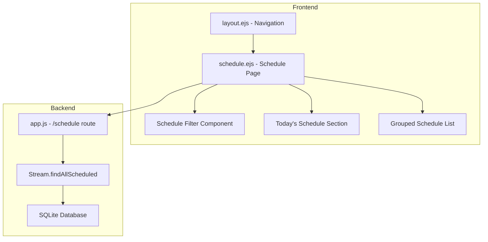

# Design Document: Replace History with Schedule

## Overview

Fitur ini mengganti menu "History" dengan halaman "Schedule" yang menampilkan overview jadwal streaming. Halaman baru ini akan memberikan visibility yang lebih baik terhadap semua stream yang terjadwal, baik yang berjalan sekali (once), harian (daily), maupun mingguan (weekly).

Perubahan utama:
1. Update navigasi sidebar dan bottom navigation untuk mengganti History dengan Schedule
2. Membuat route baru `/schedule` dan view `schedule.ejs`
3. Menampilkan Today's Schedule dan grouped schedule list
4. Implementasi client-side filtering

## Architecture



## Components and Interfaces

### 1. Navigation Update (layout.ejs)

Mengganti menu History dengan Schedule:
- Desktop sidebar: `/history` → `/schedule`
- Mobile bottom nav: `/history` → `/schedule`
- Icon: `ti-clock-hour-4` → `ti-calendar-event`
- Label: "History" → "Schedule"
- Active state: `active === 'history'` → `active === 'schedule'`

### 2. Schedule Route (app.js)

```javascript
// New route
app.get('/schedule', isAuthenticated, async (req, res) => {
  const streams = await Stream.findAllScheduled(req.session.user_id);
  res.render('schedule', {
    title: 'Schedule',
    active: 'schedule',
    streams: streams,
    helpers: helpers
  });
});
```

### 3. Stream Model Extension (models/Stream.js)

```javascript
// New method to find all scheduled streams
static findAllScheduled(userId) {
  // Returns streams with:
  // - schedule_type = 'once' AND schedule_time IS NOT NULL
  // - schedule_type = 'daily' OR 'weekly' (recurring)
  // Grouped by schedule_type
}
```

### 4. Schedule Page (views/schedule.ejs)

Struktur halaman:
- Header dengan title dan filter dropdown
- Today's Schedule section (streams yang dijadwalkan hari ini)
- Grouped schedule sections (Once, Daily, Weekly)
- Empty state jika tidak ada jadwal

## Data Models

### Stream Schedule Data (existing)

```javascript
{
  id: string,
  title: string,
  platform: string,
  schedule_type: 'once' | 'daily' | 'weekly',
  schedule_time: string | null,      // ISO datetime for 'once'
  recurring_time: string | null,     // HH:MM for daily/weekly
  schedule_days: number[] | null,    // [0-6] for weekly (0=Sunday)
  recurring_enabled: boolean,
  stream_duration_hours: number | null,
  duration: number | null,           // in minutes
  status: 'offline' | 'scheduled' | 'live'
}
```

### Schedule Display Data (computed)

```javascript
{
  ...stream,
  nextRunTime: Date | null,          // Computed next run time
  timeUntilStart: string | null,     // "2h 30m" format
  isToday: boolean                   // Whether scheduled for today
}
```

## Correctness Properties

*A property is a characteristic or behavior that should hold true across all valid executions of a system-essentially, a formal statement about what the system should do. Properties serve as the bridge between human-readable specifications and machine-verifiable correctness guarantees.*

### Property 1: Schedule grouping by type
*For any* list of streams with mixed schedule types, grouping them by schedule_type should result in each group containing only streams of that specific type, and the union of all groups should equal the original list.
**Validates: Requirements 2.1, 3.2**

### Property 2: Stream display contains required fields
*For any* stream object with valid data, the display representation should include the stream title, platform, schedule time (or recurring time), and duration.
**Validates: Requirements 2.2**

### Property 3: Next run time calculation for recurring streams
*For any* recurring stream (daily or weekly) with a valid recurring_time, the calculated next run time should be in the future and match the configured time and day constraints.
**Validates: Requirements 2.3**

### Property 4: Today's schedule chronological ordering
*For any* list of streams scheduled for today, sorting them by their scheduled time should produce a list where each stream's time is greater than or equal to the previous stream's time.
**Validates: Requirements 4.2**

### Property 5: Filter produces correct subset
*For any* list of streams and any valid filter value ('all', 'once', 'daily', 'weekly'), the filtered result should be a subset of the original list where all items match the filter criteria.
**Validates: Requirements 3.2**

## Error Handling

| Scenario | Handling |
|----------|----------|
| Database query fails | Log error, show user-friendly error message |
| No scheduled streams | Display empty state with helpful message |
| Invalid schedule data | Skip invalid entries, log warning |
| Missing video reference | Show stream with "Video not found" indicator |

## Testing Strategy

### Unit Tests
- Test `Stream.findAllScheduled()` returns correct data
- Test schedule grouping logic
- Test today's schedule filtering
- Test next run time calculation edge cases

### Property-Based Tests
Using fast-check library for JavaScript:

1. **Property 1 Test**: Generate random lists of streams with various schedule_types, verify grouping correctness
2. **Property 3 Test**: Generate random recurring schedules, verify next run time is always in future and matches constraints
3. **Property 4 Test**: Generate random today's schedules, verify chronological ordering
4. **Property 5 Test**: Generate random stream lists and filter values, verify filter produces correct subset

### Integration Tests
- Test `/schedule` route returns correct page
- Test navigation links work correctly
- Test filter UI updates display correctly
