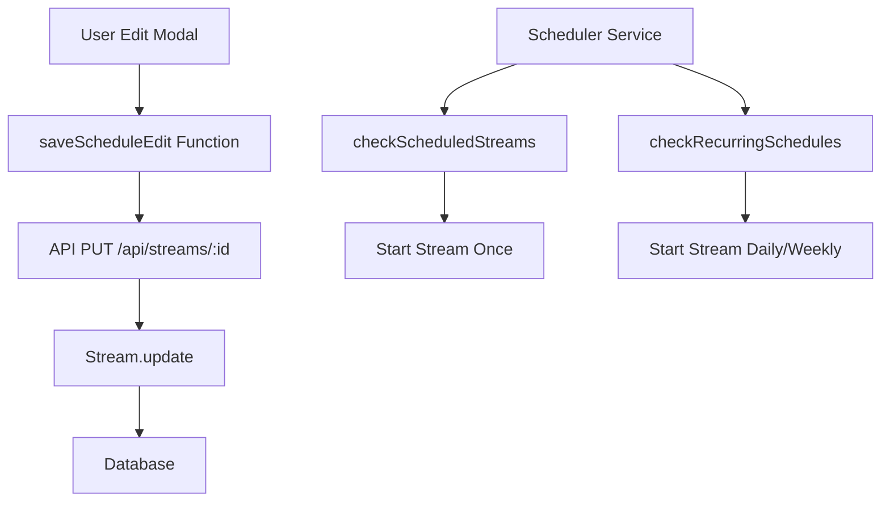

# Design Document: Schedule Time Fix

## Overview

Perbaikan ini mengatasi masalah dimana waktu Start Stream dan End Stream berubah ketika modal edit dibuka kembali. Masalah utama adalah ketidakcocokan nama field antara frontend dan backend API, serta penanganan timezone yang tidak konsisten.

## Architecture

Sistem penjadwalan terdiri dari komponen berikut:
- **Frontend (schedule.ejs)**: Modal edit untuk mengubah jadwal stream
- **Backend API (app.js)**: Endpoint PUT /api/streams/:id untuk menyimpan perubahan
- **Model (Stream.js)**: Model database untuk stream
- **Scheduler Service (schedulerService.js)**: Service untuk menjalankan jadwal otomatis



## Components and Interfaces

### 1. Frontend - schedule.ejs

**saveScheduleEdit() Function**
- Mengumpulkan data dari form
- Mengkonversi waktu lokal ke format yang benar
- Mengirim data dengan nama field yang sesuai dengan API

**Field Mapping:**
| Form Field | API Field Name |
|------------|----------------|
| editScheduleTime | scheduleStartTime |
| editEndTime | scheduleEndTime |
| editDurationHours + editDurationMinutes | streamDurationHours, streamDurationMinutes |
| editRecurringTime | recurringTime |
| editRecurringEnabled | recurringEnabled |
| editSelectedDays | scheduleDays |

### 2. Backend API - app.js

**PUT /api/streams/:id**
- Menerima field dengan nama yang sudah ditentukan
- Mengkonversi datetime-local string ke ISO string
- Menyimpan ke database

### 3. Scheduler Service

**checkRecurringSchedules()**
- Menggunakan WIB timezone untuk perbandingan waktu
- Trigger stream pada waktu yang tepat (toleransi 0-5 menit setelah jadwal)

## Data Models

### Stream Table Fields
```
schedule_time: TEXT (ISO 8601 string) - untuk jadwal once
end_time: TEXT (ISO 8601 string) - waktu berakhir untuk jadwal once
stream_duration_minutes: INTEGER - durasi dalam menit
schedule_type: TEXT ('once', 'daily', 'weekly')
recurring_time: TEXT (HH:MM format) - waktu untuk jadwal berulang
schedule_days: TEXT (JSON array) - hari untuk jadwal weekly [0-6]
recurring_enabled: INTEGER (0/1) - status aktif recurring
```

## Correctness Properties

*A property is a characteristic or behavior that should hold true across all valid executions of a system-essentially, a formal statement about what the system should do. Properties serve as the bridge between human-readable specifications and machine-verifiable correctness guarantees.*

### Property 1: Duration calculation consistency
*For any* non-negative hours and minutes values, the total duration in minutes SHALL equal (hours * 60 + minutes)
**Validates: Requirements 1.3, 3.1**

### Property 2: Duration display round-trip
*For any* total minutes value, displaying as hours and minutes then recalculating SHALL produce the same total minutes
**Validates: Requirements 3.3**

### Property 3: ISO to local datetime conversion
*For any* valid ISO 8601 string, formatDateTimeLocal SHALL produce a valid datetime-local format string (YYYY-MM-DDTHH:MM)
**Validates: Requirements 1.1, 4.1**

### Property 4: Local to ISO conversion round-trip
*For any* valid datetime-local string, converting to ISO then back to local SHALL preserve the same date and time components
**Validates: Requirements 1.4, 4.2**

### Property 5: Recurring time format validation
*For any* saved recurring_time, the format SHALL match HH:MM pattern where HH is 00-23 and MM is 00-59
**Validates: Requirements 2.1**

### Property 6: Weekly schedule days persistence
*For any* array of day numbers (0-6), saving and loading schedule_days SHALL return the same array
**Validates: Requirements 2.2**

### Property 7: Scheduler trigger timing accuracy
*For any* recurring schedule with specified time, shouldTriggerDaily/shouldTriggerWeekly SHALL return true only when current time is within 0-5 minutes after scheduled time
**Validates: Requirements 2.4**

### Property 8: WIB timezone consistency
*For any* Date object, getWIBTime SHALL return hours, minutes, and day values that correspond to Asia/Jakarta timezone
**Validates: Requirements 4.3**

## Error Handling

1. **Invalid datetime input**: Jika user memasukkan waktu yang tidak valid, sistem akan menampilkan error dan tidak menyimpan perubahan
2. **End time before start time**: API akan menolak jika end_time lebih awal dari schedule_time
3. **Missing required fields**: Validasi di frontend dan backend untuk memastikan field wajib terisi
4. **Timezone conversion errors**: Fallback ke manual calculation jika Intl.DateTimeFormat gagal

## Testing Strategy

### Unit Tests
- Test formatDateTimeLocal function dengan berbagai ISO string
- Test duration calculation (hours * 60 + minutes)
- Test duration display (floor division dan modulo)
- Test API field name mapping

### Property-Based Tests
Menggunakan Jest dengan fast-check library untuk property-based testing:
- Test duration calculation untuk semua kombinasi hours/minutes yang valid
- Test round-trip conversion untuk datetime
- Test scheduler trigger timing dengan berbagai waktu input

### Integration Tests
- Test full flow: edit modal -> save -> reload -> verify values
- Test scheduler dengan mock time untuk verify trigger timing

