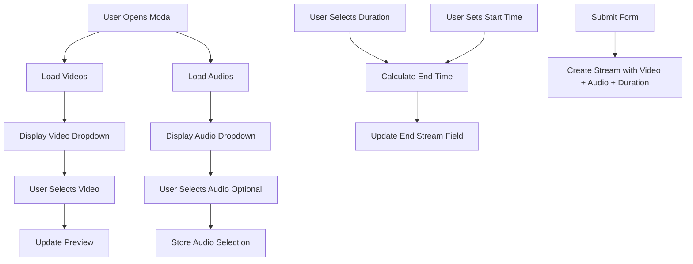

# Design Document: Stream Audio & Duration Enhancement

## Overview

Fitur ini meningkatkan modal "Create New Stream" dengan menambahkan:
1. Audio selector untuk memilih audio terpisah yang akan digabungkan dengan video
2. Duration selector untuk mengatur durasi streaming dalam format jam
3. Penghapusan Advanced Settings untuk menyederhanakan UI
4. Default RTMP URL YouTube dan layout yang lebih rapi

## Architecture

### Component Structure

```
Stream Modal
├── Video Selector (existing)
├── Audio Selector (new)
├── Stream Title (existing)
├── Stream Configuration (simplified)
│   ├── RTMP URL (default YouTube)
│   └── Stream Key
├── Schedule Settings (enhanced)
│   ├── Loop Video
│   ├── Duration Selector (new)
│   ├── Start Stream
│   └── End Stream (auto-calculated)
└── Video Preview (existing)
```

### Data Flow



## Components and Interfaces

### 1. Audio Selector Component

**Location:** `views/dashboard.ejs` (dalam modal)

**HTML Structure:**
```html
<div class="relative">
  <label class="text-sm font-medium text-white block mb-2">Select Audio (Optional)</label>
  <button type="button" onclick="toggleAudioSelector()">
    <span id="selectedAudio">No audio selected</span>
  </button>
  <div id="audioSelectorDropdown" class="hidden">
    <input type="text" id="audioSearchInput" placeholder="Search audios...">
    <div id="audioListContainer"></div>
  </div>
</div>
```

**JavaScript Functions:**
- `toggleAudioSelector()` - Toggle dropdown visibility
- `selectAudio(audio)` - Handle audio selection
- `loadGalleryAudios()` - Fetch audio list from API
- `handleAudioSearch(e)` - Filter audio list
- `displayFilteredAudios(audios)` - Render audio list
- `clearAudioSelection()` - Reset audio selection

### 2. Duration Selector Component

**Location:** `views/dashboard.ejs` (dalam Schedule Settings)

**HTML Structure:**
```html
<div>
  <label class="text-xs text-gray-400 block mb-1">Duration</label>
  <select id="streamDuration" name="streamDuration" onchange="handleDurationChange()">
    <option value="">No limit</option>
    <option value="1">1 Hour</option>
    <option value="2">2 Hours</option>
    <option value="3">3 Hours</option>
    <option value="4">4 Hours</option>
    <option value="5">5 Hours</option>
    <option value="6">6 Hours</option>
    <option value="8">8 Hours</option>
    <option value="12">12 Hours</option>
    <option value="24">24 Hours</option>
    <option value="custom">Custom</option>
  </select>
  <input type="number" id="customDuration" class="hidden" placeholder="Hours">
</div>
```

**JavaScript Functions:**
- `handleDurationChange()` - Handle duration selection
- `calculateEndTime()` - Calculate end time based on start + duration
- `updateEndTimeField()` - Update end time input

### 3. Stream Configuration (Simplified)

**Changes:**
- Remove platform selector dropdown
- Set default RTMP URL to YouTube: `rtmp://a.rtmp.youtube.com/live2`
- Display RTMP URL and Stream Key in compact layout
- Remove Twitch references

### 4. API Endpoint for Audio List

**Endpoint:** `GET /api/stream/audios`

**Response:**
```json
[
  {
    "id": "uuid",
    "name": "Audio Title",
    "duration": "3:45",
    "format": "mp3",
    "filepath": "/uploads/audios/file.mp3"
  }
]
```

## Data Models

### Stream Model Update

Tambahkan field untuk audio selection:

```javascript
{
  // existing fields
  videoId: String,
  streamTitle: String,
  rtmpUrl: String,
  streamKey: String,
  loopVideo: Boolean,
  scheduleStartTime: DateTime,
  scheduleEndTime: DateTime,
  
  // new fields
  audioId: String | null,  // Optional audio selection
  duration: Number | null  // Duration in hours
}
```

### Audio Data Structure (for dropdown)

```javascript
{
  id: String,
  name: String,
  duration: String,      // formatted "mm:ss"
  format: String,        // "mp3", "wav", etc
  filepath: String,
  thumbnail: String      // audio icon or waveform
}
```

## Correctness Properties

*A property is a characteristic or behavior that should hold true across all valid executions of a system-essentially, a formal statement about what the system should do. Properties serve as the bridge between human-readable specifications and machine-verifiable correctness guarantees.*

### Property 1: Audio search filter correctness
*For any* search query and list of audios, all returned audios should have names that contain the search query (case-insensitive)
**Validates: Requirements 1.5**

### Property 2: End time calculation correctness
*For any* valid start time and duration in hours, the calculated end time should equal start time plus (duration × 60 minutes)
**Validates: Requirements 2.5**

## Error Handling

### Audio Loading Errors
- Display "Failed to load audios" message in dropdown
- Allow retry with refresh button
- Log error to console for debugging

### Duration Calculation Errors
- Validate start time is set before calculating end time
- Handle invalid date inputs gracefully
- Show validation message if custom duration is invalid (non-positive number)

### Form Validation
- Video selection: Required
- Audio selection: Optional (allow null)
- RTMP URL: Required, validate URL format
- Stream Key: Required
- Duration: Optional (allow "No limit")

## Testing Strategy

### Unit Tests
- Test `calculateEndTime()` function with various inputs
- Test audio search filter function
- Test form validation logic

### Property-Based Tests
Library: **fast-check** (JavaScript property-based testing)

Configuration: Minimum 100 iterations per property test

**Property Test 1: Audio Search Filter**
```javascript
// **Feature: stream-audio-duration, Property 1: Audio search filter correctness**
fc.assert(
  fc.property(
    fc.array(fc.record({ name: fc.string() })),
    fc.string(),
    (audios, query) => {
      const filtered = filterAudios(audios, query);
      return filtered.every(a => 
        a.name.toLowerCase().includes(query.toLowerCase())
      );
    }
  ),
  { numRuns: 100 }
);
```

**Property Test 2: End Time Calculation**
```javascript
// **Feature: stream-audio-duration, Property 2: End time calculation correctness**
fc.assert(
  fc.property(
    fc.date(),
    fc.integer({ min: 1, max: 24 }),
    (startTime, durationHours) => {
      const endTime = calculateEndTime(startTime, durationHours);
      const expectedEnd = new Date(startTime.getTime() + durationHours * 60 * 60 * 1000);
      return endTime.getTime() === expectedEnd.getTime();
    }
  ),
  { numRuns: 100 }
);
```

### Integration Tests
- Test modal opens with all new components
- Test audio selection updates form state
- Test duration selection calculates end time
- Test form submission includes audio and duration data
