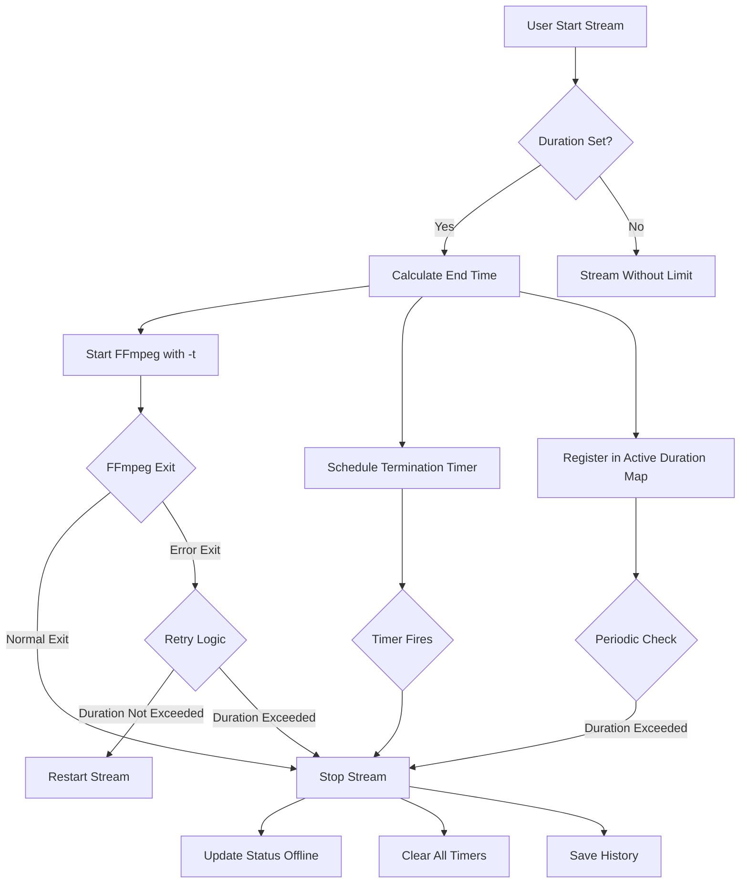

# Design Document: Stream Duration Fix

## Overview

Dokumen ini menjelaskan desain teknis untuk memperbaiki masalah durasi streaming yang tidak berhenti sesuai waktu yang ditentukan. Solusi menggunakan pendekatan multi-layer dengan tiga mekanisme penghentian yang saling backup untuk memastikan stream pasti berhenti tepat waktu.

## Architecture



## Components and Interfaces

### 1. StreamingService (Enhanced)

**Responsibilities:**
- Mengelola proses FFmpeg dengan parameter durasi yang benar
- Melacak waktu mulai dan durasi untuk setiap stream aktif
- Mendeteksi exit FFmpeg karena durasi tercapai vs error

**Interface Changes:**
```javascript
// New Map to track stream duration info
const streamDurationInfo = new Map();
// Structure: { streamId: { startTime, durationMs, expectedEndTime } }

// Enhanced function signatures
async function startStream(streamId) // Add duration tracking
function handleFFmpegExit(streamId, code, signal) // Detect duration-based exit
function isStreamDurationExceeded(streamId) // Check if duration exceeded
function getRemainingTime(streamId) // Get remaining streaming time
```

### 2. SchedulerService (Enhanced)

**Responsibilities:**
- Menjadwalkan termination timer dengan akurasi tinggi
- Menjalankan periodic check untuk stream yang melewati durasi
- Membersihkan timer saat stream dihentikan

**Interface Changes:**
```javascript
// Enhanced termination scheduling
function scheduleStreamTermination(streamId, durationMinutes, startTime)
function checkStreamDurations() // Enhanced with better detection
function forceStopOverdueStreams() // Force stop streams past duration
```

### 3. FFmpeg Args Builder (Fixed)

**Issue:** Parameter `-t` harus ditempatkan SEBELUM output untuk membatasi durasi output, bukan input.

**Current (Problematic):**
```javascript
args.push('-t', durationSeconds.toString());
// ... other args ...
args.push('-f', 'flv');
args.push(rtmpUrl);
```

**Fixed:**
```javascript
// -t should be placed just before output specification
args.push('-f', 'flv');
args.push('-t', durationSeconds.toString()); // Duration limit for output
args.push(rtmpUrl);
```

## Data Models

### StreamDurationInfo
```javascript
{
  streamId: string,
  startTime: Date,           // Waktu stream dimulai
  durationMs: number,        // Durasi dalam milliseconds
  expectedEndTime: Date,     // Waktu berakhir yang diharapkan
  terminationScheduled: boolean, // Apakah timer sudah dijadwalkan
  terminationTimerId: number // ID timer untuk cleanup
}
```

### Enhanced Stream Status
```javascript
{
  // Existing fields...
  duration_exceeded: boolean, // Flag jika stream dihentikan karena durasi
  actual_duration_seconds: number // Durasi aktual streaming
}
```


## Correctness Properties

*A property is a characteristic or behavior that should hold true across all valid executions of a system-essentially, a formal statement about what the system should do. Properties serve as the bridge between human-readable specifications and machine-verifiable correctness guarantees.*

### Property 1: End Time Calculation Correctness
*For any* stream with a valid start time and duration in hours, the calculated expected end time SHALL equal start time plus (duration × 3600 × 1000) milliseconds, and the remaining time SHALL equal expected end time minus current time.

**Validates: Requirements 1.1, 3.1**

### Property 2: Stream Termination Guarantee
*For any* stream with a specified duration, when the current time exceeds the expected end time, the stream SHALL be terminated regardless of which mechanism triggers the termination (FFmpeg -t, scheduler timer, or periodic check).

**Validates: Requirements 1.2, 2.2, 2.3**

### Property 3: Status Update on Duration Completion
*For any* stream that is terminated due to duration being reached, the stream status SHALL be 'offline' and end_time SHALL be set to a valid timestamp.

**Validates: Requirements 1.3**

### Property 4: No Restart on Normal Duration Exit
*For any* FFmpeg process that exits with code 0 when the stream duration has been reached or exceeded, the system SHALL NOT attempt to restart the stream.

**Validates: Requirements 1.4**

### Property 5: Dual Mechanism Activation
*For any* stream started with a duration, the FFmpeg arguments SHALL contain the -t parameter with correct duration value, AND a termination timer SHALL be scheduled in the scheduler service.

**Validates: Requirements 2.1**

### Property 6: Resource Cleanup on Stop
*For any* stream that is stopped (by any mechanism), all associated timers SHALL be cleared and the stream SHALL be removed from the active duration tracking map.

**Validates: Requirements 2.4**

### Property 7: Warning Threshold Detection
*For any* stream with remaining time less than 5 minutes (300000 milliseconds), the system SHALL indicate that the stream is about to end.

**Validates: Requirements 3.2**

## Error Handling

### FFmpeg Exit Handling
1. **Exit Code 0 + Duration Exceeded**: Normal termination, do not restart
2. **Exit Code 0 + Duration NOT Exceeded**: Unexpected, log warning but do not restart
3. **Exit Code != 0 + Duration Exceeded**: Error but duration reached, do not restart
4. **Exit Code != 0 + Duration NOT Exceeded**: Error, apply retry logic

### Timer Failure Handling
1. Periodic check runs every 30 seconds (reduced from 60 seconds)
2. Check compares current time with expected end time
3. Force stop any stream that exceeds expected end time by more than 1 minute

### Edge Cases
1. **Server Restart**: On startup, check all 'live' streams and verify if duration exceeded
2. **Clock Drift**: Use monotonic time where possible, add 30-second buffer to termination
3. **Very Long Durations**: Support durations up to 168 hours (1 week)

## Testing Strategy

### Unit Tests
- Test end time calculation with various durations (1 hour, 5 hours, 24 hours)
- Test remaining time calculation at different points in stream lifecycle
- Test FFmpeg args builder includes -t parameter in correct position
- Test warning threshold detection at boundary (4:59, 5:00, 5:01)

### Property-Based Tests
Library: **fast-check** (JavaScript property-based testing library)

Each property test should run minimum 100 iterations.

1. **Property 1 Test**: Generate random start times and durations, verify end time calculation
2. **Property 2 Test**: Generate streams with various durations, simulate time passage, verify termination
3. **Property 3 Test**: Generate terminated streams, verify status and end_time
4. **Property 4 Test**: Generate FFmpeg exit scenarios, verify restart behavior
5. **Property 5 Test**: Generate streams with durations, verify both mechanisms activated
6. **Property 6 Test**: Generate stopped streams, verify cleanup
7. **Property 7 Test**: Generate streams with various remaining times, verify warning detection

### Integration Tests
- Start stream with 1-minute duration, verify automatic stop
- Start stream, manually stop before duration, verify no duplicate stop
- Start stream with duration, simulate FFmpeg crash, verify no restart if duration exceeded
