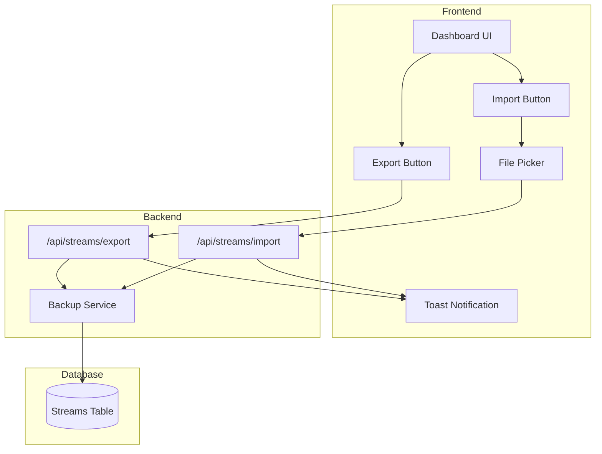

# Design Document: Stream Settings Backup & Import

## Overview

Fitur ini menyediakan kemampuan untuk melakukan backup (export) dan import konfigurasi stream. Pengguna dapat mengunduh semua pengaturan stream mereka ke file JSON dan mengimport kembali dari file tersebut. Fitur ini terintegrasi di tab streams pada dashboard.

## Architecture



## Components and Interfaces

### 1. Backup Service (`services/backupService.js`)

```javascript
/**
 * Export streams to backup format
 * @param {string} userId - User ID
 * @returns {Promise<Object>} Backup data object
 */
async function exportStreams(userId)

/**
 * Import streams from backup data
 * @param {Object} backupData - Parsed backup JSON
 * @param {string} userId - User ID
 * @returns {Promise<{imported: number, skipped: number, errors: string[]}>}
 */
async function importStreams(backupData, userId)

/**
 * Validate backup file structure
 * @param {Object} data - Parsed JSON data
 * @returns {{valid: boolean, errors: string[]}}
 */
function validateBackupFormat(data)

/**
 * Validate single stream configuration
 * @param {Object} streamConfig - Stream configuration object
 * @returns {{valid: boolean, errors: string[]}}
 */
function validateStreamConfig(streamConfig)
```

### 2. API Endpoints

#### GET `/api/streams/export`
- Authentication: Required
- Response: JSON backup file download
- Headers: `Content-Disposition: attachment; filename="streamflow-backup-YYYY-MM-DD.json"`

#### POST `/api/streams/import`
- Authentication: Required
- Content-Type: `multipart/form-data`
- Body: `file` - JSON backup file
- Response: `{success: boolean, imported: number, skipped: number, errors: string[]}`

### 3. Frontend Components

#### Export Function
```javascript
async function exportStreamSettings() {
  // Trigger download of backup file
}
```

#### Import Function
```javascript
async function importStreamSettings(file) {
  // Upload and process backup file
}
```

## Data Models

### Backup File Structure

```json
{
  "metadata": {
    "exportDate": "2025-12-06T10:30:00.000Z",
    "appVersion": "1.0.0",
    "totalStreams": 5
  },
  "streams": [
    {
      "title": "My Stream",
      "rtmp_url": "rtmp://a.rtmp.youtube.com/live2",
      "stream_key": "xxxx-xxxx-xxxx-xxxx",
      "platform": "YouTube",
      "platform_icon": "youtube",
      "bitrate": 2500,
      "resolution": "1920x1080",
      "fps": 30,
      "orientation": "horizontal",
      "loop_video": true,
      "schedule_type": "once",
      "schedule_days": null,
      "recurring_time": null,
      "recurring_enabled": true,
      "stream_duration_hours": 24
    }
  ]
}
```

### Exported Fields (Included)
| Field | Type | Required |
|-------|------|----------|
| title | string | Yes |
| rtmp_url | string | Yes |
| stream_key | string | Yes |
| platform | string | No |
| platform_icon | string | No |
| bitrate | number | No |
| resolution | string | No |
| fps | number | No |
| orientation | string | No |
| loop_video | boolean | No |
| schedule_type | string | No |
| schedule_days | array | No |
| recurring_time | string | No |
| recurring_enabled | boolean | No |
| stream_duration_hours | number | No |

### Excluded Fields (Sensitive/System)
- id
- user_id
- video_id
- audio_id
- status
- status_updated_at
- start_time
- end_time
- schedule_time
- duration
- created_at
- updated_at

## Correctness Properties

*A property is a characteristic or behavior that should hold true across all valid executions of a system-essentially, a formal statement about what the system should do. Properties serve as the bridge between human-readable specifications and machine-verifiable correctness guarantees.*

### Property 1: Export produces complete stream data
*For any* user with streams, exporting SHALL produce a JSON object containing all stream configurations with required fields (title, rtmp_url, stream_key) and optional fields (platform, bitrate, resolution, fps, orientation, loop_video, schedule_type, schedule_days, recurring_time, recurring_enabled, stream_duration_hours) present.
**Validates: Requirements 1.1, 1.2**

### Property 2: Export excludes sensitive fields
*For any* exported stream configuration, the output SHALL NOT contain any of the excluded fields (id, user_id, video_id, audio_id, status, status_updated_at, start_time, end_time, schedule_time, duration, created_at, updated_at).
**Validates: Requirements 1.3**

### Property 3: Import validates required fields
*For any* stream configuration in a backup file, if it is missing any required field (title, rtmp_url, stream_key), the import SHALL skip that entry and continue processing remaining entries.
**Validates: Requirements 2.2, 2.4**

### Property 4: Import returns accurate counts
*For any* import operation, the returned summary SHALL accurately reflect the number of streams successfully imported and the number of entries skipped due to validation failures.
**Validates: Requirements 2.3, 2.5**

### Property 5: Import accepts files with or without metadata
*For any* valid backup file, the import SHALL succeed regardless of whether the metadata section is present or absent.
**Validates: Requirements 4.3**

### Property 6: Round-trip consistency
*For any* set of valid stream configurations, exporting then importing SHALL result in streams with equivalent configuration values (excluding system-generated fields).
**Validates: Requirements 1.1, 1.2, 2.3**

## Error Handling

| Error Scenario | Response |
|----------------|----------|
| Invalid JSON file | `{success: false, error: "Invalid JSON format"}` |
| Empty file | `{success: false, error: "File is empty"}` |
| No streams array | `{success: false, error: "Invalid backup format: missing streams array"}` |
| Missing required field | Skip entry, add to skipped count |
| Database error | `{success: false, error: "Database error during import"}` |
| Unauthorized | HTTP 401 |

## Testing Strategy

### Unit Testing
- Test `validateBackupFormat` with valid and invalid inputs
- Test `validateStreamConfig` with complete and incomplete configurations
- Test export function produces correct JSON structure
- Test import function handles edge cases (empty file, invalid JSON)

### Property-Based Testing
Library: **fast-check** (JavaScript property-based testing library)

Each property-based test will:
- Run minimum 100 iterations
- Generate random stream configurations
- Verify properties hold across all generated inputs

Test annotations will follow format:
```javascript
// **Feature: stream-settings-backup, Property {number}: {property_text}**
```

Properties to implement:
1. Export completeness property
2. Export exclusion property  
3. Import validation property
4. Import count accuracy property
5. Backward compatibility property
6. Round-trip property
