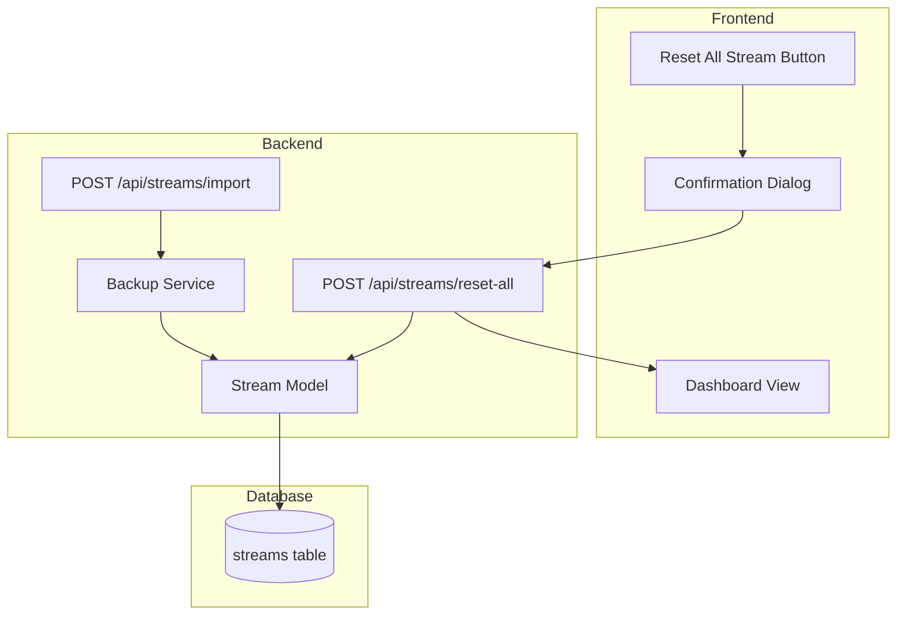

# Design Document: Stream Settings Reset

## Overview

Fitur ini memperbaiki fungsi "Reset All Stream" pada menu Backup di dashboard. Implementasi akan menyimpan settingan original saat backup file di-import ke field `original_settings` (JSON), dan menyediakan endpoint API untuk mengembalikan semua stream ke settingan tersebut.

## Architecture



## Components and Interfaces

### 1. Database Schema Changes

Tambahkan kolom `original_settings` ke tabel `streams`:

```sql
ALTER TABLE streams ADD COLUMN original_settings TEXT;
```

Field `original_settings` menyimpan JSON dengan struktur:
```json
{
  "schedule_time": "2024-01-15T10:00:00.000Z",
  "recurring_time": "10:00",
  "stream_duration_minutes": 120,
  "schedule_type": "daily",
  "schedule_days": [1, 3, 5],
  "recurring_enabled": true
}
```

### 2. Backup Service Updates

Update `importStreams` function untuk menyimpan original settings:

```javascript
/**
 * Import streams from backup data with original settings preservation
 * @param {Object} backupData - Parsed backup JSON
 * @param {string} userId - User ID
 * @returns {Promise<{imported: number, skipped: number, errors: string[]}>}
 */
async function importStreams(backupData, userId)
```

### 3. Stream Model Updates

Tambahkan method baru:

```javascript
/**
 * Reset stream to original imported settings
 * @param {string} id - Stream ID
 * @param {string} userId - User ID
 * @returns {Promise<{success: boolean, reset: boolean}>}
 */
static resetToOriginal(id, userId)

/**
 * Reset all streams to original settings for a user
 * @param {string} userId - User ID
 * @returns {Promise<{resetCount: number, skippedCount: number}>}
 */
static resetAllToOriginal(userId)
```

### 4. API Endpoint

```javascript
/**
 * POST /api/streams/reset-all
 * Reset all streams to original imported settings
 * 
 * Response:
 * {
 *   success: boolean,
 *   resetCount: number,
 *   skippedCount: number,
 *   message: string
 * }
 */
```

### 5. Frontend Updates

Update `resetAllStreamSettings()` function di dashboard.ejs:

```javascript
async function resetAllStreamSettings() {
  // Show confirmation with list of settings to reset
  // Call POST /api/streams/reset-all
  // Refresh stream list on success
}
```

## Data Models

### Original Settings Object

| Field | Type | Description |
|-------|------|-------------|
| schedule_time | string (ISO) | Original scheduled time |
| recurring_time | string (HH:MM) | Original recurring time |
| stream_duration_minutes | number | Original duration in minutes |
| schedule_type | string | Original schedule type (once/daily/weekly) |
| schedule_days | array | Original schedule days for weekly |
| recurring_enabled | boolean | Original recurring enabled state |

## Correctness Properties

*A property is a characteristic or behavior that should hold true across all valid executions of a system-essentially, a formal statement about what the system should do. Properties serve as the bridge between human-readable specifications and machine-verifiable correctness guarantees.*

### Property 1: Import preserves original settings
*For any* stream configuration in a backup file, when imported, the `original_settings` field SHALL contain the exact schedule-related values from the import data.
**Validates: Requirements 1.1**

### Property 2: Reset restores original values (Round-trip)
*For any* stream with stored original settings, after modifying the stream and calling reset, the schedule-related fields SHALL match the values in `original_settings`.
**Validates: Requirements 1.2, 1.3**

### Property 3: Reset count accuracy
*For any* reset operation, the returned `resetCount` SHALL equal the number of streams that had `original_settings` stored, and `skippedCount` SHALL equal streams without original settings.
**Validates: Requirements 1.4, 1.5**

## Error Handling

| Scenario | Handling |
|----------|----------|
| Stream has no original_settings | Skip stream, increment skippedCount |
| Invalid original_settings JSON | Skip stream, log error |
| Database error during reset | Return error response, rollback if possible |
| User not authenticated | Return 401 Unauthorized |

## Testing Strategy

### Unit Tests
- Test `resetToOriginal` method with valid original settings
- Test `resetToOriginal` method with null original settings
- Test `resetAllToOriginal` returns correct counts

### Property-Based Tests

Library: fast-check (sudah digunakan di project)

1. **Property 1 Test**: Generate random stream configurations, import them, verify original_settings matches input
2. **Property 2 Test**: Generate random streams with original settings, modify them, reset, verify fields match original
3. **Property 3 Test**: Generate mix of streams with/without original settings, reset all, verify counts

### Integration Tests
- Test full flow: import → modify → reset → verify
- Test API endpoint returns correct response format
