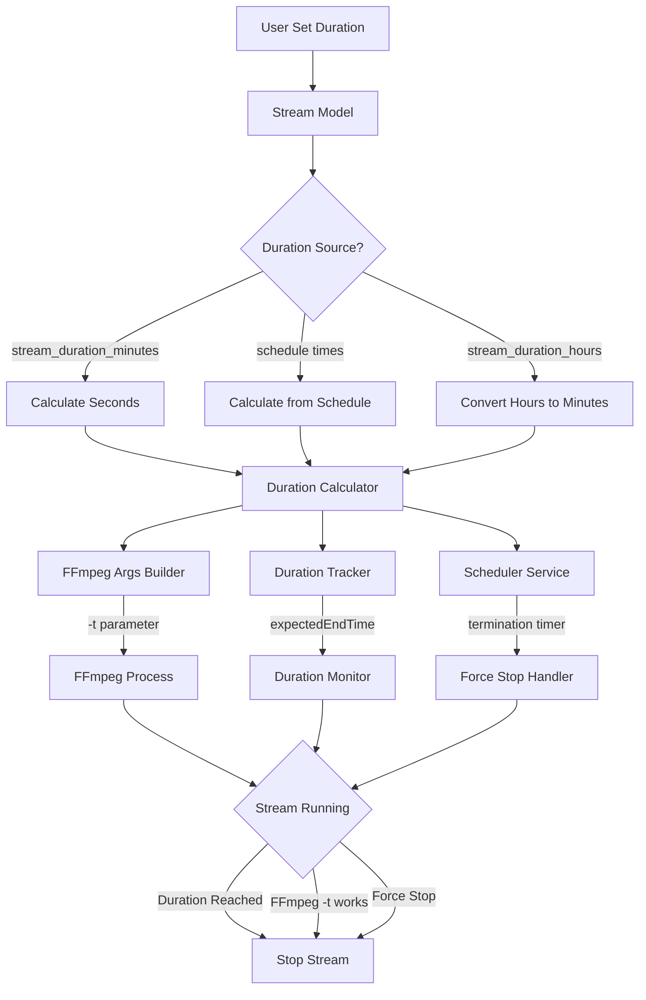

# Design Document: Streaming Duration Fix

## Overview

Dokumen ini menjelaskan desain untuk memperbaiki masalah livestreaming yang berhenti mendadak tidak sesuai durasi. Perbaikan fokus pada:

1. Standarisasi penggunaan field durasi (`stream_duration_minutes` sebagai sumber utama)
2. Perbaikan kalkulasi durasi untuk FFmpeg parameter `-t`
3. Sinkronisasi duration tracking dengan durasi sebenarnya
4. Perbaikan scheduler termination timing

## Architecture



## Components and Interfaces

### 1. Duration Calculator Module

Modul baru untuk menghitung durasi streaming secara konsisten.

```javascript
/**
 * Calculate stream duration in seconds from stream data
 * Priority: stream_duration_minutes > schedule calculation > stream_duration_hours
 * @param {Object} stream - Stream object from database
 * @returns {number|null} Duration in seconds or null if not set
 */
function calculateDurationSeconds(stream) {
  // Priority 1: stream_duration_minutes (primary field)
  if (stream.stream_duration_minutes && stream.stream_duration_minutes > 0) {
    return stream.stream_duration_minutes * 60;
  }
  
  // Priority 2: Calculate from schedule times
  if (stream.end_time && stream.schedule_time) {
    const scheduleStart = new Date(stream.schedule_time);
    const scheduleEnd = new Date(stream.end_time);
    const durationMs = scheduleEnd.getTime() - scheduleStart.getTime();
    if (durationMs > 0) {
      return Math.floor(durationMs / 1000);
    }
  }
  
  // Priority 3: Fallback to deprecated stream_duration_hours
  if (stream.stream_duration_hours && stream.stream_duration_hours > 0) {
    return stream.stream_duration_hours * 3600;
  }
  
  // Priority 4: duration field (in minutes)
  if (stream.duration && stream.duration > 0) {
    return stream.duration * 60;
  }
  
  return null;
}

/**
 * Calculate remaining duration when stream restarts
 * @param {Date} originalStartTime - Original stream start time
 * @param {number} totalDurationMs - Total intended duration in milliseconds
 * @returns {number} Remaining duration in milliseconds
 */
function calculateRemainingDuration(originalStartTime, totalDurationMs) {
  const elapsed = Date.now() - originalStartTime.getTime();
  return Math.max(0, totalDurationMs - elapsed);
}
```

### 2. Enhanced Duration Tracker

Perbaikan pada duration tracking untuk memastikan sinkronisasi.

```javascript
// Structure for duration tracking
const streamDurationInfo = new Map();
// Key: streamId
// Value: {
//   startTime: Date,           // Actual start time
//   durationMs: number,        // Total duration in milliseconds
//   expectedEndTime: Date,     // Calculated end time
//   originalDurationMs: number // Original duration (for restart calculation)
// }

/**
 * Set duration info with validation
 */
function setDurationInfo(streamId, startTime, durationMs) {
  if (!durationMs || durationMs <= 0) {
    console.log(`[DurationTracker] No valid duration for stream ${streamId}`);
    return false;
  }
  
  const expectedEndTime = new Date(startTime.getTime() + durationMs);
  
  streamDurationInfo.set(streamId, {
    startTime,
    durationMs,
    expectedEndTime,
    originalDurationMs: durationMs
  });
  
  console.log(`[DurationTracker] Duration set: ${durationMs / 60000} minutes (${durationMs / 1000} seconds)`);
  console.log(`[DurationTracker] Expected end: ${expectedEndTime.toISOString()}`);
  
  return true;
}
```

### 3. FFmpeg Args Builder Fix

Perbaikan pada pembangunan argumen FFmpeg untuk memastikan parameter `-t` benar.

```javascript
/**
 * Build FFmpeg args with correct duration parameter
 * CRITICAL: -t must be placed just before output URL
 */
function buildFFmpegArgsVideoOnly(videoPath, rtmpUrl, durationSeconds, loopVideo) {
  const args = [
    '-threads', '2',
    '-thread_queue_size', '512',
    '-hwaccel', 'auto',
    '-loglevel', 'error',
    '-re',
    '-fflags', '+genpts+igndts+discardcorrupt',
    '-avoid_negative_ts', 'make_zero'
  ];
  
  // Video input with looping
  if (loopVideo) {
    args.push('-stream_loop', '-1');
  } else {
    args.push('-stream_loop', '0');
  }
  args.push('-i', videoPath);
  
  // Copy codecs
  args.push('-c:v', 'copy');
  args.push('-c:a', 'copy');
  
  // Output settings
  args.push('-flags', '+global_header');
  args.push('-bufsize', '1M');
  args.push('-max_muxing_queue_size', '2048');
  args.push('-flvflags', 'no_duration_filesize');
  args.push('-f', 'flv');
  
  // CRITICAL: Duration limit must be just before output URL
  if (durationSeconds && durationSeconds > 0) {
    // Log the duration being set
    console.log(`[FFmpegArgs] Setting duration: ${durationSeconds} seconds (${durationSeconds / 60} minutes)`);
    args.push('-t', durationSeconds.toString());
  }
  
  args.push(rtmpUrl);
  
  return args;
}
```

### 4. Scheduler Service Fix

Perbaikan pada scheduler untuk menggunakan `start_time` aktual.

```javascript
/**
 * Check stream durations with correct time calculation
 */
async function checkStreamDurations() {
  const liveStreams = await Stream.findAll(null, 'live');
  const now = new Date();
  
  for (const stream of liveStreams) {
    // CRITICAL: Use actual start_time, not schedule_time
    if (!stream.start_time) {
      console.log(`[Scheduler] Stream ${stream.id} has no start_time, skipping duration check`);
      continue;
    }
    
    const actualStartTime = new Date(stream.start_time);
    let shouldEndAt = null;
    
    // Calculate end time based on duration from actual start
    const durationSeconds = calculateDurationSeconds(stream);
    if (durationSeconds && durationSeconds > 0) {
      shouldEndAt = new Date(actualStartTime.getTime() + (durationSeconds * 1000));
      console.log(`[Scheduler] Stream ${stream.id}: start=${actualStartTime.toISOString()}, duration=${durationSeconds}s, end=${shouldEndAt.toISOString()}`);
    }
    
    if (shouldEndAt) {
      const timeOverdue = now.getTime() - shouldEndAt.getTime();
      
      // Force stop if exceeded by more than 60 seconds
      if (timeOverdue > 60000) {
        console.log(`[Scheduler] FORCE STOP: Stream ${stream.id} exceeded by ${Math.round(timeOverdue / 1000)}s`);
        await streamingService.stopStream(stream.id);
        continue;
      }
      
      // Normal stop if exceeded
      if (shouldEndAt <= now) {
        console.log(`[Scheduler] Stream ${stream.id} reached end time, stopping`);
        await streamingService.stopStream(stream.id);
        continue;
      }
    }
  }
}
```

## Data Models

### Stream Model Fields (Existing)

| Field | Type | Description |
|-------|------|-------------|
| stream_duration_minutes | INTEGER | Primary duration field (in minutes) |
| stream_duration_hours | FLOAT | Deprecated duration field (in hours) |
| duration | INTEGER | Duration from schedule calculation (in minutes) |
| schedule_time | TEXT | Scheduled start time (ISO format) |
| end_time | TEXT | Scheduled end time (ISO format) |
| start_time | TEXT | Actual start time (ISO format) |

### Duration Priority Order

1. `stream_duration_minutes` - User-set duration in minutes (PRIMARY)
2. `end_time - schedule_time` - Calculated from schedule
3. `stream_duration_hours * 60` - Converted from deprecated hours field
4. `duration` - Legacy duration field

## Correctness Properties

*A property is a characteristic or behavior that should hold true across all valid executions of a system-essentially, a formal statement about what the system should do. Properties serve as the bridge between human-readable specifications and machine-verifiable correctness guarantees.*

### Property 1: Duration Field Priority
*For any* stream with multiple duration fields set, the `calculateDurationSeconds` function SHALL return the value from `stream_duration_minutes * 60` when that field is positive, regardless of other field values.
**Validates: Requirements 1.1, 2.1**

### Property 2: Duration Conversion Consistency
*For any* positive duration value, converting from minutes to seconds SHALL produce `minutes * 60`, and converting from hours to seconds SHALL produce `hours * 3600`.
**Validates: Requirements 1.2, 2.3**

### Property 3: Schedule Duration Calculation
*For any* stream with valid `end_time` and `schedule_time`, when `stream_duration_minutes` is not set, the calculated duration SHALL equal `(end_time - schedule_time)` in seconds.
**Validates: Requirements 2.2, 2.4**

### Property 4: Duration Tracking Consistency
*For any* call to `setDurationInfo(streamId, startTime, durationMs)`, the stored `expectedEndTime` SHALL equal `startTime + durationMs`.
**Validates: Requirements 3.1, 3.2**

### Property 5: FFmpeg Duration Parameter
*For any* stream with a positive duration, the generated FFmpeg args SHALL contain `-t` followed by the duration in seconds, positioned just before the RTMP URL.
**Validates: Requirements 1.3**

### Property 6: Scheduler Uses Actual Start Time
*For any* live stream with `start_time` set, the scheduler duration check SHALL calculate end time as `start_time + duration`, not using `schedule_time`.
**Validates: Requirements 4.4**

### Property 7: Remaining Duration Calculation
*For any* stream restart, the remaining duration SHALL equal `max(0, originalDuration - elapsedTime)`.
**Validates: Requirements 3.3**

### Property 8: Force Stop Threshold
*For any* stream that exceeds its expected end time by more than 60 seconds, the scheduler SHALL trigger a force stop.
**Validates: Requirements 4.3**

## Error Handling

### Duration Calculation Errors

1. **No duration set**: Log warning and allow stream to run indefinitely
2. **Invalid duration (negative/zero)**: Treat as no duration set
3. **Invalid date formats**: Log error and skip duration calculation

### FFmpeg Errors

1. **FFmpeg crash (SIGSEGV)**: Restart with remaining duration
2. **FFmpeg exit with error**: Retry up to 3 times with remaining duration
3. **FFmpeg -t parameter ignored**: Scheduler force stop as backup

### Scheduler Errors

1. **Stream not found**: Skip and log warning
2. **Database error**: Log error and continue with other streams
3. **Stop stream failure**: Log error and retry on next check

## Testing Strategy

### Unit Testing

Unit tests akan memverifikasi:
- `calculateDurationSeconds` dengan berbagai kombinasi field
- `setDurationInfo` menyimpan data dengan benar
- FFmpeg args builder menghasilkan parameter yang benar
- Scheduler menggunakan `start_time` bukan `schedule_time`

### Property-Based Testing

Menggunakan **fast-check** library untuk JavaScript property-based testing.

Konfigurasi:
- Minimum 100 iterations per property
- Seed untuk reproducibility

Property tests akan memverifikasi:
1. Duration field priority (Property 1)
2. Duration conversion consistency (Property 2)
3. Schedule duration calculation (Property 3)
4. Duration tracking consistency (Property 4)
5. FFmpeg duration parameter (Property 5)
6. Scheduler uses actual start time (Property 6)
7. Remaining duration calculation (Property 7)
8. Force stop threshold (Property 8)

### Test File Structure

```
tests/
  streaming-duration-fix.test.js  # All unit and property tests
```

