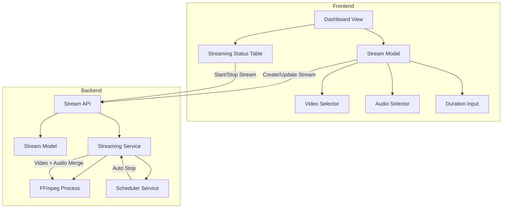

# Design Document: Streaming Fix - Video+Audio Merge & UI Improvements

## Overview

Dokumen ini menjelaskan desain teknis untuk memperbaiki fitur live streaming yang mencakup:
1. Penggabungan video dengan audio terpisah menggunakan FFmpeg
2. Looping video dan audio sesuai durasi yang ditentukan user
3. Perbaikan UI tabel Streaming Status dengan warna icon yang jelas
4. Penambahan informasi durasi dan nomor urut pada tabel
5. Penghapusan video preview dan perapian layout modal

## Architecture



## Components and Interfaces

### 1. Streaming Service - FFmpeg Args Builder

**File:** `services/streamingService.js`

**Fungsi yang dimodifikasi:** `buildFFmpegArgs(stream)`

```javascript
async function buildFFmpegArgs(stream) {
  // Get video path
  const video = await Video.findById(stream.video_id);
  const videoPath = getFullPath(video.filepath);
  
  // Get audio path if selected
  let audioPath = null;
  if (stream.audio_id) {
    const audio = await Audio.findById(stream.audio_id);
    if (audio && fs.existsSync(getFullPath(audio.filepath))) {
      audioPath = getFullPath(audio.filepath);
    }
  }
  
  const rtmpUrl = `${stream.rtmp_url}/${stream.stream_key}`;
  const durationSeconds = stream.stream_duration_hours * 3600;
  
  // Build FFmpeg args based on audio presence
  if (audioPath) {
    return buildArgsWithAudio(videoPath, audioPath, rtmpUrl, durationSeconds, stream.loop_video);
  } else {
    return buildArgsVideoOnly(videoPath, rtmpUrl, durationSeconds, stream.loop_video);
  }
}
```

**FFmpeg Command untuk Video + Audio:**
```bash
ffmpeg -hwaccel auto -re \
  -stream_loop -1 -i video.mp4 \
  -stream_loop -1 -i audio.mp3 \
  -map 0:v:0 -map 1:a:0 \
  -c:v copy -c:a aac -b:a 128k \
  -t 7200 \
  -f flv rtmp://a.rtmp.youtube.com/live2/stream-key
```

**Parameter Penting:**
- `-stream_loop -1`: Loop input secara infinite
- `-map 0:v:0`: Ambil video stream dari input pertama
- `-map 1:a:0`: Ambil audio stream dari input kedua
- `-t <seconds>`: Durasi total streaming
- `-c:v copy`: Copy video codec (no re-encoding)
- `-c:a aac`: Encode audio ke AAC

### 2. Dashboard UI - Streaming Status Table

**File:** `views/dashboard.ejs`

**Perubahan pada tabel:**
- Tambah kolom "No." di posisi pertama
- Warna icon aksi yang jelas
- Format durasi yang mudah dibaca
- Status badge dengan warna yang konsisten

```html
<table class="min-w-full">
  <thead>
    <tr>
      <th>No.</th>
      <th>Stream Name</th>
      <th>Platform</th>
      <th>Duration</th>
      <th>Status</th>
      <th>Actions</th>
    </tr>
  </thead>
  <tbody>
    <!-- Rendered by JavaScript -->
  </tbody>
</table>
```

### 3. Stream Modal - Layout Simplification

**File:** `views/dashboard.ejs`

**Perubahan:**
- Hapus section video preview (aspect-video div)
- Gunakan single column layout
- Urutan field: Video → Audio → Title → Stream Key → Duration → Schedule

## Data Models

### Stream Model (existing, no changes needed)

```javascript
{
  id: String,
  title: String,
  video_id: String,
  audio_id: String | null,  // Already exists
  rtmp_url: String,
  stream_key: String,
  stream_duration_hours: Number | null,
  loop_video: Boolean,
  status: 'offline' | 'live' | 'scheduled',
  start_time: DateTime | null,
  // ... other fields
}
```

## Correctness Properties

*A property is a characteristic or behavior that should hold true across all valid executions of a system-essentially, a formal statement about what the system should do. Properties serve as the bridge between human-readable specifications and machine-verifiable correctness guarantees.*

### Property 1: FFmpeg args with audio contains correct mapping
*For any* stream configuration with both video_id and audio_id, the generated FFmpeg args SHALL contain two `-i` inputs and proper `-map` parameters to combine video from first input and audio from second input.
**Validates: Requirements 1.1, 1.3**

### Property 2: FFmpeg args without audio uses video's original audio
*For any* stream configuration with video_id but null audio_id, the generated FFmpeg args SHALL contain only one `-i` input and no `-map` parameters, preserving the video's original audio.
**Validates: Requirements 1.2**

### Property 3: Duration parameter limits stream length
*For any* stream configuration with stream_duration_hours set, the generated FFmpeg args SHALL contain `-t` parameter with value equal to stream_duration_hours * 3600 seconds.
**Validates: Requirements 2.1**

### Property 4: Audio looping enabled when audio selected
*For any* stream configuration with audio_id, the generated FFmpeg args SHALL contain `-stream_loop -1` before the audio input to enable infinite looping.
**Validates: Requirements 2.2**

### Property 5: Status badge color mapping
*For any* stream status value, the rendered badge SHALL use the correct color class: 'live' → 'bg-green-500', 'scheduled' → 'bg-yellow-500', 'offline' → 'bg-gray-500'.
**Validates: Requirements 4.4**

### Property 6: Duration format correctness
*For any* duration value in hours, the formatted string SHALL display the value followed by " jam" (e.g., "2 jam", "24 jam").
**Validates: Requirements 4.2**

## Error Handling

### Audio File Validation
```javascript
if (stream.audio_id) {
  const audio = await Audio.findById(stream.audio_id);
  if (!audio) {
    throw new Error(`Audio not found for audio_id: ${stream.audio_id}`);
  }
  const audioPath = getFullPath(audio.filepath);
  if (!fs.existsSync(audioPath)) {
    throw new Error(`Audio file not found on disk: ${audioPath}`);
  }
}
```

### FFmpeg Process Error
- Log error ke streamLogs
- Update stream status ke 'offline'
- Retry mechanism sudah ada (MAX_RETRY_ATTEMPTS = 3)

## Testing Strategy

### Unit Tests
- Test `buildFFmpegArgs` dengan berbagai kombinasi input
- Test format functions untuk durasi dan status

### Property-Based Tests
Menggunakan **fast-check** library untuk property-based testing.

**Property Test 1: FFmpeg args structure with audio**
```javascript
// **Feature: streaming-fix, Property 1: FFmpeg args with audio contains correct mapping**
fc.assert(
  fc.property(
    fc.record({
      video_id: fc.uuid(),
      audio_id: fc.uuid(),
      stream_duration_hours: fc.integer({ min: 1, max: 168 }),
      loop_video: fc.boolean()
    }),
    (streamConfig) => {
      const args = buildFFmpegArgsSync(streamConfig, mockVideoPath, mockAudioPath);
      const inputCount = args.filter(a => a === '-i').length;
      const hasMap = args.includes('-map');
      return inputCount === 2 && hasMap;
    }
  )
);
```

**Property Test 2: FFmpeg args structure without audio**
```javascript
// **Feature: streaming-fix, Property 2: FFmpeg args without audio uses video's original audio**
fc.assert(
  fc.property(
    fc.record({
      video_id: fc.uuid(),
      audio_id: fc.constant(null),
      stream_duration_hours: fc.integer({ min: 1, max: 168 }),
      loop_video: fc.boolean()
    }),
    (streamConfig) => {
      const args = buildFFmpegArgsSync(streamConfig, mockVideoPath, null);
      const inputCount = args.filter(a => a === '-i').length;
      const hasMap = args.includes('-map');
      return inputCount === 1 && !hasMap;
    }
  )
);
```

**Property Test 3: Duration parameter**
```javascript
// **Feature: streaming-fix, Property 3: Duration parameter limits stream length**
fc.assert(
  fc.property(
    fc.integer({ min: 1, max: 168 }),
    (durationHours) => {
      const args = buildFFmpegArgsSync({ stream_duration_hours: durationHours }, mockVideoPath, null);
      const tIndex = args.indexOf('-t');
      if (tIndex === -1) return false;
      const tValue = parseInt(args[tIndex + 1]);
      return tValue === durationHours * 3600;
    }
  )
);
```

**Property Test 4: Status badge color**
```javascript
// **Feature: streaming-fix, Property 5: Status badge color mapping**
fc.assert(
  fc.property(
    fc.constantFrom('live', 'scheduled', 'offline'),
    (status) => {
      const colorClass = getStatusColorClass(status);
      const expectedColors = {
        'live': 'bg-green-500',
        'scheduled': 'bg-yellow-500',
        'offline': 'bg-gray-500'
      };
      return colorClass === expectedColors[status];
    }
  )
);
```

**Property Test 5: Duration format**
```javascript
// **Feature: streaming-fix, Property 6: Duration format correctness**
fc.assert(
  fc.property(
    fc.integer({ min: 1, max: 168 }),
    (hours) => {
      const formatted = formatDuration(hours);
      return formatted === `${hours} jam`;
    }
  )
);
```

### Test Configuration
- Minimum 100 iterations per property test
- Each test tagged with feature and property reference
