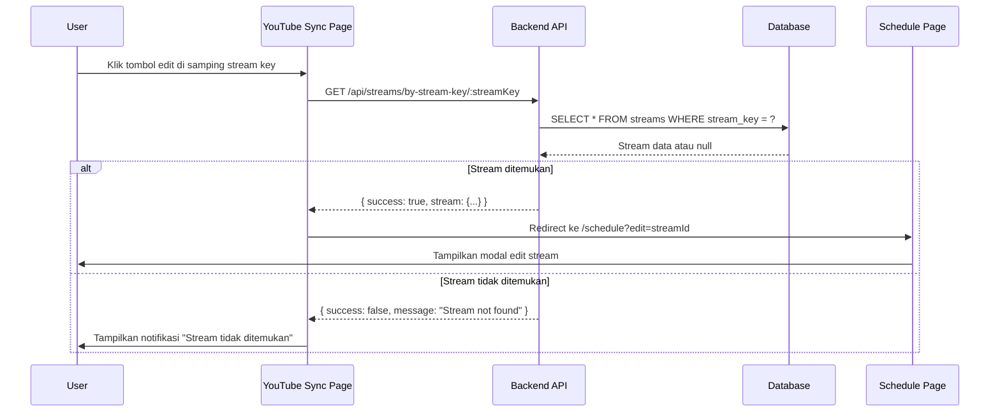

# Design Document: Stream Key Edit Shortcut

## Overview

Fitur ini mengubah tombol copy stream key di halaman YouTube Sync menjadi shortcut untuk langsung menuju edit stream di halaman Schedule. Ketika pengguna mengklik tombol di samping stream key, sistem akan mencari stream di database yang memiliki `stream_key` yang sama, kemudian mengarahkan pengguna ke halaman Schedule dengan modal edit stream terbuka.

## Architecture

### Flow Diagram



## Components and Interfaces

### 1. Backend API Endpoint

Endpoint baru untuk mencari stream berdasarkan stream_key:

```javascript
// GET /api/streams/by-stream-key/:streamKey
// Response: { success: boolean, stream?: Stream, message?: string }
```

### 2. Frontend Functions

```javascript
// Fungsi untuk navigasi ke edit stream berdasarkan stream key
async function goToEditStream(streamKey)

// Fungsi untuk menampilkan notifikasi
function showToast(message, type)
```

### 3. UI Components

- Tombol edit di samping stream key (desktop view)
- Tombol edit di samping stream key (mobile view)
- Modal edit stream di halaman Schedule

## Data Models

### Stream Model (existing)

```javascript
{
  id: string,
  title: string,
  stream_key: string,  // Digunakan untuk matching dengan YouTube broadcast streamKey
  rtmp_url: string,
  platform: string,
  // ... other fields
}
```

### API Response

```javascript
// Success response
{
  success: true,
  stream: {
    id: string,
    title: string,
    stream_key: string,
    // ... other stream fields
  }
}

// Error response
{
  success: false,
  message: string
}
```

## Correctness Properties

*A property is a characteristic or behavior that should hold true across all valid executions of a system-essentially, a formal statement about what the system should do. Properties serve as the bridge between human-readable specifications and machine-verifiable correctness guarantees.*

### Property 1: Stream Key Lookup Consistency

*For any* stream_key yang ada di database, pencarian stream berdasarkan stream_key tersebut harus mengembalikan stream yang memiliki stream_key yang sama persis.

**Validates: Requirements 1.1, 1.2**

### Property 2: Non-existent Stream Key Returns Null

*For any* stream_key yang tidak ada di database, pencarian stream berdasarkan stream_key tersebut harus mengembalikan null atau response dengan success: false.

**Validates: Requirements 1.3**

## Error Handling

| Scenario | Handling |
|----------|----------|
| Stream key tidak ditemukan | Tampilkan toast notification "Stream tidak ditemukan di jadwal" |
| Network error | Tampilkan toast notification "Gagal mencari stream" |
| Invalid stream key (empty) | Tampilkan toast notification "Stream key tidak valid" |

## Testing Strategy

### Dual Testing Approach

Fitur ini akan diuji menggunakan kombinasi unit tests dan property-based tests:

#### Unit Tests
- Test API endpoint `/api/streams/by-stream-key/:streamKey` dengan berbagai skenario
- Test fungsi `goToEditStream` dengan mock API response
- Test tampilan notifikasi untuk berbagai kondisi error

#### Property-Based Tests

Library yang digunakan: **fast-check** (sudah digunakan di project ini)

Property-based tests akan memvalidasi:
1. **Property 1**: Untuk setiap stream yang dibuat dengan stream_key tertentu, pencarian dengan stream_key tersebut harus mengembalikan stream yang sama
2. **Property 2**: Untuk setiap stream_key yang tidak ada di database, pencarian harus mengembalikan null

Setiap property test akan dikonfigurasi untuk menjalankan minimal 100 iterasi.

Format tag untuk property tests:
```javascript
// **Feature: streamkey-edit-shortcut, Property 1: Stream Key Lookup Consistency**
// **Validates: Requirements 1.1, 1.2**
```
