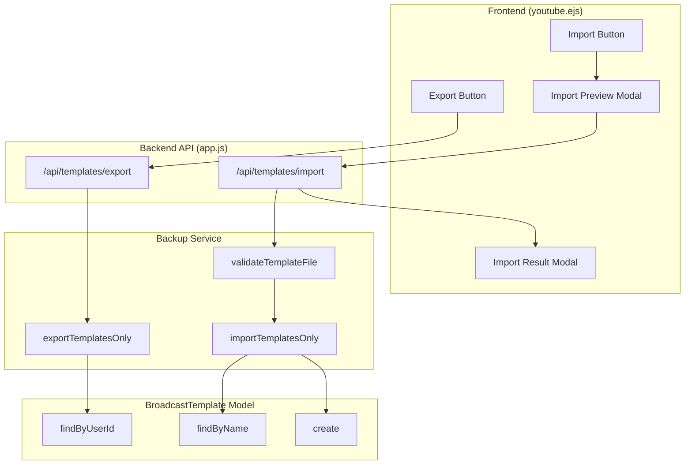

# Design Document: Template Backup & Import

## Overview

Fitur ini menambahkan kemampuan untuk mengekspor dan mengimpor template broadcast. Pengguna dapat membuat backup template ke file JSON dan mengimpor file template untuk menambahkan template baru. Fitur ini terintegrasi dengan sistem backup yang sudah ada di `backupService.js` dan menggunakan model `BroadcastTemplate` yang sudah tersedia.

## Architecture



## Components and Interfaces

### 1. Backend API Endpoints

#### GET /api/templates/export
Mengekspor semua template broadcast milik user ke file JSON.

```javascript
// Response: File download (application/json)
{
  "metadata": {
    "exportDate": "2025-12-28T10:00:00.000Z",
    "appVersion": "1.0.0",
    "exportType": "templates",
    "totalTemplates": 5
  },
  "templates": [
    {
      "name": "Morning Stream",
      "title": "Live Streaming Pagi",
      "description": "Deskripsi...",
      "privacy_status": "unlisted",
      "tags": ["live", "streaming"],
      "category_id": "20",
      "recurring_enabled": true,
      "recurring_pattern": "daily",
      "recurring_time": "08:00",
      "recurring_days": null
    }
  ]
}
```

#### POST /api/templates/import
Mengimpor template dari file JSON.

```javascript
// Request: multipart/form-data with file
// Body: { file: File, skipDuplicates: boolean }

// Response
{
  "success": true,
  "results": {
    "imported": 3,
    "skipped": 1,
    "errors": ["templates[2]: Template name already exists"]
  }
}
```

### 2. Backup Service Functions

```javascript
// services/backupService.js - New functions

/**
 * Export templates only (standalone export)
 * @param {string} userId - User ID
 * @returns {Promise<Object>} Template backup object
 */
async function exportTemplatesOnly(userId)

/**
 * Import templates only (standalone import)
 * @param {Object} backupData - Parsed JSON backup
 * @param {string} userId - User ID
 * @param {Object} options - Import options
 * @returns {Promise<Object>} Import results
 */
async function importTemplatesOnly(backupData, userId, options = {})

/**
 * Validate template backup file format
 * @param {Object} data - Parsed JSON data
 * @returns {{valid: boolean, errors: string[], templateCount: number}}
 */
function validateTemplateBackup(data)

/**
 * Format template data for export (pretty print)
 * @param {Object} backup - Backup object
 * @returns {string} Pretty-printed JSON string
 */
function formatTemplateBackupJson(backup)
```

### 3. Frontend Components

#### Template Library Modal Enhancement
Menambahkan tombol Export dan Import di header modal template library.

```html
<!-- Header dengan tombol export/import -->
<div class="flex items-center justify-between">
  <h3>Templates</h3>
  <div class="flex items-center gap-2">
    <button onclick="exportTemplates()">
      <i class="ti ti-download"></i> Export
    </button>
    <button onclick="openImportTemplateModal()">
      <i class="ti ti-upload"></i> Import
    </button>
  </div>
</div>
```

#### Import Template Modal
Modal untuk preview dan konfirmasi import.

```html
<div id="importTemplateModal">
  <input type="file" accept=".json" onchange="previewImportFile(this)">
  <div id="importPreview">
    <!-- Preview jumlah template -->
  </div>
  <label>
    <input type="checkbox" id="skipDuplicates"> Skip duplicate names
  </label>
  <button onclick="confirmImportTemplates()">Import</button>
</div>
```

#### Import Result Modal
Modal untuk menampilkan hasil import.

```html
<div id="importResultModal">
  <div class="results">
    <p>Imported: <span id="importedCount">0</span></p>
    <p>Skipped: <span id="skippedCount">0</span></p>
  </div>
  <div id="importErrors">
    <!-- Error messages -->
  </div>
</div>
```

## Data Models

### Template Export Format

```javascript
{
  // Metadata
  metadata: {
    exportDate: string,      // ISO timestamp
    appVersion: string,      // App version
    exportType: "templates", // Fixed value
    totalTemplates: number   // Count of templates
  },
  
  // Template array
  templates: [
    {
      name: string,              // Required: template name
      title: string,             // Required: broadcast title
      description: string|null,  // Optional: description
      privacy_status: string,    // "public"|"unlisted"|"private"
      tags: string[]|null,       // Optional: tag array
      category_id: string,       // YouTube category ID
      recurring_enabled: boolean,
      recurring_pattern: string|null,  // "daily"|"weekly"|null
      recurring_time: string|null,     // "HH:mm" format
      recurring_days: number[]|null    // [0-6] for weekly
    }
  ]
}
```

### Fields Excluded from Export
- `id` - Auto-generated on import
- `user_id` - Set to importing user
- `account_id` - Requires re-mapping
- `thumbnail_path` - Local file path
- `stream_id` - Account-specific
- `next_run_at` - Recalculated on import
- `last_run_at` - Reset on import
- `created_at` - Set on import
- `updated_at` - Set on import


## Correctness Properties

*A property is a characteristic or behavior that should hold true across all valid executions of a system-essentially, a formal statement about what the system should do. Properties serve as the bridge between human-readable specifications and machine-verifiable correctness guarantees.*

### Property 1: Export contains all user templates
*For any* user with templates, when export is called, the resulting JSON SHALL contain all templates belonging to that user with correct count in metadata.
**Validates: Requirements 1.1, 1.2**

### Property 2: Exported templates have required fields
*For any* exported template, the template object SHALL contain all required fields: name, title, description, privacy_status, tags, category_id, recurring_enabled, recurring_pattern, recurring_time, recurring_days.
**Validates: Requirements 1.3**

### Property 3: Import validation rejects invalid format
*For any* JSON input that is not a valid template backup format (missing metadata or templates array), the validation function SHALL return valid=false with appropriate error messages.
**Validates: Requirements 2.1, 2.4**

### Property 4: Import creates templates for valid items
*For any* valid template backup file, after import, the number of successfully imported templates plus skipped templates SHALL equal the total templates in the file.
**Validates: Requirements 2.3, 3.1**

### Property 5: Duplicate handling with skip option
*For any* template in import file where a template with the same name already exists, when skipDuplicates=true, the import SHALL skip that template and increment skipped count.
**Validates: Requirements 2.5**

### Property 6: Required field validation
*For any* template with empty name or empty title, the import validation SHALL reject that template with appropriate error message.
**Validates: Requirements 5.1**

### Property 7: Recurring configuration validation
*For any* template with recurring_enabled=true, if recurring_pattern or recurring_time is missing, the validation SHALL reject that template. Additionally, if recurring_pattern="weekly" and recurring_days is empty or missing, the validation SHALL reject that template.
**Validates: Requirements 5.2, 5.3**

### Property 8: Partial import continues on failure
*For any* import file with multiple templates where some are invalid, the import process SHALL continue processing remaining templates and report both successes and failures.
**Validates: Requirements 5.4, 3.2**

### Property 9: Round-trip consistency
*For any* set of valid templates, exporting then importing (with no duplicates) then exporting again SHALL produce equivalent template data (excluding system-generated fields like id, timestamps).
**Validates: Requirements 6.2**

## Error Handling

### Export Errors
| Error | Cause | Response |
|-------|-------|----------|
| Database error | Failed to fetch templates | 500 Internal Server Error |
| No templates | User has no templates | Return empty array with count=0 |

### Import Errors
| Error | Cause | Response |
|-------|-------|----------|
| Invalid JSON | Malformed JSON file | 400 Bad Request with parse error |
| Invalid format | Missing metadata/templates | 400 Bad Request with validation errors |
| Template validation | Missing required fields | Skip template, add to errors array |
| Duplicate name | Template name exists | Skip if skipDuplicates, else add to errors |
| Database error | Failed to create template | Skip template, add to errors array |

### Validation Error Messages
```javascript
const ERROR_MESSAGES = {
  INVALID_JSON: 'File is not valid JSON',
  MISSING_METADATA: 'Invalid backup format: missing metadata',
  MISSING_TEMPLATES: 'Invalid backup format: missing templates array',
  EMPTY_NAME: 'Template name cannot be empty',
  EMPTY_TITLE: 'Template title cannot be empty',
  INVALID_RECURRING_PATTERN: 'Recurring pattern must be daily or weekly',
  MISSING_RECURRING_TIME: 'Recurring time is required when recurring is enabled',
  MISSING_RECURRING_DAYS: 'Weekly schedule requires at least one day selected',
  DUPLICATE_NAME: 'Template with this name already exists'
};
```

## Testing Strategy

### Property-Based Testing
Menggunakan **fast-check** library untuk property-based testing di JavaScript/Node.js.

Setiap property test harus:
- Dikonfigurasi untuk minimal 100 iterasi
- Ditandai dengan komentar yang mereferensikan correctness property
- Format tag: `**Feature: template-backup-import, Property {number}: {property_text}**`

### Unit Tests
- Test export dengan berbagai jumlah template (0, 1, banyak)
- Test import dengan file valid dan invalid
- Test validasi field required
- Test validasi recurring configuration
- Test duplicate handling

### Test File Structure
```
tests/
  template-backup-import.test.js    # Unit tests + Property tests
```

### Test Data Generators (fast-check)
```javascript
// Generator untuk template valid
const validTemplateArb = fc.record({
  name: fc.string({ minLength: 1, maxLength: 100 }),
  title: fc.string({ minLength: 1, maxLength: 200 }),
  description: fc.option(fc.string({ maxLength: 1000 })),
  privacy_status: fc.constantFrom('public', 'unlisted', 'private'),
  tags: fc.option(fc.array(fc.string({ minLength: 1, maxLength: 50 }), { maxLength: 10 })),
  category_id: fc.constantFrom('20', '22', '24', '10'),
  recurring_enabled: fc.boolean(),
  recurring_pattern: fc.option(fc.constantFrom('daily', 'weekly')),
  recurring_time: fc.option(fc.string({ minLength: 5, maxLength: 5 })), // HH:mm
  recurring_days: fc.option(fc.array(fc.integer({ min: 0, max: 6 }), { minLength: 1, maxLength: 7 }))
});

// Generator untuk backup file valid
const validBackupArb = fc.record({
  metadata: fc.record({
    exportDate: fc.date().map(d => d.toISOString()),
    appVersion: fc.constant('1.0.0'),
    exportType: fc.constant('templates'),
    totalTemplates: fc.nat()
  }),
  templates: fc.array(validTemplateArb)
});
```
