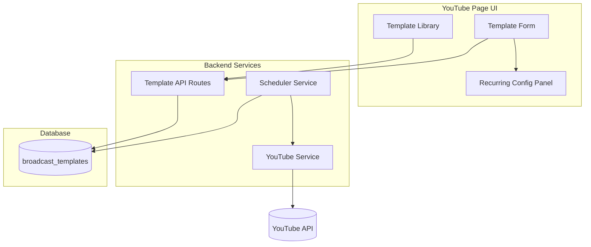

# Design Document

## Overview

Fitur ini mengintegrasikan recurring schedule ke dalam Broadcast Template dengan menambahkan kolom-kolom recurring pada tabel `broadcast_templates` dan menghapus UI section "Recurring Schedules" yang terpisah. Scheduler service akan dimodifikasi untuk membaca recurring configuration dari templates, bukan dari tabel `recurring_schedules` yang terpisah.

## Architecture



## Components and Interfaces

### 1. Database Schema Changes

Tambahkan kolom recurring ke tabel `broadcast_templates`:

```sql
ALTER TABLE broadcast_templates ADD COLUMN recurring_enabled INTEGER DEFAULT 0;
ALTER TABLE broadcast_templates ADD COLUMN recurring_pattern TEXT; -- 'daily' or 'weekly'
ALTER TABLE broadcast_templates ADD COLUMN recurring_time TEXT; -- HH:MM format
ALTER TABLE broadcast_templates ADD COLUMN recurring_days TEXT; -- JSON array for weekly, e.g. ["monday","wednesday"]
ALTER TABLE broadcast_templates ADD COLUMN last_run_at TEXT;
ALTER TABLE broadcast_templates ADD COLUMN next_run_at TEXT;
```

### 2. BroadcastTemplate Model Updates

```javascript
// Extended template object structure
{
  id: string,
  user_id: string,
  account_id: string,
  name: string,
  title: string,
  description: string,
  privacy_status: string,
  tags: string[],
  category_id: string,
  thumbnail_path: string,
  stream_id: string,
  // New recurring fields
  recurring_enabled: boolean,
  recurring_pattern: 'daily' | 'weekly' | null,
  recurring_time: string | null,  // "HH:MM"
  recurring_days: string[] | null, // ["monday", "tuesday", ...]
  last_run_at: string | null,
  next_run_at: string | null,
  created_at: string,
  updated_at: string
}
```

### 3. API Endpoints

| Method | Endpoint | Description |
|--------|----------|-------------|
| PUT | `/api/templates/:id/recurring` | Update recurring settings for a template |
| POST | `/api/templates/:id/recurring/toggle` | Quick toggle recurring on/off |
| GET | `/api/templates/recurring` | Get all templates with recurring enabled |

### 4. Scheduler Service Updates

```javascript
// schedulerService.js modifications
class SchedulerService {
  // Load templates with recurring enabled instead of recurring_schedules
  async loadActiveSchedules() {
    return BroadcastTemplate.findWithRecurringEnabled();
  }
  
  // Process template-based recurring
  async processRecurringTemplate(template) {
    // Create broadcast using template settings
    // Update last_run_at and next_run_at
  }
}
```

### 5. UI Components

#### Template List Item with Recurring Indicator
```
┌─────────────────────────────────────────────────────────┐
│ 📋 Morning Show Template                    [Toggle 🔄] │
│ YouTube: My Channel                                     │
│ 🔄 Daily at 08:00 • Next: 12/25/2025, 8:00 AM          │
└─────────────────────────────────────────────────────────┘
```

#### Template Form with Recurring Section
```
┌─────────────────────────────────────────────────────────┐
│ Template Settings                                       │
│ ─────────────────────────────────────────────────────── │
│ Name: [Morning Show Template        ]                   │
│ Title: [Live Stream {date}          ]                   │
│ ...                                                     │
│ ─────────────────────────────────────────────────────── │
│ Recurring Schedule                                      │
│ [✓] Enable recurring                                    │
│ Pattern: (•) Daily  ( ) Weekly                          │
│ Time: [08:00]                                           │
│ Days: □Mon □Tue □Wed □Thu □Fri □Sat □Sun               │
└─────────────────────────────────────────────────────────┘
```

## Data Models

### Template with Recurring Configuration

```javascript
const templateWithRecurring = {
  // Existing fields
  id: "uuid",
  user_id: "user-uuid",
  account_id: "youtube-account-uuid",
  name: "Morning Show Template",
  title: "Live Stream {date}",
  description: "Daily morning broadcast",
  privacy_status: "unlisted",
  tags: ["live", "morning"],
  category_id: "20",
  thumbnail_path: "/uploads/thumbnails/morning.jpg",
  stream_id: "stream-uuid",
  
  // New recurring fields
  recurring_enabled: true,
  recurring_pattern: "daily",
  recurring_time: "08:00",
  recurring_days: null, // null for daily, array for weekly
  last_run_at: "2025-12-24T08:00:00Z",
  next_run_at: "2025-12-25T08:00:00Z",
  
  created_at: "2025-12-01T00:00:00Z",
  updated_at: "2025-12-24T08:00:00Z"
};
```

### Weekly Recurring Example

```javascript
const weeklyTemplate = {
  // ... other fields
  recurring_enabled: true,
  recurring_pattern: "weekly",
  recurring_time: "19:00",
  recurring_days: ["monday", "wednesday", "friday"],
  next_run_at: "2025-12-25T19:00:00Z" // Next Wednesday
};
```


## Correctness Properties

*A property is a characteristic or behavior that should hold true across all valid executions of a system-essentially, a formal statement about what the system should do. Properties serve as the bridge between human-readable specifications and machine-verifiable correctness guarantees.*

### Property 1: Template Recurring Data Round-Trip
*For any* valid template with recurring configuration (pattern, time, days), saving the template and then retrieving it should return the exact same recurring configuration values.
**Validates: Requirements 1.4**

### Property 2: Weekly Pattern Requires Days Validation
*For any* template with recurring_pattern set to "weekly", if recurring_days is empty or null, the save operation should be rejected with a validation error.
**Validates: Requirements 1.5**

### Property 3: Recurring Display Contains Required Info
*For any* template with recurring_enabled set to true, the display/render output should contain the pattern type, scheduled time, and next_run_at value.
**Validates: Requirements 2.2**

### Property 4: Disabled Recurring Shows No Indicator
*For any* template with recurring_enabled set to false, the display/render output should not contain recurring schedule information.
**Validates: Requirements 2.3**

### Property 5: Toggle Preserves Configuration
*For any* template with recurring configuration, toggling recurring_enabled from true to false should preserve the recurring_pattern, recurring_time, and recurring_days values unchanged.
**Validates: Requirements 3.2**

### Property 6: Next Run Calculation Correctness
*For any* template with recurring enabled and valid configuration (daily with time, or weekly with time and days), the calculated next_run_at should be a future timestamp that matches the pattern and time specification.
**Validates: Requirements 3.3, 6.3**

### Property 7: Migration Preserves Schedule Data
*For any* existing recurring_schedule record, after migration the corresponding template should have recurring_enabled=true with matching pattern, time, and days values.
**Validates: Requirements 4.3**

### Property 8: Broadcast Creation Updates Timestamps
*For any* successful broadcast creation from a recurring template, the template's last_run_at should be updated to the current time and next_run_at should be recalculated to the next occurrence.
**Validates: Requirements 5.4**

### Property 9: Combined Validation on Create
*For any* new template creation with recurring enabled, both template validation (name, title, account required) and recurring validation (pattern required, weekly needs days) should be enforced.
**Validates: Requirements 6.2**

## Error Handling

| Error Scenario | Handling Strategy |
|----------------|-------------------|
| Weekly pattern without days | Return validation error, prevent save |
| Invalid time format | Return validation error with format hint |
| Template not found for recurring update | Return 404 error |
| YouTube API failure during broadcast creation | Log error, retry up to 3 times, update error status |
| Database error during save | Return 500 error, rollback transaction |
| Migration failure for single schedule | Log error, continue with other schedules, report failures |

## Testing Strategy

### Property-Based Testing Library
- **Library**: fast-check (JavaScript)
- **Minimum iterations**: 100 per property test

### Unit Tests
- Template CRUD operations with recurring fields
- Validation logic for weekly pattern days requirement
- Next run calculation for daily and weekly patterns
- Toggle functionality preserving configuration
- Migration logic from recurring_schedules to templates

### Property-Based Tests
Each correctness property will be implemented as a property-based test:

1. **Round-trip test**: Generate random valid recurring configs, save and retrieve, verify equality
2. **Weekly validation test**: Generate weekly patterns with various days arrays (including empty), verify rejection
3. **Display rendering test**: Generate templates with recurring enabled, verify output contains required fields
4. **Toggle preservation test**: Generate templates with config, toggle off, verify config unchanged
5. **Next run calculation test**: Generate patterns and times, verify calculated next_run_at is valid future time
6. **Migration test**: Generate recurring_schedule records, run migration, verify template equivalence

### Integration Tests
- End-to-end template creation with recurring
- Scheduler service loading recurring templates
- Broadcast creation from recurring template
