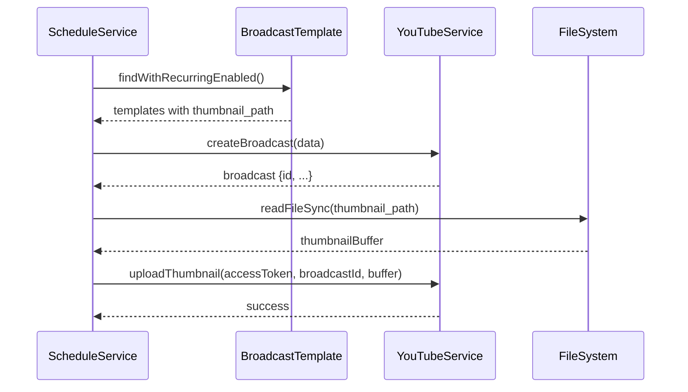

# Design Document: Template Thumbnail Fix

## Overview

Perbaikan ini mengatasi masalah dimana thumbnail dari template broadcast tidak di-upload ketika template digunakan kembali melalui recurring schedule (scheduleService). Saat ini, `scheduleService.executeTemplate()` membuat broadcast tanpa meng-upload thumbnail meskipun template memiliki `thumbnail_path` yang valid.

## Architecture

Perubahan akan dilakukan pada:
1. **scheduleService.js** - Menambahkan logic untuk upload thumbnail setelah broadcast dibuat
2. **app.js** - Memastikan multi-broadcast template menyimpan thumbnail path untuk setiap broadcast



## Components and Interfaces

### 1. ScheduleService Changes

```javascript
// services/scheduleService.js
async executeTemplate(template, retryCount = 0) {
  // ... existing code to create broadcast ...
  
  // NEW: Upload thumbnail after broadcast creation
  if (template.thumbnail_path) {
    await this.uploadThumbnailForBroadcast(
      accessToken, 
      broadcastId, 
      template.thumbnail_path
    );
  }
}

// NEW: Helper method for thumbnail upload
async uploadThumbnailForBroadcast(accessToken, broadcastId, thumbnailPath) {
  try {
    const fullPath = path.join(__dirname, '..', 'public', thumbnailPath);
    if (!fs.existsSync(fullPath)) {
      console.warn(`[ScheduleService] Thumbnail not found: ${thumbnailPath}`);
      return;
    }
    const thumbnailBuffer = fs.readFileSync(fullPath);
    await youtubeService.uploadThumbnail(accessToken, broadcastId, thumbnailBuffer);
    console.log(`[ScheduleService] Thumbnail uploaded for broadcast: ${broadcastId}`);
  } catch (error) {
    console.error(`[ScheduleService] Thumbnail upload failed:`, error.message);
    // Continue without failing - thumbnail is optional
  }
}
```

### 2. Multi-Broadcast Template Structure

```javascript
// Structure for broadcasts in multi-broadcast template
{
  title: string,
  description: string,
  privacyStatus: string,
  streamId: string | null,
  streamKey: string,
  categoryId: string,
  tags: string[],
  thumbnailPath: string | null  // NEW: Add thumbnail path per broadcast
}
```

## Data Models

### BroadcastTemplate (existing)
- `thumbnail_path`: String - Path to thumbnail file relative to /public

### Multi-Broadcast JSON Structure (in description field)
```json
[
  {
    "title": "Broadcast 1",
    "description": "...",
    "privacyStatus": "unlisted",
    "streamId": "abc123",
    "thumbnailPath": "/uploads/thumbnails/thumb1.jpg"
  },
  {
    "title": "Broadcast 2",
    "thumbnailPath": "/uploads/thumbnails/thumb2.jpg"
  }
]
```

## Correctness Properties

*A property is a characteristic or behavior that should hold true across all valid executions of a system-essentially, a formal statement about what the system should do. Properties serve as the bridge between human-readable specifications and machine-verifiable correctness guarantees.*

### Property 1: Thumbnail upload on template execution
*For any* template with a valid thumbnail_path, when executeTemplate is called and broadcast is successfully created, uploadThumbnail should be called with the correct broadcast ID and thumbnail buffer.
**Validates: Requirements 1.1**

### Property 2: Multi-broadcast thumbnail mapping
*For any* multi-broadcast template where individual broadcasts have thumbnailPath defined, when executing the template, each broadcast should have its corresponding thumbnail uploaded (if thumbnailPath exists).
**Validates: Requirements 1.2, 3.2**

### Property 3: Thumbnail path persistence in multi-broadcast
*For any* multi-broadcast template saved with thumbnail paths, the stored JSON should contain thumbnailPath field for each broadcast that had a thumbnail.
**Validates: Requirements 3.1**

## Error Handling

1. **Missing Thumbnail File**
   - Check if file exists before reading
   - Log warning and continue without thumbnail
   - Do not fail broadcast creation

2. **YouTube API Upload Failure**
   - Catch error from uploadThumbnail
   - Log error with details
   - Continue without failing broadcast creation

3. **Invalid Thumbnail Path**
   - Validate path format
   - Handle null/undefined gracefully

## Testing Strategy

### Property-Based Testing
- Use Jest with fast-check for property-based tests
- Test that thumbnail upload is called correctly for various template configurations
- Minimum 100 iterations per property test

### Unit Tests
- Test uploadThumbnailForBroadcast helper method
- Test error handling scenarios
- Test multi-broadcast thumbnail mapping

### Test Annotations
Each property-based test must be tagged with:
`**Feature: template-thumbnail-fix, Property {number}: {property_text}**`
