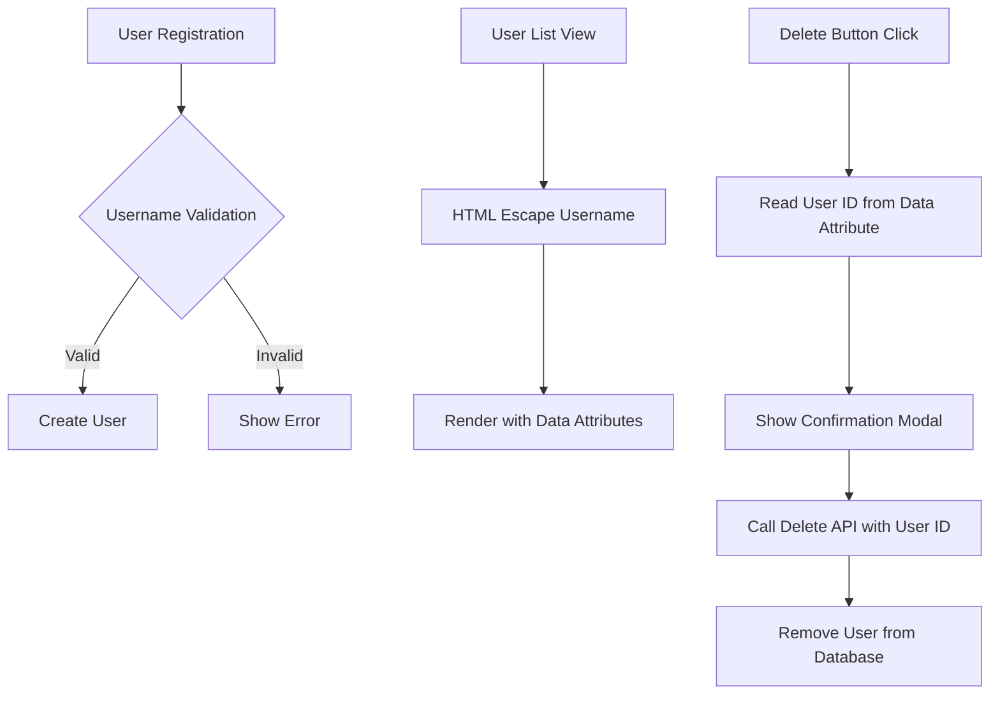

# Design Document: User Security Fix

## Overview

Dokumen ini menjelaskan desain untuk memperbaiki kerentanan keamanan pada sistem User Management. Masalah utama adalah user dengan username berbahaya seperti `'="or'` (SQL injection pattern) tidak dapat dihapus karena karakter khusus merusak JavaScript handler di UI.

Solusi meliputi:
1. Memperbaiki escaping di UI untuk menangani karakter khusus
2. Menambahkan validasi username saat registrasi
3. Menggunakan pendekatan data-attribute untuk passing data ke JavaScript

## Architecture



## Components and Interfaces

### 1. Username Validator (Backend)

```javascript
// utils/usernameValidator.js
const VALID_USERNAME_REGEX = /^[a-zA-Z0-9_]+$/;
const MIN_LENGTH = 3;
const MAX_LENGTH = 20;

function validateUsername(username) {
  if (!username || typeof username !== 'string') {
    return { valid: false, message: 'Username is required' };
  }
  
  if (username.length < MIN_LENGTH || username.length > MAX_LENGTH) {
    return { valid: false, message: `Username must be between ${MIN_LENGTH} and ${MAX_LENGTH} characters` };
  }
  
  if (!VALID_USERNAME_REGEX.test(username)) {
    return { valid: false, message: 'Username can only contain letters, numbers, and underscores' };
  }
  
  return { valid: true };
}
```

### 2. HTML Escape Helper (Frontend)

```javascript
// Escape function untuk mencegah XSS
function escapeHtml(str) {
  if (!str) return '';
  return String(str)
    .replace(/&/g, '&amp;')
    .replace(/</g, '&lt;')
    .replace(/>/g, '&gt;')
    .replace(/"/g, '&quot;')
    .replace(/'/g, '&#039;');
}
```

### 3. Modified User List Template

Menggunakan data attributes untuk menyimpan data user, bukan inline onclick:

```html
<button class="delete-user-btn" 
        data-user-id="<%= user.id %>" 
        data-username="<%- escapeHtml(user.username) %>">
  Delete
</button>
```

## Data Models

Tidak ada perubahan pada data model. User model tetap sama:

```javascript
{
  id: string (UUID),
  username: string,
  password: string (hashed),
  avatar_path: string | null,
  user_role: 'admin' | 'member',
  status: 'active' | 'inactive',
  created_at: datetime,
  updated_at: datetime
}
```

## Correctness Properties

*A property is a characteristic or behavior that should hold true across all valid executions of a system-essentially, a formal statement about what the system should do. Properties serve as the bridge between human-readable specifications and machine-verifiable correctness guarantees.*

### Property 1: Username Escape Safety

*For any* username string containing special characters (`'`, `"`, `<`, `>`, `&`), the escaped output SHALL NOT contain these characters in their raw form.

**Validates: Requirements 1.1, 1.3, 3.1**

### Property 2: Username Validation Correctness

*For any* input string, the username validator SHALL return `valid: true` if and only if the string contains only alphanumeric characters and underscores, and has length between 3 and 20 characters.

**Validates: Requirements 2.1, 2.2**

### Property 3: Delete Operation Independence

*For any* user in the database, the delete operation SHALL succeed based solely on the user ID, regardless of the characters in the username.

**Validates: Requirements 1.2, 4.2**

## Error Handling

| Error Scenario | Handling |
|----------------|----------|
| Invalid username format | Return validation error with clear message |
| User not found for deletion | Return 404 with "User not found" message |
| Database error during deletion | Return 500 with generic error, log details |
| XSS attempt in username | Escape all output, reject at registration |

## Testing Strategy

### Unit Tests

1. Test `escapeHtml` function dengan berbagai input berbahaya
2. Test `validateUsername` function dengan valid dan invalid inputs
3. Test User.delete dengan user ID yang valid dan invalid

### Property-Based Tests

Menggunakan **fast-check** library untuk JavaScript:

1. **Property 1 Test**: Generate random strings dengan karakter khusus, verify escape output tidak mengandung raw characters
2. **Property 2 Test**: Generate random strings, verify validation result sesuai dengan regex pattern
3. **Property 3 Test**: Create users dengan random usernames, verify delete berhasil untuk semua

### Integration Tests

1. Test full flow: create user dengan username berbahaya → list users → delete user
2. Test UI rendering dengan username yang mengandung karakter khusus
