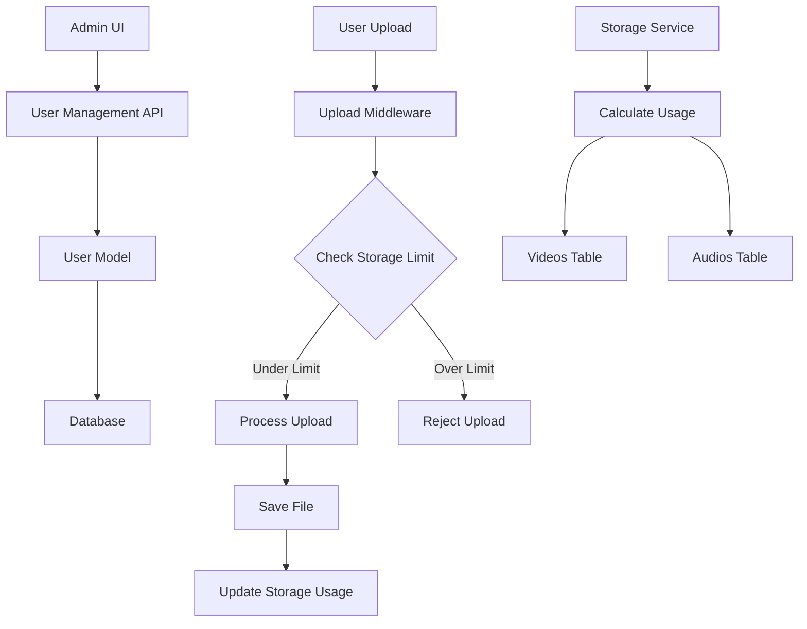

# Design Document: User Storage Limit

## Overview

Fitur User Storage Limit memungkinkan admin untuk membatasi kapasitas penyimpanan setiap user dalam sistem StreamFlow. Sistem akan melacak penggunaan storage (video + audio) per user dan mencegah upload file baru jika batas sudah tercapai.

## Architecture



## Components and Interfaces

### 1. StorageService (services/storageService.js)

Service baru untuk mengelola perhitungan dan validasi storage.

```javascript
class StorageService {
  /**
   * Calculate total storage usage for a user
   * @param {string} userId - User ID
   * @returns {Promise<{totalBytes: number, videoBytes: number, audioBytes: number}>}
   */
  static async calculateUsage(userId);

  /**
   * Check if user can upload a file of given size
   * @param {string} userId - User ID
   * @param {number} fileSize - Size of file to upload in bytes
   * @returns {Promise<{allowed: boolean, currentUsage: number, limit: number|null, remaining: number|null}>}
   */
  static async canUpload(userId, fileSize);

  /**
   * Get storage info for display
   * @param {string} userId - User ID
   * @returns {Promise<{usage: number, limit: number|null, percentage: number|null, formatted: {usage: string, limit: string}}>}
   */
  static async getStorageInfo(userId);

  /**
   * Format bytes to human readable string
   * @param {number} bytes - Size in bytes
   * @returns {string} - Formatted string (e.g., "1.5 GB")
   */
  static formatBytes(bytes);
}
```

### 2. User Model Extensions (models/User.js)

Menambahkan method untuk storage limit management.

```javascript
// New methods to add
static updateStorageLimit(userId, limitBytes);
static getStorageLimit(userId);
```

### 3. Upload Middleware Enhancement (middleware/uploadMiddleware.js)

Menambahkan validasi storage limit sebelum upload.

```javascript
// New middleware function
const checkStorageLimit = async (req, res, next) => {
  // Check if user has storage limit
  // Validate file size against remaining storage
  // Reject or allow upload
};
```

### 4. API Endpoints

| Method | Endpoint | Description |
|--------|----------|-------------|
| GET | /api/users/:id/storage | Get user storage info |
| PUT | /api/users/:id/storage-limit | Update user storage limit |
| GET | /api/settings/default-storage-limit | Get default storage limit |
| PUT | /api/settings/default-storage-limit | Set default storage limit |

## Data Models

### Database Schema Changes

```sql
-- Add storage_limit column to users table
ALTER TABLE users ADD COLUMN storage_limit INTEGER DEFAULT NULL;

-- Add default_storage_limit to system_settings
INSERT OR IGNORE INTO system_settings (key, value) 
VALUES ('default_storage_limit', 'null');
```

### Storage Info Response Model

```javascript
{
  userId: string,
  usage: {
    total: number,      // Total bytes used
    videos: number,     // Bytes used by videos
    audios: number      // Bytes used by audios
  },
  limit: number | null, // Storage limit in bytes (null = unlimited)
  remaining: number | null, // Remaining bytes (null if unlimited)
  percentage: number | null, // Usage percentage (null if unlimited)
  formatted: {
    usage: string,      // e.g., "1.5 GB"
    limit: string,      // e.g., "5 GB" or "Unlimited"
    remaining: string   // e.g., "3.5 GB" or "Unlimited"
  },
  status: 'normal' | 'warning' | 'critical' // Based on percentage
}
```


## Correctness Properties

*A property is a characteristic or behavior that should hold true across all valid executions of a system-essentially, a formal statement about what the system should do. Properties serve as the bridge between human-readable specifications and machine-verifiable correctness guarantees.*

### Property 1: Storage Limit Persistence
*For any* valid storage limit value (positive integer or null), when an admin sets this limit for a user, querying the user's storage limit should return the same value.
**Validates: Requirements 1.2**

### Property 2: Storage Usage Calculation Accuracy
*For any* user with a set of videos and audios, the calculated storage usage should equal the sum of all file_size values from their videos plus the sum of all file_size values from their audios.
**Validates: Requirements 2.1, 2.2**

### Property 3: Unlimited Storage Behavior
*For any* user with storage limit set to null or zero, and *for any* file size, the canUpload check should always return allowed=true.
**Validates: Requirements 1.3, 4.4**

### Property 4: Storage Limit Enforcement
*For any* user with a positive storage limit, and *for any* file size, the canUpload check should return allowed=true if and only if (currentUsage + fileSize) <= storageLimit.
**Validates: Requirements 1.4, 4.1, 4.2**

### Property 5: Percentage and Status Calculation
*For any* user with a positive storage limit, the percentage should equal (usage / limit * 100), and status should be 'critical' if percentage >= 100, 'warning' if percentage >= 80, otherwise 'normal'.
**Validates: Requirements 3.2, 3.3, 3.4**

### Property 6: Default Storage Limit Application
*For any* newly created user, if a default storage limit is configured in system settings, the user's storage limit should equal that default value; otherwise it should be null.
**Validates: Requirements 5.1, 5.2, 5.3**

### Property 7: Bytes Formatting Round Trip
*For any* byte value, formatting it to human-readable string and the original bytes value should be consistently represented (the formatted string should accurately represent the magnitude of bytes).
**Validates: Requirements 2.3**

## Error Handling

| Error Scenario | Response Code | Error Message |
|----------------|---------------|---------------|
| Storage limit exceeded | 413 | "Storage limit exceeded. Current usage: X, Limit: Y, File size: Z" |
| Invalid storage limit value | 400 | "Invalid storage limit. Must be a positive number or null" |
| User not found | 404 | "User not found" |
| Unauthorized access | 403 | "Only admins can modify storage limits" |

## Testing Strategy

### Property-Based Testing

Menggunakan **fast-check** library untuk JavaScript property-based testing.

Setiap property test harus:
- Menjalankan minimal 100 iterasi
- Menggunakan generator yang sesuai untuk input
- Di-tag dengan referensi ke correctness property

### Unit Tests

Unit tests akan mencakup:
- StorageService.calculateUsage dengan berbagai kombinasi video/audio
- StorageService.canUpload dengan edge cases (exactly at limit, 1 byte over)
- StorageService.formatBytes dengan berbagai ukuran (bytes, KB, MB, GB, TB)
- User.updateStorageLimit dengan valid dan invalid values
- Middleware checkStorageLimit integration

### Test File Structure

```
tests/
  user-storage-limit.test.js       # Unit tests
  user-storage-limit.property.js   # Property-based tests
```
