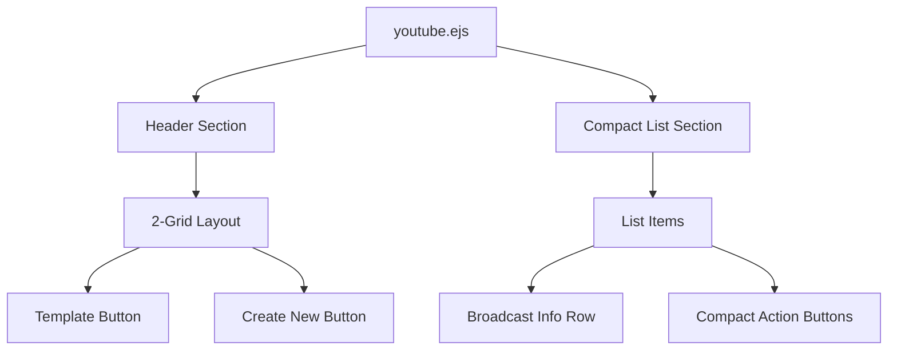

# Design Document: YouTube Broadcast List Redesign

## Overview

Redesign tampilan daftar "Scheduled Broadcasts" di halaman YouTube Sync untuk memberikan tampilan yang lebih compact dan ramping. Perubahan utama meliputi:
- Layout 2-grid untuk tombol Template dan Create New (+) di header
- Format list sederhana (bukan card besar) untuk setiap broadcast
- Action buttons yang compact (icon-only, tanpa background besar)
- Stream key ditampilkan dalam format truncated
- Responsive design untuk mobile

## Architecture

Perubahan ini bersifat frontend-only dan hanya mempengaruhi file `views/youtube.ejs` dan CSS terkait. Tidak ada perubahan pada backend, API, atau database.



## Components and Interfaces

### 1. Header Buttons Component (2-Grid Layout)

Layout 2 kolom untuk tombol Template dan Create New:

```
┌─────────────────────────────────────────────┐
│ ┌───────────────────┐ ┌───────────────────┐ │
│ │ 📋 Template       │ │ ➕ Create New     │ │
│ └───────────────────┘ └───────────────────┘ │
└─────────────────────────────────────────────┘
```

CSS Grid Implementation:
```css
.header-buttons {
  display: grid;
  grid-template-columns: 1fr 1fr;
  gap: 10px;
}
```

### 2. Compact List Item Component

Format list sederhana per baris:

```
┌─────────────────────────────────────────────────────────────────┐
│ 1 │ La Davina Melodia │ PUBLIC │ gz24-wh2m... │ [✏️][🔄][🗑️] │
└─────────────────────────────────────────────────────────────────┘
```

Struktur HTML:
```html
<div class="broadcast-list-item">
  <span class="item-number">1</span>
  <span class="item-title">La Davina Melodia</span>
  <span class="item-privacy">PUBLIC</span>
  <span class="item-streamkey">gz24-wh2m-134s...</span>
  <div class="item-actions">
    <button class="action-btn edit"><i class="fas fa-edit"></i></button>
    <button class="action-btn sync"><i class="fas fa-sync"></i></button>
    <button class="action-btn delete"><i class="fas fa-trash"></i></button>
  </div>
</div>
```

### 3. Compact Action Buttons

Tombol kecil icon-only dengan warna berbeda:

| Button | Icon | Color | Action |
|--------|------|-------|--------|
| Edit | fa-edit | Blue (#3b82f6) | Open edit modal |
| Sync | fa-sync | Green (#22c55e) | Reuse/copy broadcast |
| Delete | fa-trash | Red (#ef4444) | Delete with confirmation |

CSS untuk compact buttons:
```css
.action-btn {
  width: 32px;
  height: 32px;
  padding: 0;
  border: none;
  border-radius: 6px;
  cursor: pointer;
  display: inline-flex;
  align-items: center;
  justify-content: center;
}
```

### 4. Mobile Layout

Pada mobile, list item di-stack secara vertikal tapi tetap compact:

```
┌─────────────────────────────────┐
│ 1 │ La Davina Melodia  │ PUBLIC │
│ 🔑 gz24-wh2m-134s-h2w9-0r3p    │
│ [✏️] [🔄] [🗑️]                  │
└─────────────────────────────────┘
```

## Data Models

Tidak ada perubahan pada data model. Menggunakan struktur broadcast yang sudah ada:

```javascript
{
  id: string,
  title: string,
  channelName: string,
  privacyStatus: 'public' | 'unlisted' | 'private',
  scheduledStartTime: Date,
  streamKey: string,
  accountId: number
}
```


## Correctness Properties

*A property is a characteristic or behavior that should hold true across all valid executions of a system-essentially, a formal statement about what the system should do. Properties serve as the bridge between human-readable specifications and machine-verifiable correctness guarantees.*

### Property 1: Essential Information Display
*For any* broadcast object rendered in the list, the output SHALL contain the broadcast number, title, privacy status, and stream key (or placeholder if empty).
**Validates: Requirements 2.2, 4.1, 4.2**

### Property 2: Action Buttons Presence
*For any* broadcast item rendered in the list, the output SHALL contain exactly three action buttons: edit, sync, and delete.
**Validates: Requirements 3.1**

## Error Handling

| Scenario | Handling |
|----------|----------|
| Stream key is null/empty | Display "-" placeholder |
| Broadcast title is too long | Truncate with ellipsis (CSS text-overflow) |
| Copy to clipboard fails | Show error toast notification |
| Empty broadcast list | Show empty state message |

## Testing Strategy

### Unit Testing

Unit tests akan memverifikasi:
- Header buttons menggunakan 2-grid layout
- List item menampilkan informasi essential
- Action buttons ada dan berfungsi
- Stream key placeholder untuk data kosong

### Property-Based Testing

Menggunakan **fast-check** library untuk JavaScript property-based testing.

Property tests akan memverifikasi:
1. **Property 1**: Untuk setiap broadcast dengan data valid, output mengandung number, title, privacy status, dan stream key
2. **Property 2**: Untuk setiap broadcast item, terdapat tepat 3 action buttons (edit, sync, delete)

Setiap property test akan:
- Menjalankan minimal 100 iterasi
- Menggunakan generator untuk membuat data broadcast random
- Di-tag dengan format: `**Feature: youtube-broadcast-list-redesign, Property {number}: {property_text}**`
