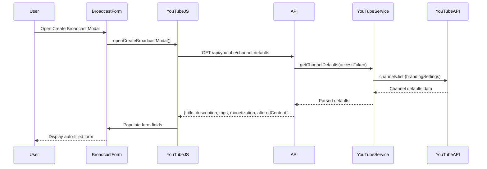

# Design Document: YouTube Default Settings Auto-Fill

## Overview

Fitur ini mengintegrasikan YouTube Live API untuk mengambil default settings dari channel pengguna dan mengisi otomatis form broadcast. Tujuannya adalah mengurangi duplikasi input dengan menggunakan konfigurasi yang sudah ada di YouTube Live Dashboard.

## Architecture



## Components and Interfaces

### 1. YouTubeService Extension

Tambahan method di `services/youtubeService.js`:

```javascript
/**
 * Get channel default settings for broadcasts
 * @param {string} accessToken - Access token
 * @returns {Promise<ChannelDefaults>}
 */
async getChannelDefaults(accessToken) {
  // Returns: { title, description, tags, monetizationEnabled, alteredContent }
}
```

### 2. API Endpoint

New endpoint di `app.js`:

```
GET /api/youtube/channel-defaults
Response: {
  success: boolean,
  defaults: {
    title: string,
    description: string,
    tags: string[],
    monetizationEnabled: boolean,
    alteredContent: boolean,
    categoryId: string
  }
}
```

### 3. Frontend Components

Update di `public/js/youtube.js`:
- `fetchChannelDefaults()` - Fetch defaults saat modal dibuka
- `populateFormWithDefaults(defaults)` - Populate form fields
- `renderTags(tags)` - Render tags sebagai chips

Update di `views/youtube.ejs`:
- Tambah field untuk monetization, altered content, dan tags
- Tambah loading indicator untuk auto-fill
- Tambah visual indicator untuk auto-filled fields

## Data Models

### ChannelDefaults

```typescript
interface ChannelDefaults {
  title: string;           // Default title template (bisa kosong)
  description: string;     // Default description
  tags: string[];          // Default tags array
  monetizationEnabled: boolean;  // Apakah channel bisa monetisasi
  alteredContent: boolean; // Default altered content setting
  categoryId: string;      // Default category ID
}
```

### BroadcastFormData (Extended)

```typescript
interface BroadcastFormData {
  title: string;
  description: string;
  scheduledStartTime: string;
  privacyStatus: 'public' | 'unlisted' | 'private';
  streamId?: string;
  thumbnail?: File;
  thumbnailPath?: string;
  // New fields
  tags: string[];
  monetizationEnabled: boolean;
  alteredContent: boolean;
}
```

## Correctness Properties

*A property is a characteristic or behavior that should hold true across all valid executions of a system-essentially, a formal statement about what the system should do. Properties serve as the bridge between human-readable specifications and machine-verifiable correctness guarantees.*

### Property Reflection

After analyzing the prework, the following redundancies were identified:
- Properties 1.2 and 1.3 can be combined into a single "form population" property
- Properties 1.5, 3.2, and 4.2 all test user override behavior - can be combined
- Properties 2.1 and 2.2 overlap - 2.2 is an edge case of 2.1

### Correctness Properties

**Property 1: Default settings population**
*For any* valid ChannelDefaults response from YouTube API, the form fields (title, description, tags, monetization, alteredContent) SHALL be populated with the corresponding values from the response.
**Validates: Requirements 1.2, 1.3, 2.1, 3.1, 4.1**

**Property 2: Error handling preserves form usability**
*For any* API error response when fetching channel defaults, the form SHALL remain functional with empty/default field values and display a warning message.
**Validates: Requirements 1.4**

**Property 3: User modifications override defaults**
*For any* auto-filled field value and any user modification to that field, the final value used for broadcast creation SHALL be the user-modified value, not the auto-filled default.
**Validates: Requirements 1.5, 3.2, 4.2**

**Property 4: Tags rendering consistency**
*For any* array of tags, each tag SHALL be rendered as a removable chip element, and the total number of rendered chips SHALL equal the number of tags in the array.
**Validates: Requirements 4.3**

**Property 5: Monetization field visibility**
*For any* channel where monetization is not enabled, the monetization field SHALL be hidden or disabled.
**Validates: Requirements 2.3**

## Error Handling

| Error Scenario | Handling Strategy |
|----------------|-------------------|
| YouTube API timeout | Show warning toast, allow manual input |
| Invalid access token | Redirect to reconnect YouTube |
| Rate limit exceeded | Show warning, use cached defaults if available |
| Network error | Show warning toast, form remains usable |
| Partial data returned | Populate available fields, leave others empty |

## Testing Strategy

### Unit Tests
- Test `getChannelDefaults()` parsing logic
- Test `populateFormWithDefaults()` field mapping
- Test `renderTags()` chip rendering
- Test error handling scenarios

### Property-Based Tests
Library: **fast-check** (JavaScript property-based testing library)

Configuration: Minimum 100 iterations per property test.

Each property test will be tagged with format: `**Feature: youtube-default-settings, Property {number}: {property_text}**`

Property tests will cover:
1. Form population with random valid ChannelDefaults
2. Error handling with various error types
3. User override behavior with random modifications
4. Tags rendering with random tag arrays
5. Monetization visibility based on channel status
