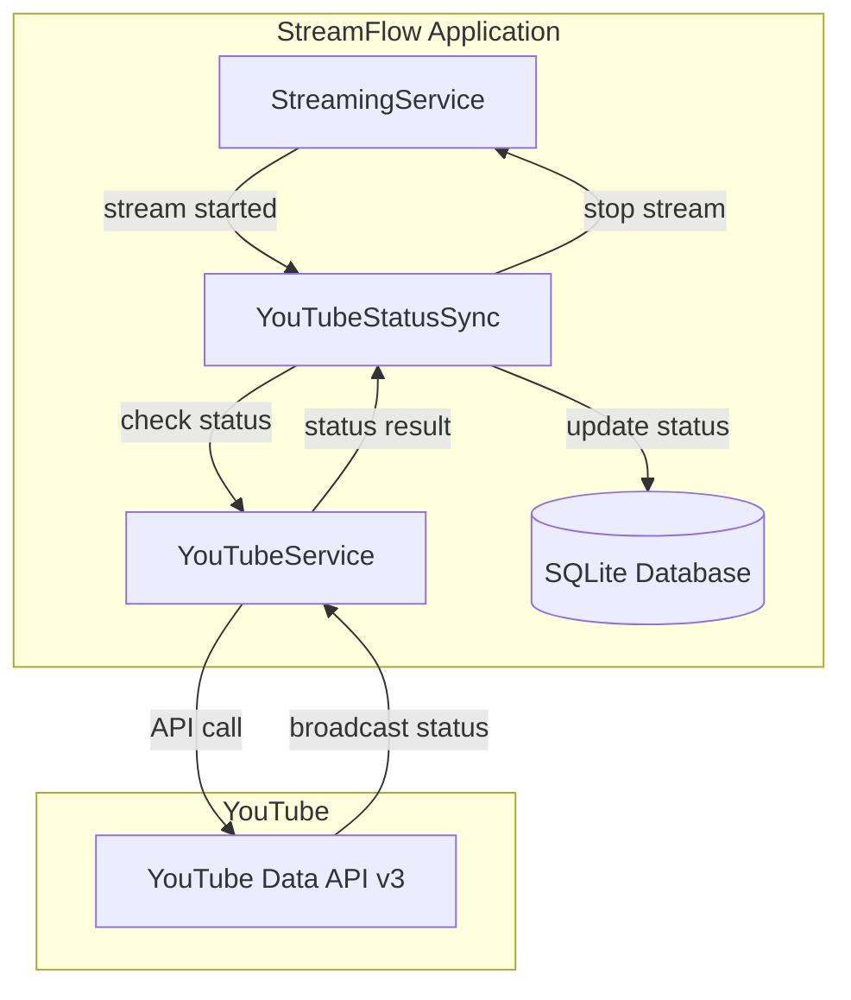

# Design Document: YouTube Status Sync

## Overview

YouTube Status Sync adalah fitur untuk menyinkronkan status stream antara aplikasi StreamFlow dengan YouTube Live. Fitur ini menambahkan mekanisme polling yang memeriksa status broadcast di YouTube setiap 60 detik dan memperbarui status stream lokal secara otomatis ketika broadcast selesai atau dihapus.

## Architecture



### Flow

1. **Stream Start:**
   - StreamingService memulai stream
   - Jika platform adalah "YouTube", YouTubeStatusSync diaktifkan
   - System mencari broadcast yang cocok berdasarkan stream key

2. **Status Polling:**
   - Setiap 60 detik, system memeriksa status broadcast via YouTube API
   - Jika status berubah ke "complete" atau "revoked", stream dihentikan
   - Jika broadcast dihapus, stream dihentikan

3. **Error Handling:**
   - API error: log dan retry di interval berikutnya
   - Quota exceeded: disable sync selama 1 jam
   - No broadcast found: continue tanpa sync

## Components and Interfaces

### 1. YouTubeStatusSync Service (services/youtubeStatusSync.js)

```javascript
class YouTubeStatusSync {
  constructor() {
    this.activeChecks = new Map(); // streamId -> { intervalId, broadcastId, userId }
    this.quotaExceededUntil = null; // Timestamp when quota cooldown ends
  }
  
  // Start monitoring a stream
  async startMonitoring(streamId, userId, streamKey)
  
  // Stop monitoring a stream
  stopMonitoring(streamId)
  
  // Check broadcast status (called by interval)
  async checkBroadcastStatus(streamId, broadcastId, userId)
  
  // Find broadcast by stream key
  async findBroadcastByStreamKey(userId, streamKey)
  
  // Handle quota exceeded
  handleQuotaExceeded()
  
  // Check if quota is in cooldown
  isQuotaCooldown()
  
  // Map YouTube lifecycle status to display text
  static mapStatusToDisplay(lifeCycleStatus)
  
  // Get current YouTube status for a stream
  getYouTubeStatus(streamId)
}
```

### 2. YouTubeService Additions (services/youtubeService.js)

```javascript
// New methods to add:

/**
 * Get broadcast status by ID
 * @param {string} accessToken - Access token
 * @param {string} broadcastId - Broadcast ID
 * @returns {Promise<{lifeCycleStatus: string, exists: boolean}>}
 */
async getBroadcastStatus(accessToken, broadcastId)

/**
 * Find broadcast by stream key
 * @param {string} accessToken - Access token
 * @param {string} streamKey - Stream key to search
 * @returns {Promise<{broadcastId: string, lifeCycleStatus: string} | null>}
 */
async findBroadcastByStreamKey(accessToken, streamKey)

/**
 * List active broadcasts (live and testing)
 * @param {string} accessToken - Access token
 * @returns {Promise<Array<{id: string, streamKey: string, lifeCycleStatus: string}>>}
 */
async listActiveBroadcasts(accessToken)
```

### 3. StreamingService Integration

Modify `startStream()` to:
1. After FFmpeg starts successfully, check if platform is "YouTube"
2. If YouTube, call `youtubeStatusSync.startMonitoring()`

Modify `stopStream()` to:
1. Call `youtubeStatusSync.stopMonitoring()` to clean up

### 4. Database Changes

No new tables needed. We'll use existing `streams` table and `youtube_credentials` table.

Add to streams table (optional, for caching):
```sql
ALTER TABLE streams ADD COLUMN youtube_broadcast_id TEXT;
ALTER TABLE streams ADD COLUMN youtube_lifecycle_status TEXT;
```

## Data Models

### YouTubeStatusSync State

```javascript
// Active check entry
{
  streamId: string,
  intervalId: NodeJS.Timeout,
  broadcastId: string,
  userId: string,
  lastStatus: string,
  lastChecked: Date
}

// Status display mapping
const STATUS_DISPLAY = {
  'created': 'Dibuat',
  'ready': 'Siap',
  'testing': 'Menunggu Preview',
  'live': 'Live di YouTube',
  'complete': 'Selesai',
  'revoked': 'Dibatalkan'
};
```

## Correctness Properties

*A property is a characteristic or behavior that should hold true across all valid executions of a system-essentially, a formal statement about what the system should do. Properties serve as the bridge between human-readable specifications and machine-verifiable correctness guarantees.*

### Property 1: YouTube stream monitoring activation
*For any* stream with platform "YouTube" and valid user credentials, starting the stream SHALL activate status monitoring for that stream.
**Validates: Requirements 1.1, 3.1**

### Property 2: Broadcast status change handling
*For any* monitored YouTube stream, when the broadcast status changes to "complete", "revoked", or the broadcast is deleted, the local FFmpeg process SHALL be stopped and stream status SHALL be updated appropriately.
**Validates: Requirements 1.2, 1.3**

### Property 3: API error resilience
*For any* YouTube API error during status check (except quota exceeded), the system SHALL log the error and continue monitoring without crashing, retrying on the next interval.
**Validates: Requirements 1.5**

### Property 4: Status display mapping
*For any* YouTube lifecycle status value, the mapStatusToDisplay function SHALL return a valid Indonesian display string, with unknown statuses returning "Status tidak diketahui".
**Validates: Requirements 2.1, 2.2, 2.3, 2.4, 2.5**

### Property 5: Non-YouTube stream isolation
*For any* stream with platform other than "YouTube", the YouTube status sync system SHALL not perform any YouTube API calls or monitoring.
**Validates: Requirements 3.4**

### Property 6: Stream key matching
*For any* YouTube stream with valid credentials, the system SHALL attempt to find a matching broadcast by stream key, and if not found, SHALL continue streaming without sync.
**Validates: Requirements 3.2, 3.3**

### Property 7: Quota cooldown behavior
*For any* quota exceeded error, the system SHALL disable status checking for exactly 1 hour, then resume normal checking after the cooldown period expires.
**Validates: Requirements 4.1, 4.2, 4.4**

## Error Handling

### API Errors
- **Network error**: Log and retry next interval
- **Invalid credentials**: Stop monitoring, log warning
- **Broadcast not found**: Stop monitoring (broadcast deleted)
- **Quota exceeded**: Enable 1-hour cooldown, continue streaming

### Edge Cases
- Stream stopped manually while monitoring active → Clean up monitoring
- Multiple streams for same user → Each stream monitored independently
- Credentials deleted while monitoring → Stop monitoring gracefully

## Testing Strategy

### Dual Testing Approach

Both unit tests and property-based tests will be used:
- Unit tests verify specific examples and edge cases
- Property tests verify universal properties across all inputs

### Unit Testing
- Test YouTubeStatusSync methods with mocked YouTubeService
- Test status display mapping for all known statuses
- Test quota cooldown timing
- Test cleanup on stream stop

### Property-Based Testing

Using fast-check library:

- **Property 1**: Generate random YouTube streams, verify monitoring is activated
- **Property 2**: Generate random status changes (complete/revoked/deleted), verify stream is stopped
- **Property 3**: Generate random API errors, verify system continues running
- **Property 4**: Generate random lifecycle status strings, verify display mapping returns valid string
- **Property 5**: Generate random non-YouTube platforms, verify no YouTube API calls
- **Property 6**: Generate random stream keys, verify matching behavior
- **Property 7**: Generate random quota exceeded scenarios, verify 1-hour cooldown

Each property-based test MUST:
- Run minimum 100 iterations
- Be tagged with format: `**Feature: youtube-status-sync, Property {number}: {property_text}**`

