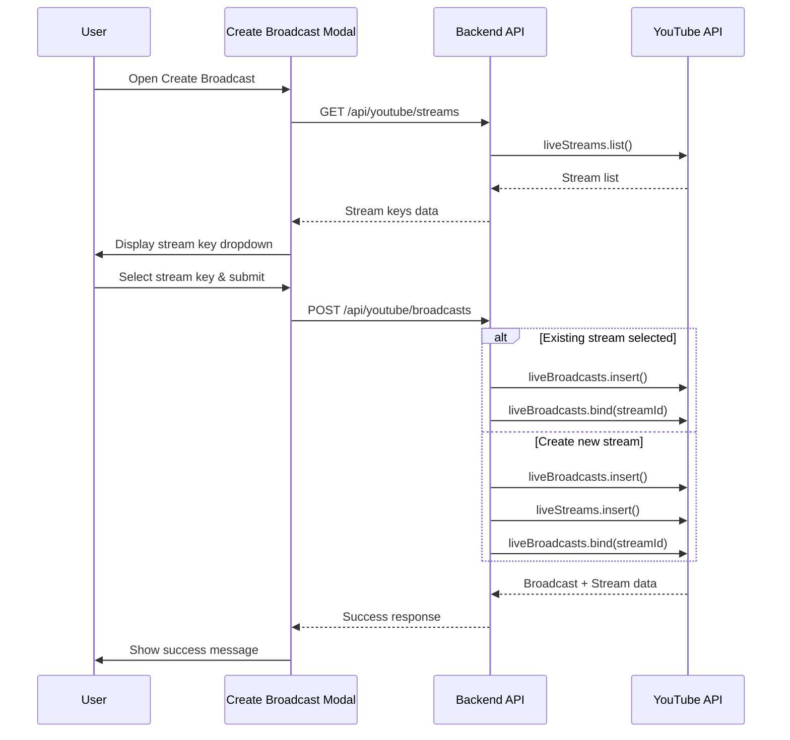

# Design Document: YouTube Stream Key Selector

## Overview

Fitur ini menambahkan kemampuan untuk memilih stream key yang sudah ada di YouTube saat membuat broadcast baru. Saat ini sistem selalu membuat stream key baru secara otomatis. Dengan fitur ini, pengguna dapat memilih dari daftar stream key yang sudah dibuat di YouTube Studio.

## Architecture



## Components and Interfaces

### 1. YouTubeService (Backend)

Menambahkan method baru untuk mengambil daftar stream keys:

```javascript
/**
 * List available live streams (stream keys)
 * @param {string} accessToken - Access token
 * @returns {Promise<Array<{id: string, title: string, streamKey: string, rtmpUrl: string, resolution: string, frameRate: string}>>}
 */
async listStreams(accessToken)

/**
 * Create broadcast with optional existing stream
 * @param {string} accessToken - Access token
 * @param {Object} data - Broadcast data including optional streamId
 * @returns {Promise<Object>} Broadcast and stream info
 */
async createBroadcastWithStream(accessToken, { title, description, scheduledStartTime, privacyStatus, streamId })
```

### 2. API Endpoints

| Endpoint | Method | Description |
|----------|--------|-------------|
| `/api/youtube/streams` | GET | Mengambil daftar stream keys yang tersedia |
| `/api/youtube/broadcasts` | POST | Membuat broadcast (dimodifikasi untuk menerima streamId dan thumbnailPath) |
| `/api/thumbnails` | GET | Mengambil daftar thumbnail yang sudah diupload |

### 3. Frontend Components

- **Stream Key Dropdown**: Select element yang menampilkan daftar stream keys
- **Loading State**: Spinner saat mengambil data stream keys
- **Error State**: Pesan error dengan tombol retry

## Data Models

### Stream Key Object

```javascript
{
  id: string,           // YouTube stream ID
  title: string,        // Stream title
  streamKey: string,    // Stream key untuk RTMP
  rtmpUrl: string,      // RTMP ingestion URL
  resolution: string,   // e.g., "1080p", "720p"
  frameRate: string     // e.g., "30fps", "60fps"
}
```

### Create Broadcast Request (Modified)

```javascript
{
  title: string,              // Required
  description: string,        // Optional
  scheduledStartTime: string, // Required, ISO datetime
  privacyStatus: string,      // "public", "unlisted", "private"
  streamId: string | null     // Optional, existing stream ID or null for new
}
```

## Correctness Properties

*A property is a characteristic or behavior that should hold true across all valid executions of a system-essentially, a formal statement about what the system should do. Properties serve as the bridge between human-readable specifications and machine-verifiable correctness guarantees.*

### Property 1: Stream list completeness
*For any* YouTube account with existing streams, the listStreams function SHALL return all streams with their id, title, streamKey, and rtmpUrl fields populated.
**Validates: Requirements 1.1, 1.2**

### Property 2: Existing stream binding
*For any* valid streamId provided to createBroadcastWithStream, the function SHALL bind that stream to the broadcast without creating a new stream, and the response SHALL contain the original stream's key and RTMP URL.
**Validates: Requirements 2.1, 2.3**

### Property 3: Stream info display completeness
*For any* stream key data returned from the API, the rendered dropdown option SHALL contain the stream title, resolution, and frame rate.
**Validates: Requirements 3.1, 3.2**

### Property 4: Thumbnail gallery completeness
*For any* set of thumbnail files in the uploads/thumbnails folder, the gallery API SHALL return all files with their filename and accessible URL path.
**Validates: Requirements 4.1**

### Property 5: Thumbnail selection persistence
*For any* thumbnail selected from the gallery, the broadcast creation request SHALL include the correct file path for that thumbnail.
**Validates: Requirements 4.2, 4.5**

### 4. Thumbnail Gallery Component

```javascript
// API Response for thumbnails
{
  thumbnails: [
    {
      filename: string,    // e.g., "thumb-abc123.jpg"
      path: string,        // e.g., "/uploads/thumbnails/thumb-abc123.jpg"
      url: string          // Full URL for display
    }
  ]
}
```

**UI Components:**
- Grid layout displaying uploaded thumbnails
- Selection indicator (border/overlay) for selected thumbnail
- "Upload new" button alongside gallery
- Empty state when no thumbnails exist

## Error Handling

| Error Scenario | Handling |
|----------------|----------|
| API fetch fails | Display error message with retry button |
| No streams found | Show "Create new stream key" as only option |
| Invalid streamId | Return 400 error with descriptive message |
| Stream already bound | Allow rebinding (YouTube API handles this) |

## Testing Strategy

### Unit Tests
- Test `listStreams` returns correct data structure
- Test `createBroadcastWithStream` with existing streamId
- Test `createBroadcastWithStream` without streamId (creates new)
- Test error handling for API failures

### Property-Based Tests
Using fast-check library for JavaScript:

1. **Property 1**: For any list of mock stream data, listStreams should return objects with all required fields
2. **Property 2**: For any valid streamId, createBroadcastWithStream should not call liveStreams.insert
3. **Property 3**: For any stream data, the dropdown render function should include title, resolution, and frameRate

### Integration Tests
- Test full flow: open modal → fetch streams → select stream → create broadcast
- Test with empty stream list
- Test with API error scenarios

