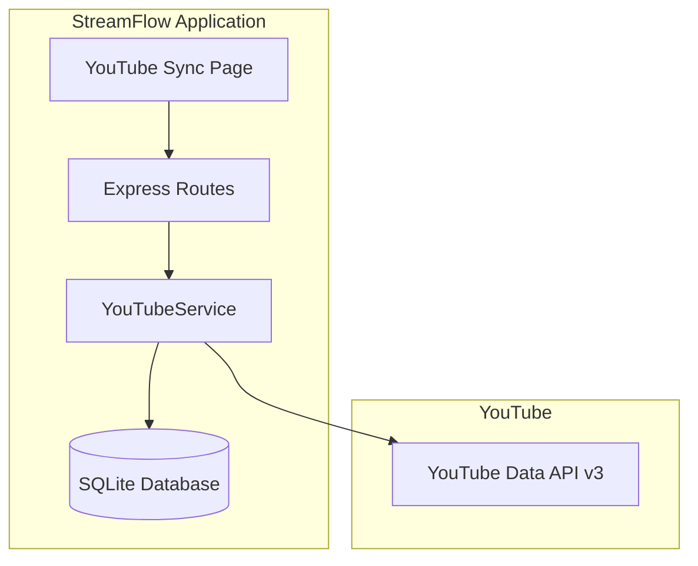

# Design Document: YouTube Sync

## Overview

YouTube Sync adalah fitur sederhana untuk membuat scheduled live broadcasts di YouTube langsung dari StreamFlow. User memasukkan API credentials (Client ID, Client Secret, Refresh Token) satu kali, lalu bisa langsung menjadwalkan live stream tanpa buka YouTube Studio.

## Architecture



### Flow Sederhana

1. **Setup Credentials:**
   - User masukkan Client ID, Client Secret, Refresh Token
   - System validasi dengan test API call
   - Simpan credentials di database

2. **Create Broadcast:**
   - User isi form (title, description, waktu, privacy)
   - System panggil YouTube API untuk buat broadcast
   - Tampilkan stream key yang didapat

3. **Manage Broadcasts:**
   - Lihat daftar scheduled broadcasts
   - Copy stream key untuk dipakai di StreamFlow
   - Delete broadcast jika tidak diperlukan

## Components and Interfaces

### 1. YouTubeService (services/youtubeService.js)

```javascript
class YouTubeService {
  // Credentials
  async validateCredentials(clientId, clientSecret, refreshToken)
  async getAccessToken(clientId, clientSecret, refreshToken)
  
  // Channel Info
  async getChannelInfo(accessToken)
  
  // Broadcasts
  async createBroadcast(accessToken, { title, description, scheduledStartTime, privacyStatus })
  async listBroadcasts(accessToken)
  async deleteBroadcast(accessToken, broadcastId)
  
  // Thumbnail
  async uploadThumbnail(accessToken, broadcastId, imageBuffer)
}
```

### 2. Database Schema

**youtube_credentials table:**
```sql
CREATE TABLE youtube_credentials (
  id INTEGER PRIMARY KEY AUTOINCREMENT,
  user_id INTEGER NOT NULL UNIQUE,
  client_id TEXT NOT NULL,
  client_secret TEXT NOT NULL,
  refresh_token TEXT NOT NULL,
  channel_name TEXT,
  channel_id TEXT,
  created_at DATETIME DEFAULT CURRENT_TIMESTAMP,
  FOREIGN KEY (user_id) REFERENCES users(id) ON DELETE CASCADE
);
```

### 3. Express Routes

```javascript
// Page
GET  /youtube                          // YouTube Sync page

// Credentials API
POST /api/youtube/credentials          // Save credentials
GET  /api/youtube/credentials          // Check if credentials exist
DELETE /api/youtube/credentials        // Remove credentials

// Broadcasts API
GET  /api/youtube/broadcasts           // List broadcasts
POST /api/youtube/broadcasts           // Create broadcast (with optional thumbnail)
DELETE /api/youtube/broadcasts/:id     // Delete broadcast

// Thumbnail API
POST /api/youtube/broadcasts/:id/thumbnail  // Upload/change thumbnail
```

### 4. View (views/youtube.ejs)

Sections:
- Credentials form (jika belum setup)
- Connected account info (jika sudah setup)
- Create broadcast button & modal
- Broadcasts list dengan stream key

## Data Models

### YouTubeCredentials Model

```javascript
class YouTubeCredentials {
  static async save(userId, { clientId, clientSecret, refreshToken, channelName, channelId })
  static async findByUserId(userId)
  static async delete(userId)
}
```

## Correctness Properties

*A property is a characteristic or behavior that should hold true across all valid executions of a system-essentially, a formal statement about what the system should do. Properties serve as the bridge between human-readable specifications and machine-verifiable correctness guarantees.*

### Property 1: Credentials validation
*For any* set of credentials (Client ID, Client Secret, Refresh Token), the system SHALL successfully obtain an access token if and only if the credentials are valid.
**Validates: Requirements 1.2, 1.5**

### Property 2: Credentials storage
*For any* valid credentials saved, retrieving credentials for the same user SHALL return the same Client ID, Client Secret, and Refresh Token.
**Validates: Requirements 1.3**

### Property 3: Credentials deletion
*For any* user with saved credentials, calling delete SHALL result in no credentials found for that user.
**Validates: Requirements 1.4**

### Property 4: Broadcast creation returns stream key
*For any* valid broadcast creation request, the response SHALL contain a non-empty stream key.
**Validates: Requirements 2.2, 2.3**

### Property 5: Scheduled time validation
*For any* broadcast creation request with scheduled start time less than 10 minutes in the future, the system SHALL reject the request.
**Validates: Requirements 2.5**

### Property 6: Broadcast list contains required fields
*For any* broadcast in the list, the display SHALL include title, scheduled time, privacy status, stream key, and status.
**Validates: Requirements 3.2**

### Property 7: Broadcast deletion
*For any* confirmed broadcast deletion, the broadcast SHALL no longer appear in the broadcasts list.
**Validates: Requirements 3.5**

### Property 8: Thumbnail validation
*For any* thumbnail upload, the system SHALL reject files that are not JPG or PNG format, or exceed 2MB in size.
**Validates: Requirements 2.7**

### Property 9: Thumbnail upload success
*For any* valid thumbnail image (JPG/PNG, under 2MB), uploading to a broadcast SHALL result in the thumbnail being updated on YouTube.
**Validates: Requirements 2.3, 3.4**

## Error Handling

### Credentials Errors
- Invalid credentials → Display "Invalid credentials. Please check your Client ID, Client Secret, and Refresh Token."
- API quota exceeded → Display "YouTube API quota exceeded. Please try again tomorrow."

### Broadcast Errors
- Creation failed → Display specific error from YouTube API
- Deletion failed → Display error and keep broadcast in list

## Testing Strategy

### Unit Testing
- Test YouTubeService methods with mocked API responses
- Test YouTubeCredentials model CRUD operations
- Test scheduled time validation

### Property-Based Testing
Using fast-check library:

- **Property 2**: Generate random credentials, verify storage round-trip
- **Property 3**: Generate random user IDs, verify deletion completeness
- **Property 5**: Generate random timestamps, verify 10-minute rule enforcement
- **Property 6**: Generate random broadcast objects, verify all required fields present
- **Property 7**: Generate random broadcast IDs, verify deletion removes from list

Each property-based test MUST:
- Run minimum 100 iterations
- Be tagged with format: `**Feature: youtube-sync, Property {number}: {property_text}**`
